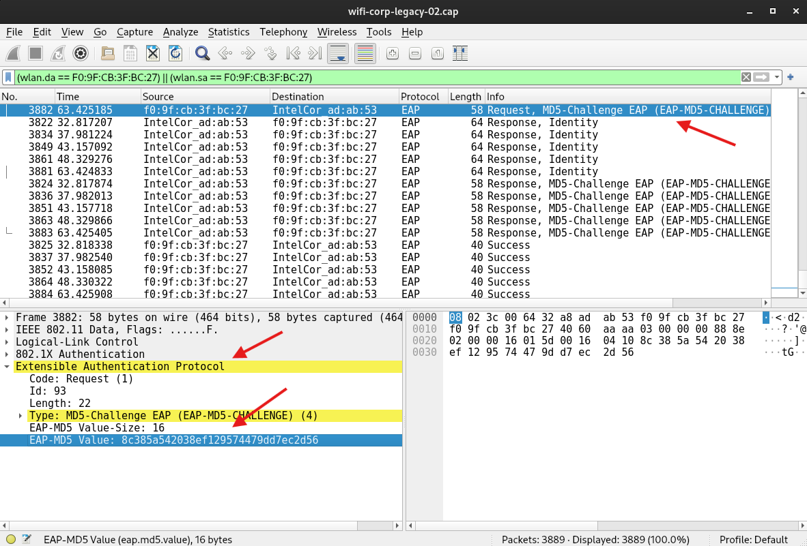

# Attacking EAP-MD5
`EAP-MD5` is an outdate authentication method in the EAP family. It uses a simple *challenge-response* exchange where the server sends a challenge and the client responds by sending *an MD5 hash of the challenge and its password*. By capturing the MD5 hashed answer from the client, an attacker can easily crack the password from it.
## Data in the Exchange
When you capture an EAP-MD5 authentication (for example with [wireshark](../../cybersecurity/TTPs/recon/tools/scanning/wireshark.md) or [Aircrack-ng](../../cybersecurity/wifi/Aircrack-ng.md)), the important pieces you will see in the EAP packet are:
- **Identifier** - the EAP identifier byte that pairs request and response (one byte, 2 hex characters)
- **Challenge** - the random challenge value sent by the server (typically 16 bytes, 32 hex characters)
- **Response** - the MD5 digest supplied by the client (16 bytes, 32 hex characters) 
## Technique
### Extract the Hash
#### 1. Identify the EAP-MD5 packets
Open the capture in Wireshark and filter for EAP packets. Look for EAP Request MD5-Challenge (server) and EAP Response MD5-Challenge (client). The packet details pane shows the identifier, challenge value, and response value.

In Wireshark expand the EAP layer and then the MD5-Challenge or MD5-Response field to view raw bytes. Use Copy -> Bytes -> as Hex Stream to copy the exact hex values.

#### 2. Assemble the string for the cracker 
From the client response packet copy the 16-byte MD5 response (32 hex chars). From the server request packet copy the 16-byte challenge (32 hex chars). Copy the single identifier byte (2 hex chars). Concatenate them using colons: response:challenge:identifier.
#### 3. Or use `hcxpcapngtool`
Tools such as hcxpcapngtool automate extraction from capture files and produce a hash file formatted for hashcat. Example:
```bash
hcxpcapngtool --eapmd5=eap.hash -o /dev/null /root/md5-01.cap
```
### Format the Hash for Cracking
Tools that crack EAP-MD5 expect a single-line string combining the captured response, the challenge, and the identifier in this exact text format:
`<response-32-hex>:<challenge-32-hex>:<identifier-2-hex>`
Example:  
`5f4dcc3b5aa765d61d8327deb882cf99:0123456789abcdef0123456789abcdef:01`
**NOTE**: To convert decimal to hex you you can use:
```python
printf '%x\n' 80
```
### Crack with Hashcat
Once you have `eap.hash` in the expected `response:challenge:identifier` format, use [hashcat](../../cybersecurity/TTPs/cracking/tools/hashcat.md) with mode 4800 (EAP-MD5) to attempt recovery:
```bash
hashcat -m 4800 -a 0 eap.hash ~/dictionary.txt --force
```

> [!Resources]
> - [Wifi Challenge Academy](https://academy.wifichallenge.com/courses/take/certified-wifichallenge-professional-cwp/texts/57442649-wi-fi-attacks-mgt)