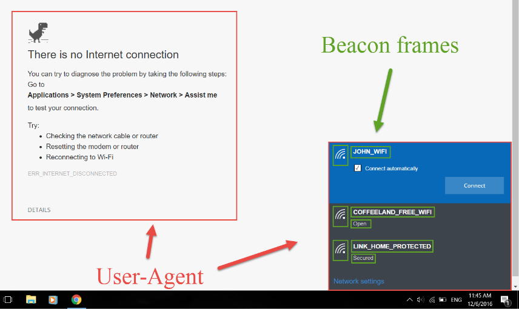

# Phishing + RogueAP (Captive Portal)
This attack combines a [rogue-AP](rogue-AP.md) attack with a [captive portal](../OPN-attacks/captive-portal-bypass.md) for [phishing](../../cybersecurity/TTPs/delivery/phishing.md). The attacker creates a fake AP and then redirects victims to the captive portal. Once they enter their credentials, you obrain them.

To do this, the attacker creates a fake AP with an OPN network configuration. Then they create a realistic captive portal which prompts users for their password.
## Steps
### 1. Create the Captive Portal
To create the captive portal, you have to edit the captive portal file in `eaphammer` (`./core/wskeyloggerd/templates/user_defined/login/body.html`).
### 2. Create the fake AP
```bash
cd ~/tools/eaphammer
sudo killall dnsmasq
./eaphammer --essid WiFi-Restaurant --interface wlan4 --captive-portal
```
#### Alternatives
You can also do this with `airgeddon` or `wifiphisher` which have pre-generated templates. For instance, `wifiphisher` can imitate a Windows error message:

##### `wifiphisher` command:
```bash
wifiphisher -aI wlan0 -p wifi_connect --handshake-capture handshake.pcap
```
- `-aI`: Interface to create the fake AP
- `-p`: Attack module to use
- `--handshake-capture`: Captures the real Handshake to verify the password

> [!Resources]
> - [Wifi Challenge Academy](https://academy.wifichallenge.com/courses/take/certified-wifichallenge-professional-cwp/texts/57442980-introduction)
> - My [own notes](https://github.com/trshpuppy/obsidian-notes) linked throughout the text.
