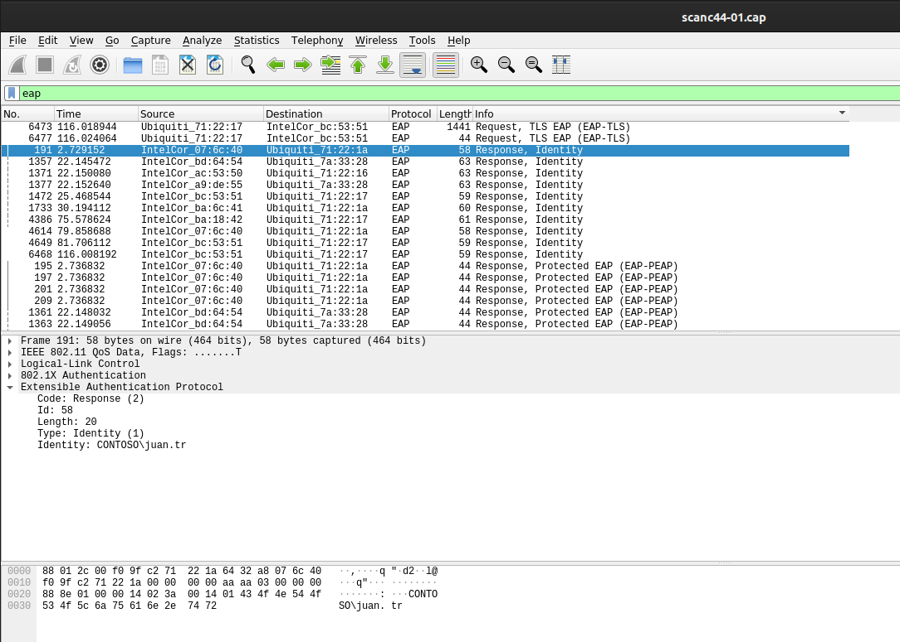
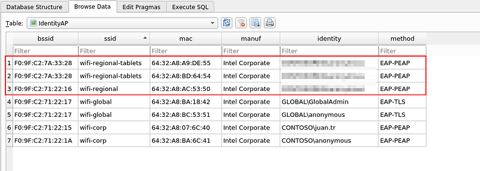
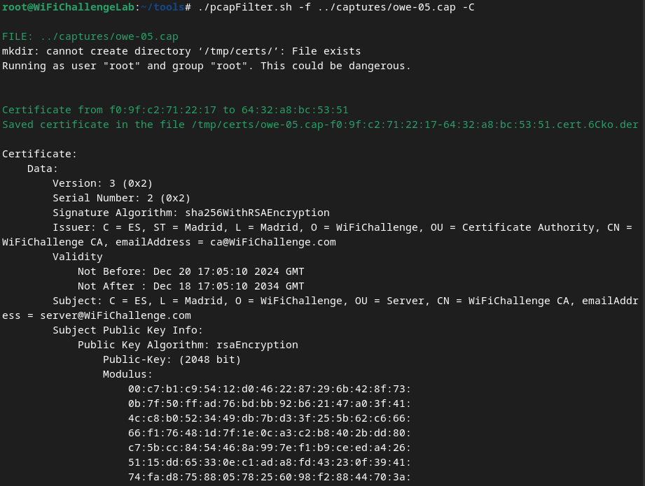
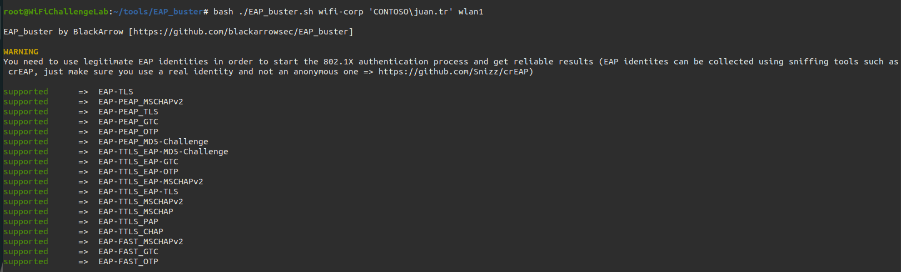

# MGT Network Recon

## User Enumeration
Because MGT/Enterprise networks use usernames and passwords for clients to login, they are vulnerable to username enumeration. When a client logs in, their identity is sent *before a proper [TLS](../../networking/protocols/TLS.md) tunnel is established*, meaning the identity travels in cleartext over the network.

An attacker can passively listen to network traffic and capture the unencrypted packets containing the username. The only protection against this is if the *client* is configured to use an anonymous identity.

With an anonymous identity, the username isn't shared until *after TLS is established*. Unfortunately, since anonymous identities are a *client side config*, it is rarely implemented.

> There are various types of identities that can be used in infrastructure, each offering a different level of information. Among them are standard identities, such as a simple username ("user"), the User Principal Name (UPN), which combines the user and domain (user@domain.com), the SAMAccountName in the format of domain and user (domain\user), and the email address (email@domain.com). Additionally, in certain specific configurations, custom attributes may be used, such as employee number or other attributes on platforms like Azure in cases of Microsoft cloud integrations.
> 
> On the other hand, when an anonymous identity is used, it is still possible to obtain some level of information. This is because many administrators configure the anonymous identity to include the domain name, allowing the domain to be identified simply by monitoring the network. For example, in formats like CONTOSO\anonymous or anonymous@CONTOSO.local, the domain name becomes evident.
### Manually Capturing
First, use `airodump-ng` to capture wifi traffic and save it to a capture file:
```bash
airodump-ng wlan0mon -w ./captures/mgt -c 44 --wps
```
Then, use [wireshark](../../cybersecurity/TTPs/recon/tools/scanning/wireshark.md) to analyze the traffic and find transmitted usernames:

### Using `wifi_db`
You can also use [wifi_db](../offensive-wifi-recon/wifi_db.md) to extract usernames *automagically* (point it at the directory where you your capture file is saved, in this case `./captures`)
```bash
python3 wifi_db.py -d wifidata.SQLITE ./captures
```
Then use `sqlitebrowser` to view the database in the browser:
```bash
sqlitebrowser wifidata.SQLITE
```
Once the browser is open, Go to:
```
Browse Data --> Table: Identity AP
```

### Using `tshark`
You can also use `tshark` to filter for packets containing `EAP` identities from the command line:
```bash
tshark -r ./captures/mgt-01.cap -Y '(eap && wlan.ra == xx:xx:xx:xx:xx:xx) && (eap.identity)' -T fields -e eap.identity
```
- `/home/user/wifi/scan-01.cap`: the location of the packet capture file
- `xx:xx:xx:xx:xx:xx`: the specific destination MAC address to filter, i.e., the MAC of the AP
- `-Y '(eap && wlan.ra == xx:xx:xx:xx:xx:xx) && (eap.identity)'`: the display filter specifying that only EAP packets with the given destination MAC address containing an EAP identifier should be considered
- `-T fields -e eap.identity`: configures the output to display only the EAP identity field
## AP Certificate Enumeration
For the TLS tunnel to be established b/w the AP and a client, the server's certificate needs to be sent in *plaintext first*. Capturing the certificate allows attackers to find out more information about the server and the connection, and the cert could also be leveraged in attacks like the [evil twin](../PSK-attacks/evil-twin.md) attack.
### `pcapFilter.sh`
[`pcpapFilter.sh`](https://gist.github.com/r4ulcl/f3470f097d1cd21dbc5a238883e79fb2) is a command line tool which you can use to extract certificates from capture files:
```bash
bash pcapFilter.sh -f ./captures/scan-01.cap -C
```

In the output, we can see all the certificate information, with the most important being the *Issuer line*. The Issuer line contains the CA that signed the certificate, and the Subject fields, which are the text fields of the final certificate, i.e., the AP certificate.
### Wireshark
In Wireshark, certificates can be filtered using the AP's BSSID.
```bash
(wlan.sa == xx:xx:xx:xx:xx:xx) && (tls.handshake.certificate)
```
### `tshark`
For `tshark`, the command would be:
```bash
tshark -r ./captures/scan-01.cap -Y "wlan.bssid == xx:xx:xx:xx:xx:xx && ssl.handshake.type == 11" -V
```
## EAP Authentication
Once you discover a valid username, you can use tools like [`EAP_buster`](https://github.com/blackarrowsec/EAP_buster) to discover what authentication methods are supported by the AP.
> [!Note]
> 1. Make sure the username is a valid one, or else this tool won't work.
> 2. Make sure `EAP_buster` is the only tool using the interface (use `airmon-ng check kill` to make sure the interface has nothing else attached to it)
### `EAP_buster.sh`
```bash
bash ./EAP_buster.sh <SSID> 'DOMAIN\User' wlan1
```

If the output shows networks using `EAP-TLS`, then you can rule those networks out for testing because it will be impossible (?) to attack communications b/w the clients and AP on those networks.


> [!Resources]
> - [`EAP_buster`](https://github.com/blackarrowsec/EAP_buster)
> - [pcpaFilter.sh GitHub Gist](https://gist.github.com/r4ulcl/f3470f097d1cd21dbc5a238883e79fb2)
> - [Wifi Challenge Academy](https://academy.wifichallenge.com/courses/take/certified-wifichallenge-professional-cwp/texts/57442980-introduction)
> - My [own notes](https://github.com/trshpuppy/obsidian-notes) linked throughout the text.