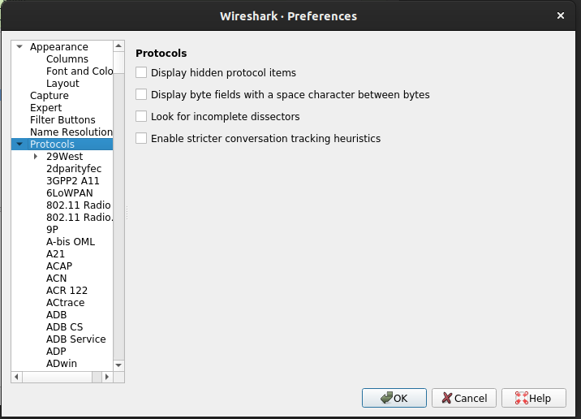
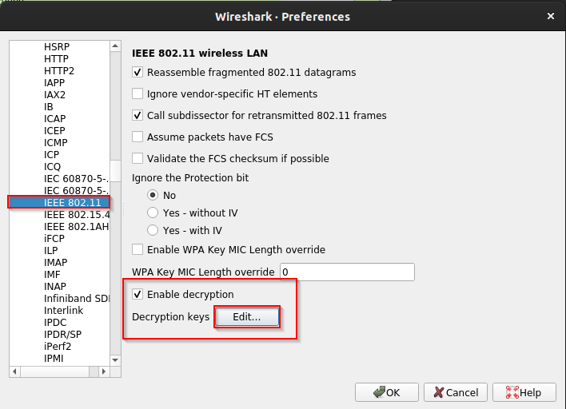
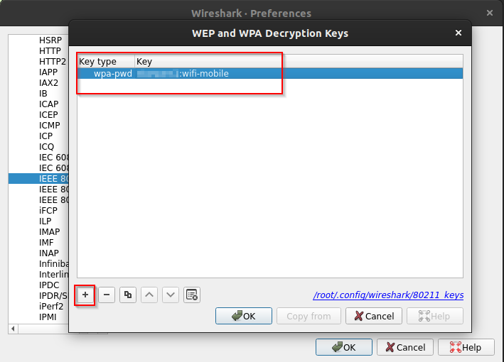

# Decrypting traffic in WPA/WPA2-PSK Networks
If you can capture all four packets of the [WPA/WPA2 handshake](../../networking/wifi/WPA-WPA2.md#Authentication) (which is where the encryption keys are negotiated), then you can use that information to *decrypt network traffic* between clients and the AP. Even if the client is using a VPN, we can still gain a lot of information by capturing handshakes and decrypting their traffic.

To carry out the attack, traffic is captured using `tshark` or `airodump-ng`. To ensure you capture authentication packets, you can perform [deauth attacks](handshake-attack.md#2.1%20Force%20traffic) to force clients off the target AP so you can capture when the re-auth afterwards.
## Steps
#### 1. Deauth clients
In order to decrypt the traffic of all users on the target AP, you want to deauth all of the clients so you can capture handshakes for all of them. You can deauth with `aireplay-ng` (see [these notes](handshake-attack.md#2.1%20Force%20traffic)) or you can use [`UnicastDeauth`](https://github.com/mamatb/UnicastDeauth) which is a python script that will automate the process against all targets:
##### 1.1 Make sure nothing is monitoring on the same interface
To use this tool, first make sure nothing else is using the interface in monitor mode because it will interfere with the script:
```bash
airmon-ng check kill
ip link set dev "${WIFI_INTERFACE}" down
iw dev "${WIFI_INTERFACE}" set monitor control
iw dev "${WIFI_INTERFACE}" set channel "${WIFI_CHANNEL}"
ip link set dev "${WIFI_INTERFACE}" up
```
> [!Note]
> You still probably want `airodump-ng` running on a **SEPARATE INTERFACE** because as soon as you deauth clients, you want to capture their re-authentication packets (so also run `airodump-ng` with the `-w` output to get a capture file)
##### 1.2 Run the de-auth
Before de-authing, make sure you know the `ESSID` of the AP you want to target. `UnicastDeauth.py` will target that AP and de-auth all of its clients.
```bash
UnicastDeauth.py -i wlan2 -e $ESSID -b
```
- `-b`: Enables broadcast deauthentication
#### 2. Decrypt the traffic
Once you've captured the handshake **AND** have the networks PSK/ password, you can use either `airdecap-ng` or [wireshark](../../cybersecurity/TTPs/recon/tools/scanning/wireshark.md) to decrypt and analyze the traffic. To get the PSK, check out [these notes](handshake-attack.md).
##### 2.1 Decrypt with `airdecap-ng`
`airdecap-ng` is part of the [Aircrack-ng](../../cybersecurity/wifi/Aircrack-ng.md) suite. We can use it to decrypt traffic by giving it the AP's `ESSID` and the network's password, as well as the capture file with the handshakes:
```bash
airdcap-ng -e <ESSID> -p <PASSWORD> ./captured.cap
```
This command generates a capture file *with a `-dec`* at the end of its name. In this example, it would be named `./captured-dec.cap`. If you open the file with Wireshark, then you'll be able to view all of the decrypted traffic.
##### 2.2 Decrypt with Wireshark
Alternatively, you can open the original capture file (`./captured.cap` in this example) in Wireshark:
```bash
wireshark ./captured.cap
```
Once the GUI is open, you can configure wireshark to use the password to decrypt the traffic. Just go to Edit --> Preferences --> Protocols then select `IEEE 802.11`:

In the `IEEE 802.11` menu, make sure to check "Enable decryption". Then click the "Edit" button:

Click the "+" icon to create a new entry in the table. Set the "Key type" as `wpa-pwd`, then enter the plaintext password followed by a colon and AP's `ESSID`:

Once you hit "OK" you should see new HTTP traffic from the AP and its clients.

> [!Resources]
> - [GitHub - mamatb/UnicastDeauth](https://github.com/mamatb/UnicastDeauth)
> - [Wifi Challenge Academy](https://academy.wifichallenge.com/courses/take/certified-wifichallenge-professional-cwp/texts/57442980-introduction)
> - My [own notes](https://github.com/trshpuppy/obsidian-notes) linked throughout the text.

https://www.twitch.tv/midnightsumo/clip/ExuberantPlainRavenDatBoi-SYgi6CBOew6-6SWN