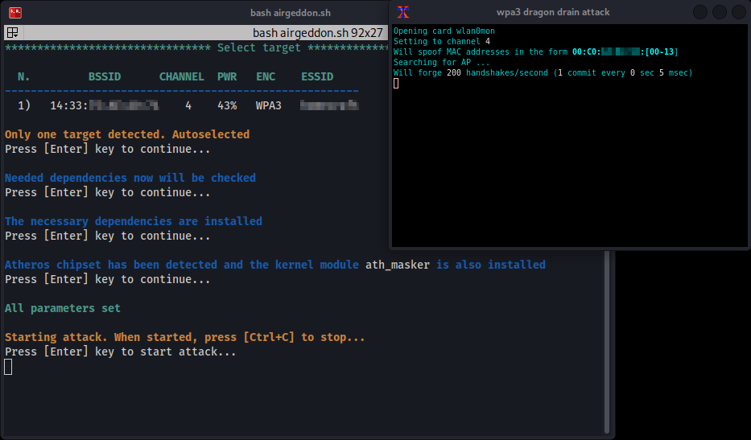

# DragonDrain on SAE
Because [WPA-SAE](../../networking/wifi/WPA-WPA2.md) uses modern cryptographic functions that have a high computational cost, it is vulnerable to *denial-of-service* attacks. SAE relies on *Dragonfly* password-authenticated key exchange which uses elliptic curve/ finite field operations that are *expensive*.

An attacker can exploit this by initiating repeated SAE authentication exchanges. This forces the AP to perform costly computations for each attempt, leading to a DoS scenario.

The effect of a DoS attack is significant impact to network availability. In other words, *these attacks do not compromise encryption of password secrecy*.

There are multiple DoS-related issues effecting SAE, but one of the more notable is the DragonDrain attack which targets expensive stages of the SAE handshake. Basically, the DragonDrain attack floods the target AP with large numbers of *forged or semi-valid SAE commit messages*. This exhausts [cpu](../../computers/concepts/cpu.md) resources and disrupts legitimate client associations.
## Attack
The impact of this attack is usually gradual rather than immediate because, as other clients try to connect, they will fail to associate. Or, clients who are already connected will experience connection delays or be disconnected. Over time, the AP will degrade as it attempts to process excessive cryptographic operations.
### Tools
#### dragondrain-and-time
The github project: [vanhoefm/dragondrain-and-time](https://github.com/vanhoefm/dragondrain-and-time) is the main repository that provides proof-of-concept code for both DragonDrain and a related Dragontime test suite. It contains utilities to generate handshake frames that trigger the expensive parts of the Dragonfly process on an access point. Usage instructions show how to set up your wireless interface in monitor mode and run the tool against a target AP to test for vulnerability.
> [!Note]
> This tool has only been tested with Atheros ath9k_htc–based wireless adapters. Other chipsets may fail to trigger the intended cryptographic workload on the access point or may not function reliably.  
>
> The `ath_masker` kernel module *is required when using ath9k_htc adapters*. It enables controlled MAC address masking and proper handling of transmitted management frames, which is necessary for reliably eliciting handshake responses from the target access point during repeated Dragonfly or OWE association attempts.

A simple attack requires only a wireless interface, the target access point BSSID, and the operating channel:
```bash
cd /root/tools/dragondrain-and-time
./src/dragondrain -d wlan2 -a AA:BB:CC:DD:EE:FF -c 10
```
This minimal invocation performs a continuous stream of OWE association attempts.
- `-d wlan2`: Specifies the wireless interface used for transmission. The interface must support monitor mode and frame injection, as the tool crafts and injects raw 802.11 management frames
- `-a AA:BB:CC:DD:EE:FF`: Defines the target access point BSSID. This is the MAC address of the AP that will be forced to process repeated Dragonfly handshakes
- `-c 10`: Sets the Wi-Fi channel on which the attack is executed. The interface must be tuned to the same channel as the target AP, otherwise frames will not be processed
##### Advanced Execution Option:
```bash
./src/dragondrain -d wlan1 -a AA:BB:CC:DD:EE:FF -b 54 -n 20 -c 10 -i 3000 -f
```
This configuration increases attack intensity and realism by enabling additional parameters.
- `-d wlan1`: Selects a different wireless interface, useful when testing with multiple radios or separating monitoring and injection roles
- `-a AA:BB:CC:DD:EE:FF`: Target BSSID, identical in function to the basic example
- `-b 54`: Controls the transmission rate used for injected frames. Higher rates allow the attacker to send more handshake requests per second, increasing pressure on the access point
- `-n 20`: Sets the number of parallel handshake attempts. This simulates multiple clients attempting to associate simultaneously, amplifying the computational load on the AP
- `-c 10`: Wi-Fi channel used for the attack
- `-i 3000`: Defines the interval between handshake attempts in milliseconds. Tuning this value allows the attacker to balance sustained pressure versus burst-style exhaustion
- `-f`: Enables continuous or forced execution mode, ensuring that handshake attempts persist even if responses are not received. This maximizes the likelihood of CPU exhaustion on vulnerable devices
#### Airgeddon Plugin
The [dragon-drain-wpa3-airgeddon-plugin](https://github.com/Janek79ax/dragon-drain-wpa3-airgeddon-plugin) plugin adds a DragonDrain-style Denial-of-Service option to `airgeddon`’s suite of WPA3 attack modules. It leverages the dragondrain-and-time tool under the hood, but integrates it in a more automated and user-friendly manner.
> [!Note]
> This plugin only works with SAE networks

##### Warnings & Compatibility:
- Only some WPA3 access points are affected. Since this attack was discovered some time ago, most APs have already been patched against it. Therefore, if you are unsuccessful, the main reason could be that the access point is not vulnerable
- This plugin is designed only for Debian based Linux distributions as the installation/compilation part is using `apt` command
- The original attack is only compatible with specific wireless adapters (mostly Atheros), but this version has been modified to work with all chipsets adjusting bitrate based on chipset for better reliability


> [!Resources]
> - [GitHub - Janek79ax/dragon-drain-wpa3-airgeddon-plugin](https://github.com/Janek79ax/dragon-drain-wpa3-airgeddon-plugin)
> - [GitHub - vanhoefm/dragondrain-and-time](https://github.com/vanhoefm/dragondrain-and-time)
> - [Wifi Challenge Academy](https://academy.wifichallenge.com/courses/take/certified-wifichallenge-professional-cwp/texts/57442980-introduction)
> - My [own notes](https://github.com/trshpuppy/obsidian-notes) linked throughout the text.