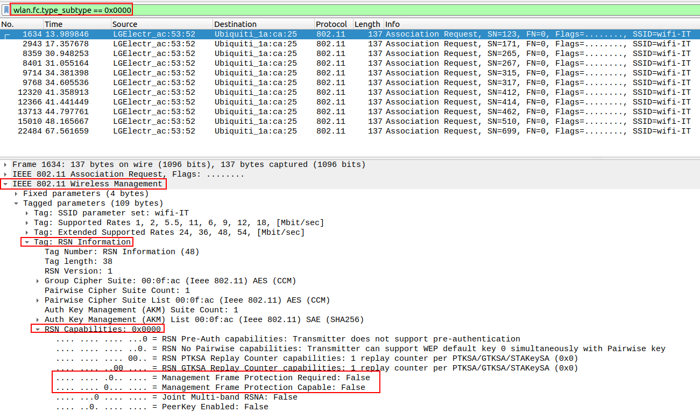
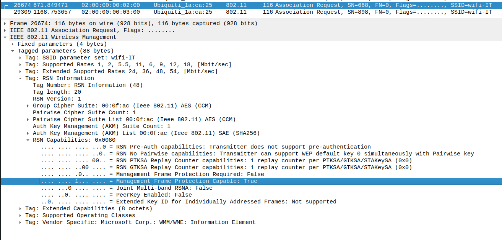
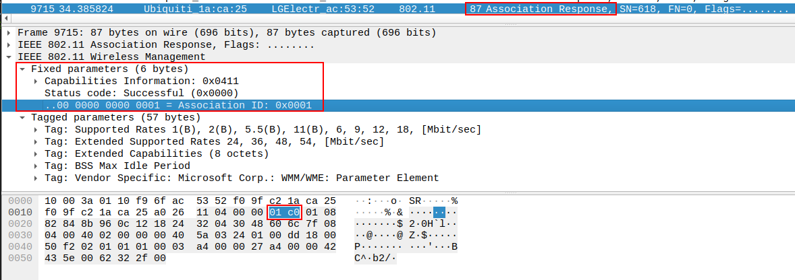
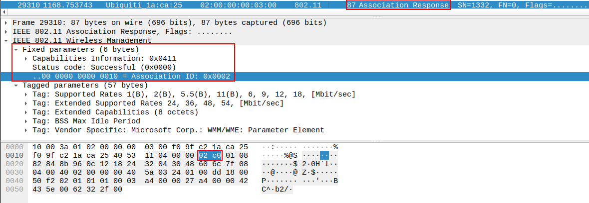

---
aliases:
  - transitional network
  - transitional networks
---
# Attacks on Transitional Networks or Mixed Mode
Although [SAE](../../networking/wifi/WPA3.md#SAE) is a very robust authentication method, it isn't perfectly secure and does come with some vulnerabilities. Mostly, attackers can exploit *configuration errors*.

In WPA2/WPA3 Transitional mode, the network allows connections from devices which support [WPA2](../../networking/wifi/WPA-WPA2.md) as well as [WPA3](../../networking/wifi/WPA3.md), which increases the overall attack surface. Because WPA2 is supported, these networks commonly have WPA2 clients connected, *making it possible to obtain a [handshake](../../networking/wifi/WPA-WPA2.md#Authentication)* and perform [WPA2 handshake attacks](../PSK-attacks/handshake-attack.md) against it.

Additionally, if a client is configured to connect to the network using WPA2, and then the network is changed to WPA2/WPA3 Transitional, the client *will continue to connect using WPA2*. The client would detect that WPA3 network as a completely separate network since the authentication method is different.
## Detecting Transitional AP Support
To check if an AP has transitional support, you have to capture the traffic and examine the packets for a specific value called "Auth Key Management (AKM) List" in one of the *Beacon Frames*
#### 1. Run `airodump-ng` and save to a capture file
```bash
sudo airodump-ng wlan0mon --band abg' -w ./capture/transitional
```
#### 2. Inspect in Wireshark
```bash
wireshark transitional-01.cap
```
#### 3. Find the value
In Wireshark, find a Beacon Frame. Find the section `IEEE 802.11 Wireless Management > Tagged parameters > RSN IE > Auth Key Management (AKM) list`. Check to see if its only `SAE`, `PSK`, or both (Transitional)

## Detecting MFP
Checking the client's [MFP](../../networking/wifi/MFP.md) configuration is necessary to understand if [deauthentication attacks](../PSK-attacks/handshake-attack.md#2.1%20Force%20traffic) will be effective or blocked.
- If the client doesn't use MFP, deauth frames can be sent
- If MFP is enabled, wait for the client to reconnect
> [!Note]
> The client MFP should only be checked when the AP's capable flag is set to 1. If it's required, it will always be enabled; if it's not capable, it will always be disabled.

Frame protection status can be verified in Wireshark as follows:
1. **Filter for Association Requests of a specific client**
```
wlan.fc.type_subtype == 0x0000
``` 
2. **Locate RSN Capabilities**
    - Check the MFP Required bit in RSN Capabilities
        - **0** = not required
        - **1** = required
    - Check the MFP Capable bit in RSN Capabilities
        - **0** = not capable
        - **1** = capable

If MFP is disabled, the field should look like this in wireshark:
If MFP is enabled, it should look like this:

## Detecting Client's Connection Type (PSK or SAE)
Next, you want to check if the client is using SAE or PSK in the transitional network.
#### Steps
##### 1. Filter for Association Responses
In wireshark, use the following filter to filter for Association Responses:
```bash
wlan.fc.type_subtype == 0x0001
```
##### 2. Locate `RSN IE`
##### 3. Read `AKM Suites`
The AKM-count is made up of 2 octets and shows how many suites that follow. Each suite is 4 octets
- **PSK**: AID = `0x01C0`:`00-0F-AC-02`

- **SAE**: AID 1 `0x02C0`:`00-0F-AC-08`


> [!Resources]
> - [Wifi Challenge Academy](https://academy.wifichallenge.com/courses/take/certified-wifichallenge-professional-cwp/texts/57442980-introduction)
> - My [own notes](https://github.com/trshpuppy/obsidian-notes) linked throughout the text.