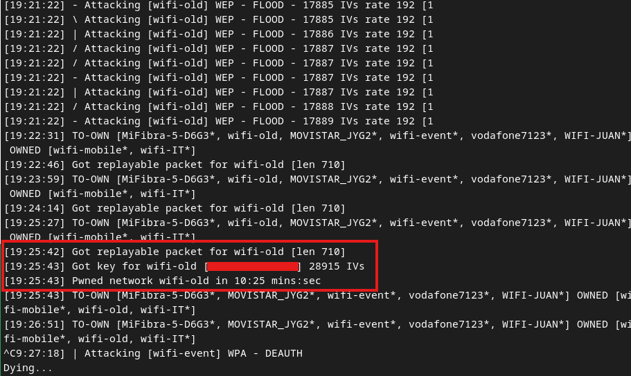

# `besside-ng`
`besside-ng` is part of the [Aircrack-ng](../../cybersecurity/wifi/Aircrack-ng.md) suite and basically automates WEP and WPA hacking and cracking. It automatically cracks all [WPA](../../networking/wifi/WPA-WPA2.md) and [WEP](../../networking/wifi/WEP.md) networks in range.
## Use
### Attacking WEP
To automatically crack WEP networks:
```bash
besside-ng wlan0mon
```
The output will look something like this:

The key is displayed on the screen *in hex format* separated by ":". To use the key, just remove the ":". Then you can connect to the network.
#### Connecting to the WEP network
Use `wpa_supplicant` with the following conf file:
```bash
network={
    ssid="wifi-old"
    key_mgmt=NONE
    wep_key0=<PASSWORD>
    wep_tx_keyidx=0
}
```
Then run:
```bash
wpa_supplicant -i wlan2 -c wep.conf
```
Retrieve your new IP address from the DHCP server:
```bash
dhclient wlan2 -v
```

To get a WPA handshake from a specific target:
```bash
besside-ng -W -c 6 -b <MAC> wlan0mon
```
### Log file
There is a log file created at `besside.log`

> [!Resources]
> - [besside-ng [Aircrack-ng]](https://www.aircrack-ng.org/doku.php?id=besside-ng)