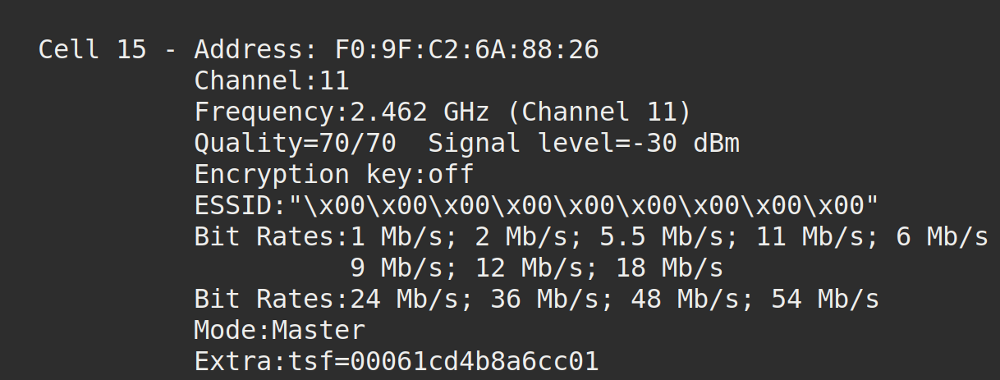
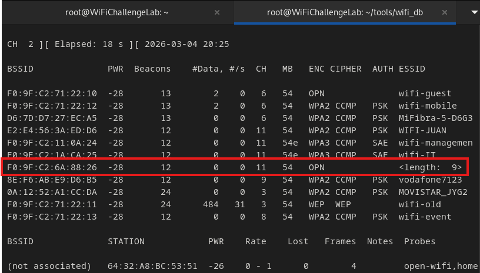

udo  Analyzing Hidden Networks
In terms of [wifi](../../networking/wifi/802.11.md) networks, a hidden network is one in which its *SSID is not broadcast*. To connect, the SSID *must be manually entered*.
## Detecting Hidden Networks
Even though their SSIDs are not broadcast, you can still detect hidden networks:
### Detecting w/ `iwlist`
```bash
sudo iwlist wlan0 scan
```
In the output, look for an `ESSID` set to `off/any`, `""`, or something like `"\x00\x00\x00"` with the number of `x\00` indicating the length of the SSID.

### Detecting w/ `airodump-ng`
```bash
sudo airodump-ng wlan0mon
```
Hidden networks will show up *with a BSSID but no ESSID*, and instead will have a length listed under ESSID:

## Obtaining a Hidden ESSID
### Brute Forcing
Once located, hidden SSIDs can be brute-forced using [MDK4](https://github.com/aircrack-ng/mdk4). 
```bash
mdk4 wlan0mon p -t [BSSID] -f [ESSID-DIC]
```
- `p`: Used to discover and test hidden SSIDs in a Wi-Fi network
- `-t [BSSID]`: MAC address of the target access point
- `-f [ESSID-DIC]`: Path to the wordlist containing possible SSID names. This dictionary is usually customized based on other public networks or possible keywords
### Client Reconnection
Another technique involves waiting for a client to reconnect or forcing the reconnection via a deauthentication attack. This method works as follows:
- Disconnect clients from the access point:
    - Perform a deauthentication attack, forcing clients to disconnect from the AP
- Monitor reconnection attempts:
    - During reconnection attempts, hidden SSIDs may be revealed in the Handshake packets


> [!Resources]
> - [GitHub - aircrack-ng/mdk4: MDK4 · GitHub](https://github.com/aircrack-ng/mdk4)
> - [Wifi Challenge Academy](https://academy.wifichallenge.com/courses/take/certified-wifichallenge-professional-cwp/texts/57442980-introduction)
> - My [own notes](https://github.com/trshpuppy/obsidian-notes) linked throughout the text.

