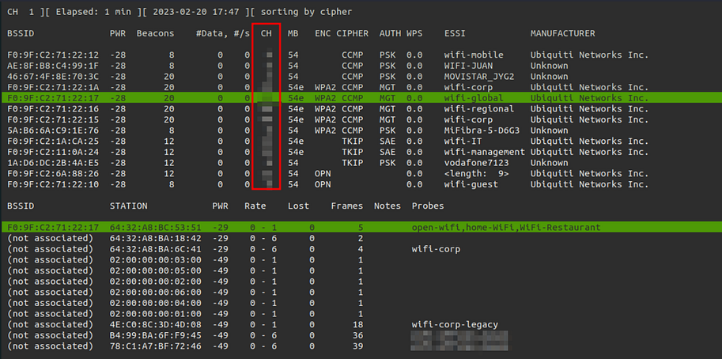
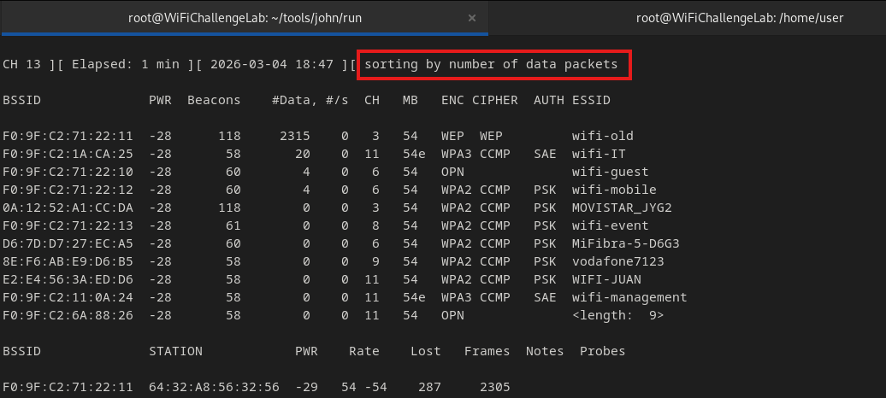
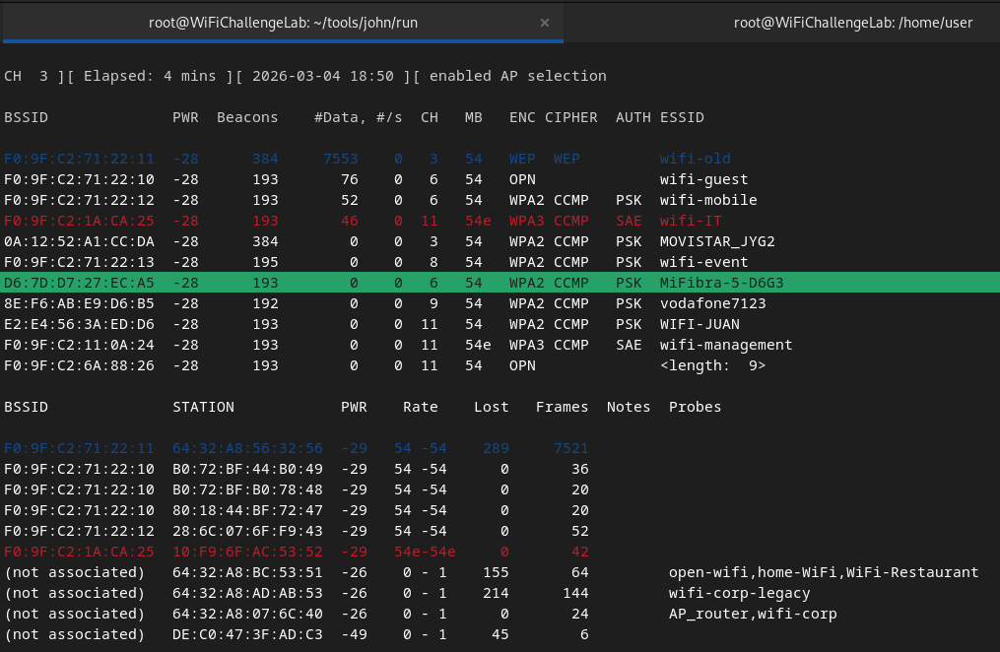

# Monitor Mode and Packet Capture
To capture any packets, our interface has to be in monitor mode. We can turn on monitor mode and capture and analyze packets all with the [Aircrack-ng](../../cybersecurity/wifi/Aircrack-ng.md) suite, starting with [Airmon-ng](../../cybersecurity/wifi/Aircrack-ng.md#Airmon-ng):
```bash
sudo airmon-ng start wlan0
```
## Using `airodump-ng`
`airodump-ng` is a part of the Aircrack suite and is used for capturing packets.
### Data Capture
To start capturing data across all channels:
```bash
sudo airodump-ng wlan0mon
```
The output will list info on all networks within range including BSSID, ESSID, channel, encryption type, number of clients, and signal strength. 
#### Capturing on all Bands
However, it only does so *within the 2.4GHz band*. To capture from both 2.4 and 5GHz, the command is:
```bash
sudo airodump-ng --band bag -w [outputfile] --gpsd wlan0mon
```
- `--band bag` Scans all channels in the 2.4GHz and 5GHz bands (`airodump-ng` does not currently support scanning all bands, including 6GHz, as it is new and not widely used.)
- `-w [outputfile]`: Specifies the file name to save captured packets. Saving captures is important for later processing, so avoid filtering by BSSID or ESSID unless the number of APs is too large. The file name is automatically appended with -01, incrementing with each execution to avoid overwriting.
- `--gpsd`: Optional, enables GPSD usage to record the GPS coordinates of detected access points. GPSD is a service that provides location data from a GPS receiver connected to the system. For this option to work, GPSD must be installed and configured on your system.
#### Focusing on Specific Channel
```bash
sudo airodump-ng -c [channel] -w [outputfile] wlan0mon
```
- `-c [channel]`: Specifies the target network's channel
- `-w [outputfile]`: Specifies the file name for captured packets
#### Other Flags
##### `--mfp`
Lets you display the MFP status:
```bash
sudo airodump-ng -c [channel] -w [outputfile] --mfp wlan0mon
```
- 0: Disabled
- 1: Optional
- 2: mandatory
##### `--bssid`
Lets you focus the command on a specific BBSID (Access Point)
### Output
**Access Point Section**:
- BSSID: The equivalent of the AP's MAC address
- PWR: The signal strength detected, shown in negative values, closer to 0 indicates better strength
- Beacons: The number of beacons detected from that AP
- DATA: Legitimate network traffic packets detected
- #/s: Number of packets per second detected
- CH: Channel on which the AP is broadcasting
- MB: AP's data rate in megabits
- ENC (Encryption): Indicates the general encryption type used by the network (e.g., OPN, WEP, WPA, WPA2, WPA3)
- CIPHER (Cipher Algorithm): Specifies the encryption algorithm used within the general encryption scheme (e.g., TKIP, CCMP, GCMP)
- AUTH: Type of authentication (e.g., PSK, MGT, or SAE)
- WPS: WPS version supported by the AP; if not supported, 0.0 or nothing is shown
- ESSID: Network name
- MANUFACTURER: Manufacturer of the AP, obtained from the BSSID and public OUI tables
**Client Section**:
- BSSID: MAC address of the AP to which the client is connected, or "not associated" if no AP is detected for that client
- STATION: Client device's MAC address
- PWR: Client's signal strength in dBm (closer to 0 is better)
- Rate: Current data rate in Mbps (transmit/receive)
- Lost: Data packets lost during the scan
- Frames: Total number of frames transmitted or received by the client
- Notes: Additional information about the client
- Probes: SSID networks to which the client has sent connection requests
### Advanced Use
In `airodump-ng` you can color the output based on AP, sort APs and clients, and even select specific APs.
#### Pausing
You can use the `Space` key to pause the on-screen output (other shortcuts won't work while paused).
#### Sorting
First, you can sort the output by *pressing `s` which will cycle through different sorting options*. For example, you can sort APs by the number of data packets so the APs w/ the most packet traffic are listed first:

#### AP Selection Mode
To enter selection mode, and navigate through the APs and their clients, *press `TAB`, then use the arrow keys to move up and down the list*:
#### Colorize
Once you've highlighted an AP (with selection mode) you can *press `m` to assign it a color*. Pressing `m` repeatedly will cycle through the different colors. Once an AP is assigned a color, the output will reflect that



> [!Resources]
> - [Wifi Challenge Academy](https://academy.wifichallenge.com/courses/take/certified-wifichallenge-professional-cwp/texts/57442980-introduction)
> - My [own notes](https://github.com/trshpuppy/obsidian-notes) linked throughout the text.

> [!Related]
> - [My notes on Aircrack-ng](../../cybersecurity/wifi/Aircrack-ng.md)
