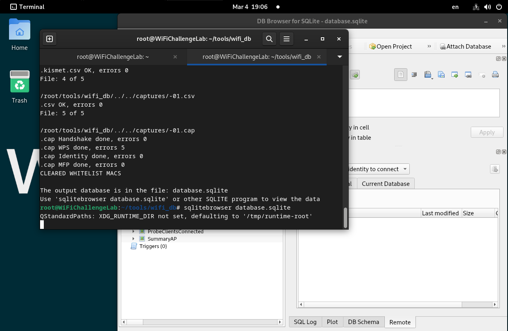

# Analyzing Captures w/ `wifi_db`
`wifi-db` is a [python](../../coding/languages/python/python.md) tool used to import capture files created with `airodump-ng` into a SQLite database. Once the data is in a database, its much easier to identify relationships b/w APs and clients and to *extract handshakes* from PSK networks.
## Usage
### Creating Capture file with `airodump`
An easy way to use these two tools together is to first create a directory to store the capture files from `airodump`. Once the directory is created, then run `airodump` with the `-w` flag to capture all of its output to a file in the directory (in this case, the directory is called `captures`):
```bash
sudo airodump-ng wlan0mon -w captures/ --gpsd
```
Running `airodump` in this way creates the following files in `captures/`:
```bash
root@WiFiChallengeLab:~/captures# ls
-01.cap  -01.csv  -01.gps  -01.kismet.csv  -01.kismet.netxml  -01.log.csv
```
### Running `wifi_db` with Capture File
Once the capture files are created, you can run `wifi_db` and specify the capture folder:
```bash
root@WiFiChallengeLab:~/tools/wifi_db# python3 wifi_db.py -d database.sqlite ../../captures/

           _   __  _             _  _
__      __(_) / _|(_)         __| || |__
\ \ /\ / /| || |_ | |        / _` || '_ \
 \ V  V / | ||  _|| |       | (_| || |_) |
  \_/\_/  |_||_|  |_| _____  \__,_||_.__/
                     |_____|
                               by r4ulcl

You are using the latest version (1.5).

/usr/bin/hcxpcapngtool
/usr/bin/tshark
['../../captures/']
Download and load vendors
/tmp/tmpkwbfnht1
Copy new file to /root/tools/wifi_db/utils/mac-vendors-export.csv
Parsing folder: ../../captures
['-01.log.csv', '-01.kismet.netxml', '-01.kismet.csv', '-01.csv', '-01.cap']
File: 1 of 5

/root/tools/wifi_db/../../captures/-01.log.csv
.log.csv done, errors 0
File: 2 of 5

/root/tools/wifi_db/../../captures/-01.kismet.netxml
.kismet.netxml OK, errors 0
File: 3 of 5

/root/tools/wifi_db/../../captures/-01.kismet.csv
.kismet.csv OK, errors 0
File: 4 of 5

/root/tools/wifi_db/../../captures/-01.csv
.csv OK, errors 0
File: 5 of 5

/root/tools/wifi_db/../../captures/-01.cap
.cap Handshake done, errors 0
.cap WPS done, errors 5
.cap Identity done, errors 0
.cap MFP done, errors 0
CLEARED WHITELIST MACS

The output database is in the file: database.sqlite
Use 'sqlitebrowser database.sqlite' or other SQLITE program to view the data
```
### Access the Database
As stated at the bottom of the output, you can access the database by using the `sqlitebrowser` tool:


> [!Resources]
> - [Wifi Challenge Academy](https://academy.wifichallenge.com/courses/take/certified-wifichallenge-professional-cwp/texts/57442980-introduction)
> - My [own notes](https://github.com/trshpuppy/obsidian-notes) linked throughout the text.