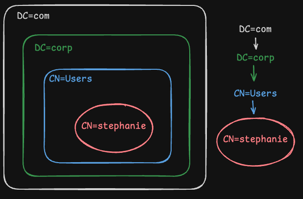

# Enumerating AD w/ PowerShell and .NET Classes

> [!Note]
> For these notes, the following *scenario* applies: we're enumerating the `corp.com` domain. We've obtained user credentials to a domain user through a successful phishing attack. The user we have access to is `stephanie` who has remote desktop permissions on a Windows 11 machine `CLIENT75` which is a part of the domain. This user is not a local administrator on the machine. The scope is restricted to the `corp.com` domain.
> 
> We have remoted into `CLIENT75` using [xfreerdp](../../../CLI-tools/linux/remote/xfreerdp.md) via the [RDP](../../../networking/protocols/RDP.md) protocol:
> `kali@kali:~$ xfreerdp /u:stephanie /d:corp.com /v:192.168.50.75`

[PowerShell](../../../coding/languages/powershell.md) has multiple tools we can use to enumerate AD, but not all of them are available to us in this scenario. For example the `Get-ADUser` cmdlet *is only installed by default on [Domain Controller](../../../computers/windows/active-directory/domain-controller.md)s* as part of the [_Remote Server Administration Tools_](https://learn.microsoft.com/en-us/troubleshoot/windows-server/system-management-components/remote-server-administration-tools) (RSAT) tool. RSAT is rarely present on domains. Additionally, we need *admin privileges* to install them.

Instead, we can use [.NET](../../../coding/dotNET.md) classes with PowerShell to *create a script which mimics AD queries*. In addition to PS and .NET, we're also going to use [ADSI](../../../computers/windows/active-directory/ADSI.md), which is essentially *an API of methods, interfaces, etc.* which we can use to script against AD. 

ADSI offers two "providers" which facilitate communication between ADSI and AD. In order to use ADSI, you *have to* use one of the providers. There is the [WinNT Provider](../../../computers/windows/active-directory/ADSI.md#WinNT%20Provider) and the [LDAP Provider](../../../computers/windows/active-directory/ADSI.md#LDAP%20Provider). The provider you choose *determines the protocol ADSI will use to interact with AD*. 

While both are capable of communicating w/i AD, the LDAP provider *offers more functionality* and is the more comprehensive of the two. LDAP is a *heavily used* protocol within AD. For example, when a machine on the domain searches for an object, like a printer, *LDAP serves as the communication channel* for handling the search query.
## LDAP ADSI
We'll use the [LDAP ADSI Provider](https://learn.microsoft.com/en-us/windows/win32/adsi/adsi-ldap-provider) for our script. The ADSI objects w/i the LDAP ADSI provider are *compatible with LDAP* and exist within an LDAP-specific *namespace*.
### ADsPath & Namespaces
In order to use the LDAP Provider to *bind* to specific objects in the AD, we need to provide the [LDAP ADsPath](https://learn.microsoft.com/en-us/windows/win32/adsi/ldap-adspath) to the objects we want to perform operations on. The ADsPath is basically just a *string which identifies a directory object in AD*. The LDAP ADsPath *has a specific format* which needs to be followed in order to work.

#### Distinguished Names
In AD, every object has a unique [Distinguished Name](../../../computers/windows/active-directory/objects.md#Distinguished%20Names) which identifies it. An object's DN is made up of  [Relative Distinguished Names](../../../computers/windows/active-directory/objects.md#Relative%20Distinguished%20Names) separated by commas. These parts make up the *absolute path* to the object within the domain. In our scenario, the DN for the `stephanie` user object, likely resembles:
```
CN=Stephanie,CN=Users,DC=corp,DC=com
```
`CN` stands for Common Name (CN) (attribute = `commonName`). The two CNs refer to the `stephanie` user account object, and then the `Users` group object.

`DC` stands for Domain Component (DC) (attribute = `domainComponent`). The two DCs represent the *tops of LDAP trees*, which in this case is the DN of the *domain itself*.

When reading a DN, you should start *from the right* because the name denotes a hierarchy with each item being the next level *down* in the hierarchy. 

> Me

`stephanie` is at the *bottom of the hierarchy* or the "lowest level" of the tree, indicating this is the object and its *namespace* our DN points to.
#### Back to the ADsPath
For our tool, we don't want to provide the DN for `stephanie` as our ADsPath because it *will restrict us to the same namespace* as `stephanie`. Instead, we want to be able to enumerate a *larger namespace*, so we'll set our ADsPath to the *Domain Component* object (`DC=corp,DC=com`) which is also the *top of our LDAP tree*. If we gave the DN for `stephanie`, or even for the `Users` group, our tool would only be able to enumerate *within the scope of those containers/ objects*.
## Building our Script
So, the first thing our script needs to do is *find the LDAP ADsPath* for the object/ namespace we want to operate on. We've already decided we want to operate within the `corp.com` namespace so our current ADsPath is:
```powershell
LDAP://corp.com/DC=corp,DC=com
```
However, the current `HostName` might not be *the most effective* hostname for our purposes. Setting `HostName` to the domain name is fine, and will likely get us results, but if we set it to the [_Primary Domain Controller_](https://learn.microsoft.com/en-GB/troubleshoot/windows-server/identity/fsmo-roles) (PDC) instead, our enumeration will return *the most up to date information for the same namespace*.

In other words, binding to `LDAP://corp.com/DC=corp,DC=com` is a "*domain-specific bind*" and will *resolve to one of the available domain controllers* in the domain. But binding to `LDAP://<PDC>/DC=corp,DC=com` is a "*server-specific bind*" and will force ADSI to bind to the PDC (rather than some random DC). This grants us access *to the same scope/namespace* with the advantage of also giving us access *to the most accurate and up to date info*.
### Primary Domain Controller
The PDC is the [Domain Controller](../../../computers/windows/active-directory/domain-controller.md) in the domain which holds *the most up to date information*. There can only be *one PDC* in a domain. You can identify a PDC from other DCs because the PDC holds the `PdcRoleOwner` property.
### Invoking a .NET Class with PowerShell
To find the PDC in our scenario domain, we can use a [.NET class](https://learn.microsoft.com/en-us/dotnet/api/) called `Domain Class` from the `System.DirectoryServices.ActiveDirectory` namespace. According to the [documentation](https://learn.microsoft.com/en-us/dotnet/api/system.directoryservices.activedirectory.domain?view=windowsdesktop-7.0) `PdcRoleOwner` is a method/property on the class which we can use to get "the `DomainController` object that holds the primary domain controller for this domain."

All we have to do to invoke this method is run the following command in PowerShell:
```powershell
PS C:\Users\stephanie> [System.DirectoryServices.ActiveDirectory.Domain]::GetCurrentDomain()

Forest                  : corp.com
DomainControllers       : {DC1.corp.com}
Children                : {}
DomainMode              : Unknown
DomainModeLevel         : 7
Parent                  :
PdcRoleOwner        : DC1.corp.com
RidRoleOwner            : DC1.corp.com
InfrastructureRoleOwner : DC1.corp.com
Name                  	: corp.com
```
From the output, we can see that the PDC for the current domain (remember we ran this as `stephanie`) is `DC1.corp.com`.
#### Adding to our PS Script
Now that we have the PDC's name, we can add it to our script. But instead of hard-coding the value in, we can just add the command instead. This will make our script *re-usable in other environments*:
```powershell
# Use the .NET DomainClass method to get the domain object, then save in a variable called 'domainObj':
$domainObj = [System.DirectoryServices.ActiveDirectory.Domain]::GetCurrentDomain()

# Print the value of $domainObj:
$domainObj
```
#### Running our Script
To run the script, we first have to *bypass the execution policy* which prevents us from accidentally running PS scripts:
```powershell
PS C:\Users\stephanie> powershell -ep bypass
Windows PowerShell
Copyright (C) Microsoft Corporation. All rights reserved.

Install the latest PowerShell for new features and improvements! https://aka.ms/PSWindows

PS C:\Users\stephanie>
```
Then we can run our script by executing it with `.\`:
```powershell
PS C:\Users\stephanie> .\enumeration.ps1

Forest                  : corp.com
DomainControllers       : {DC1.corp.com}
Children                : {}
DomainMode              : Unknown
DomainModeLevel         : 7
Parent                  :
PdcRoleOwner            : DC1.corp.com
RidRoleOwner            : DC1.corp.com
InfrastructureRoleOwner : DC1.corp.com
Name                    : corp.com
```
#### Polishing the Script
Right now, our script calls the `GetCurrentDomain()` method of the `Domain Class` [.NET](../../../coding/dotNET.md) class. But we can polish it so that it *only prints the PDC*. Since everything seems to be object oriented around here, all we have to do is access the`Name` property of the  `PdcRoleOwner` property in the output and save it to another variable, then print that:
```powershell
# Use the .NET DomainClass method to get the domain object, then save in a variable called 'domainObj':
$domainObj = [System.DirectoryServices.ActiveDirectory.Domain]::GetCurrentDomain()

# Store the "Name" property of the "PdcRoleOwner" property to $PDC:
$PDC = $domainObj.PdcRoleOwner.Name

# Print $pDC:
$PDC
```
Now when we run the script, we should see:
```powershell
PS C:\Users\stephanie> .\enumeration.ps1
DC1.corp.com
```
### Using ADSI w/ PowerShell
Our script is able to dynamically fetch and print the name of the PDC, but *it's not formatted correctly for LDAP*. To create the correct ADsPath string programmatically, we need it to look like this:
```
LDAP://DC1.corp.com/DC=corp,DC=com
```
We could probably do some string splicing and force it into the format we like, but again, we want our script to be *re-usable* across other assessments. We could also grab the DN from the `$domainObj`, but it's also not formatted correctly.

Instead, we can *access the ADSI API directly with PowerShell*. So, let's do that to retrieve the DN:
```powershell
# Use the .NET DomainClass method to get the domain object, then save in a variable called 'domainObj':
$domainObj = [System.DirectoryServices.ActiveDirectory.Domain]::GetCurrentDomain()

# Store the "Name" property of the "PdcRoleOwner" property to $PDC:
$PDC = $domainObj.PdcRoleOwner.Name

# Use the ADSI API to retrieve the DN, then store:
$DN = ([adsi]'').distinguishedName

# Print the $DN variable
$DN
```
Running this script should now output:
```powershell
PS C:\Users\stephanie> .\enumeration.ps1
DC=corp,DC=com
```
### Generating the LDAP Path:
Now that we have both the `HostName` and the `DistinguishedName` portions of our LDAP ADsPath, we can put them together into the full path. *As a reminder*: we need this in order to *use the LDAP ADSI provider* which we're going to use to programmatically interact with AD.

To get the ADsPath, all we have to do is splice together a string (like we've been avoiding until now):
```powershell
# Use the .NET DomainClass method to get the domain object, then save in a variable called 'domainObj':
$domainObj = [System.DirectoryServices.ActiveDirectory.Domain]::GetCurrentDomain()

# Store the "Name" property of the "PdcRoleOwner" property to $PDC:
$PDC = $domainObj.PdcRoleOwner.Name

# Use the ADSI API to retrieve the DN, then store:
$DN = ([adsi]'').distinguishedName

# Create the LDAP ADsPath by building $PDC and $DN into a string:
$ADsPath = "LDAP://$PDC/$DN"

# Print the LDAP ADsPath:
$ADsPath
```
The output should now be:
```powershell
PS C:\Users\stephanie> .\enumeration.ps1
LDAP://DC1.corp.com/DC=corp,DC=com
```
Congratulations! You've successfully used PowerShell, ADSI, and .NET to generate an LDAP ADsPath. WOW!
## Adding Enumeration
Now that we have a correct ADsPath, we can use LDAP ADSI in our script. ADSI will help us build enumeration and search functionality. We'll use two *.NET classes*, both of which are from the `System.DirectoryServices` namespace.
### `DirectoryEntry`
[_`DirectoryEntry`_](https://learn.microsoft.com/en-us/dotnet/api/system.directoryservices.directoryentry?view=dotnet-plat-ext-6.0) is a class which *encapsulates* an object in the AD hierarchy. It provides properties which directly relate to whatever object it encapsulates. For example, its `.Guid` property returns the object's *[GUID](../../../computers/windows/active-directory/objects.md#GIDs)*. 

Since we want to be able to search *from the top of the domain (hierarchy)*, we can use the ADsPath (which stores the *path to the PDC* within the `corp.com` domain) to create an instance of `DirectoryEntry` encapsulating it:
```powershell
# Use the .NET DomainClass method to get the domain object, then save in a variable called 'domainObj':
$domainObj = [System.DirectoryServices.ActiveDirectory.Domain]::GetCurrentDomain()

# Store the "Name" property of the "PdcRoleOwner" property to $PDC:
$PDC = $domainObj.PdcRoleOwner.Name

# Use the ADSI API to retrieve the DN, then store:
$DN = ([adsi]'').distinguishedName

# Create the LDAP ADsPath by building $PDC and $DN into a string:
$ADsPath = "LDAP://$PDC/$DN"

# Create an instance of the DirectoryEntry class using the LDAP ADsPath:
$dirEntry = New-Object System.DirectoryServices.DirectoryEntry($ADsPath)
```
### `DirectorySearcher`
The [_`DirectorySearcher`_](https://learn.microsoft.com/en-us/dotnet/api/system.directoryservices.directorysearcher?view=dotnet-plat-ext-6.0) class primarily offers methods and properties for making queries against an AD domain. For example, the `FindOne()` method "executes the search and returns only the first entry that is found."

`DirectorySearcher` *uses LDAP* to perform the queries. When we *instantiate* (create an instance of) this class, we can provide the object we just made using `DirectoryEntry` as an argument. This will be stored to the new `DirectorySearcher` instance as its `SearchRoot` property which ensures that our searcher will work within the scope of the `corp.com` namespace:
```powershell
# Use the .NET DomainClass method to get the domain object, then save in a variable called 'domainObj':
$domainObj = [System.DirectoryServices.ActiveDirectory.Domain]::GetCurrentDomain()

# Store the "Name" property of the "PdcRoleOwner" property to $PDC:
$PDC = $domainObj.PdcRoleOwner.Name

# Use the ADSI API to retrieve the DN, then store:
$DN = ([adsi]'').distinguishedName

# Create the LDAP ADsPath by building $PDC and $DN into a string:
$ADsPath = "LDAP://$PDC/$DN"

# Create an instance of the DirectoryEntry class using the LDAP ADsPath:
$dirEntry = New-Object System.DirectoryServices.DirectoryEntry($ADsPath)

# Instantiate DirectorySearcher, using $dirEntry to establish the SearchRoot:
$dirSearcher = New-Object System.DirectoryServices.DirectorySearcher($dirEntry)

# Use the FindAll() method of dirSearcher to search the domain and return all entries:
$dirSearcher.FindAll()
```
After creating the `DirectorySearcher` instance, we then call its `FindAll()` method which will search the `corp.com` domain space and *return all the entries* within it. When we run our script, the output should look like this:
```powershell
PS C:\Users\stephanie> .\enumeration.ps1

Path
----
LDAP://DC1.corp.com/DC=corp,DC=com
LDAP://DC1.corp.com/CN=Users,DC=corp,DC=com
LDAP://DC1.corp.com/CN=Computers,DC=corp,DC=com
LDAP://DC1.corp.com/OU=Domain Controllers,DC=corp,DC=com
LDAP://DC1.corp.com/CN=System,DC=corp,DC=com
LDAP://DC1.corp.com/CN=LostAndFound,DC=corp,DC=com
LDAP://DC1.corp.com/CN=Infrastructure,DC=corp,DC=com
LDAP://DC1.corp.com/CN=ForeignSecurityPrincipals,DC=corp,DC=com
LDAP://DC1.corp.com/CN=Program Data,DC=corp,DC=com
LDAP://DC1.corp.com/CN=Microsoft,CN=Program Data,DC=corp,DC=com
LDAP://DC1.corp.com/CN=NTDS Quotas,DC=corp,DC=com
LDAP://DC1.corp.com/CN=Managed Service Accounts,DC=corp,DC=com
LDAP://DC1.corp.com/CN=Keys,DC=corp,DC=com
LDAP://DC1.corp.com/CN=WinsockServices,CN=System,DC=corp,DC=com
LDAP://DC1.corp.com/CN=RpcServices,CN=System,DC=corp,DC=com
LDAP://DC1.corp.com/CN=FileLinks,CN=System,DC=corp,DC=com
LDAP://DC1.corp.com/CN=VolumeTable,CN=FileLinks,CN=System,DC=corp,DC=com
LDAP://DC1.corp.com/CN=ObjectMoveTable,CN=FileLinks,CN=System,DC=corp,DC=com
...
```
This is a lot of output because we started *at the top of our namespace* and *aren't filtering any results*. So, the output includes *every entry in the `corp.com` domain*.
### Filtering by the `samAccountType`
We can filter the output by using the [_samAccountType_](https://learn.microsoft.com/en-us/windows/win32/adschema/a-samaccounttype), which is an *attribute* that stores information about *every account-type object* in the domain. In other words, every user, computer, and group object has a `samAccountType` property.

There are 12 possible values, each with a different *hex* identifier:
- SAM_DOMAIN_OBJECT `0x0`
- SAM_GROUP_OBJECT `0x10000000`
- SAM_NON_SECURITY_GROUP_OBJECT `0x10000001`
- SAM_ALIAS_OBJECT `0x20000000`
- SAM_NON_SECURITY_ALIAS_OBJECT `0x20000001`
- _SAM_USER_OBJECT_ `0x30000000`
- SAM_NORMAL_USER_ACCOUNT `0x30000000`
- SAM_MACHINE_ACCOUNT `0x30000001`
- SAM_TRUST_ACCOUNT `0x30000002`
- SAM_APP_BASIC_GROUP `0x40000000`
- SAM_APP_QUERY_GROUP `0x40000001`
- SAM_ACCOUNT_TYPE_MAX `0x7fffffff`
The value `0x30000000` indicates [User Objects](../../../computers/windows/active-directory/objects.md#User%20Object), so we'll give that code to the `.Filter` property of our `$dirSearcher` instance to filter the output so it just returns user accounts:
> [!Note]
> OSCP for some reason has you use the decimal equivalent to the hex code, but that seems dumb and more tedious? In the script they use `$dirSearcher.Filter="samAccountType=805306368"` but I'm pretty sure you can just do `$dirSearcher.Filter = "(samAccountType=0x30000000`. I'm too lazy to test right now tho so don't @ me if it doesn't work :).
```powershell
...
# Create an instance of the DirectoryEntry class using the LDAP ADsPath:
$dirEntry = New-Object System.DirectoryServices.DirectoryEntry($ADsPath)

# Instantiate DirectorySearcher, using $dirEntry to establish the SearchRoot:
$dirSearcher = New-Object System.DirectoryServices.DirectorySearcher($dirEntry)

# Set $dirSearcher's "Filter" property to the samAccountType value for user accounts:
$dirSearcher.Filter = "(samAccountType=0x30000000)"

# Use $dirSearcher's FindAll() method to return all user accounts in the domain:
$dirSearcher.FindAll()
```
Now, our output should only show user accounts within `corp.com`:
```powershell
PS C:\Users\stephanie> .\enumeration.ps1

Path                                                         Properties
----                                                         ----------
LDAP://DC1.corp.com/CN=Administrator,CN=Users,DC=corp,DC=com {logoncount, codepage, objectcategory, description...}
LDAP://DC1.corp.com/CN=Guest,CN=Users,DC=corp,DC=com         {logoncount, codepage, objectcategory, description...}
LDAP://DC1.corp.com/CN=krbtgt,CN=Users,DC=corp,DC=com        {logoncount, codepage, objectcategory, description...}
LDAP://DC1.corp.com/CN=dave,CN=Users,DC=corp,DC=com          {logoncount, codepage, objectcategory, usnchanged...}
LDAP://DC1.corp.com/CN=stephanie,CN=Users,DC=corp,DC=com     {logoncount, codepage, objectcategory, dscorepropagatio...
LDAP://DC1.corp.com/CN=jeff,CN=Users,DC=corp,DC=com          {logoncount, codepage, objectcategory, dscorepropagatio...
LDAP://DC1.corp.com/CN=jeffadmin,CN=Users,DC=corp,DC=com     {logoncount, codepage, objectcategory, dscorepropagatio...
LDAP://DC1.corp.com/CN=iis_service,CN=Users,DC=corp,DC=com   {logoncount, codepage, objectcategory, dscorepropagatio...
LDAP://DC1.corp.com/CN=pete,CN=Users,DC=corp,DC=com          {logoncount, codepage, objectcategory, dscorepropagatio...
LDAP://DC1.corp.com/CN=jen,CN=Users,DC=corp,DC=com           {logoncount, codepage, objectcategory, dscorepropagatio
```
### Getting Each User Account's Attributes
Now that our script returns every user in the domain, we want to expand each user account object so we can see *all of its attributes*. Since each user account returned by our script right now is *an object*, we can access each user account's attributes by accessing each objects *properties*.

To do that, we need two for loops, one nested in the other. The first for loop will iterate through each user account object. For each user account the first for loop iterates, the second loop will iterate through that object's properties. We'll save each account object's properties to a variable, and then print that to the terminal as output:
```powershell
...
# Create an instance of the DirectoryEntry class using the LDAP ADsPath:
$dirEntry = New-Object System.DirectoryServices.DirectoryEntry($ADsPath)

# Instantiate DirectorySearcher, using $dirEntry to establish the SearchRoot:
$dirSearcher = New-Object System.DirectoryServices.DirectorySearcher($dirEntry)

# Set $dirSearcher's "Filter" property to the samAccountType value for user accounts:
$dirSearcher.Filter = "(samAccountType=0x30000000)"

# Use $dirSearcher's FindAll() method to return all user accounts in the domain:
$result = $dirSearcher.FindAll()

# For each accout object returned by FindAll...:
Foreach($accountObj in $result) {
	# ...iterate the account object's properties (attributes) and print them:
	Foreach($prop in $accountObj.Properties) {
		$prop
	}

	# Print a line b/w each object to deliminate them:
	Write-Host "--------------------------------------"
}
```
Our output should look something like:
```powershell
PS C:\Users\stephanie> .\enumeration.ps1
...
--------------------------------------
logoncount                     {173}
codepage                       {0}
objectcategory                 {CN=Person,CN=Schema,CN=Configuration,DC=corp,DC=com}
dscorepropagationdata          {9/3/2022 6:25:58 AM, 9/2/2022 11:26:49 PM, 1/1/1601 12:00:00 AM}
usnchanged                     {52775}
instancetype                   {4}
name                           {jeffadmin}
badpasswordtime                {133086594569025897}
pwdlastset                     {133066348088894042}
objectclass                    {top, person, organizationalPerson, user}
badpwdcount                    {0}
samaccounttype                 {805306368}
lastlogontimestamp             {133080434621989766}
usncreated                     {12821}
objectguid                     {14 171 173 158 0 247 44 76 161 53 112 209 139 172 33 163}
memberof                       {CN=Domain Admins,CN=Users,DC=corp,DC=com, CN=Administrators,CN=Builtin,DC=corp,DC=com}
whencreated                    {9/2/2022 11:26:48 PM}
adspath                        {LDAP://DC1.corp.com/CN=jeffadmin,CN=Users,DC=corp,DC=com}
useraccountcontrol             {66048}
cn                             {jeffadmin}
countrycode                    {0}
primarygroupid                 {513}
whenchanged                    {9/19/2022 6:44:22 AM}
lockouttime                    {0}
lastlogon                      {133088312288347545}
distinguishedname              {CN=jeffadmin,CN=Users,DC=corp,DC=com}
admincount                     {1}
samaccountname                 {jeffadmin}
objectsid                      {1 5 0 0 0 0 0 5 21 0 0 0 30 221 116 118 49 27 70 39 209 101 53 106 82 4 0 0}
lastlogoff                     {0}
accountexpires                 {9223372036854775807}
--------------------------------------
...
```
The output has been truncated so only the `jeffadmin` account attributes are listed.
### Filtering by Specific Attributes
If we only want to see what *groups each user account is in*, then we can edit the above 2nd for loop to only print a specific property (the `.memberof` property). Additionally, let's add a second `Write-Host` line which prints the current account object's `.name` property so we know which user account is being iterated:
```powershell
...
# Create an instance of the DirectoryEntry class using the LDAP ADsPath:
$dirEntry = New-Object System.DirectoryServices.DirectoryEntry($ADsPath)

# Instantiate DirectorySearcher, using $dirEntry to establish the SearchRoot:
$dirSearcher = New-Object System.DirectoryServices.DirectorySearcher($dirEntry)

# Set $dirSearcher's "Filter" property to the samAccountType value for user accounts:
$dirSearcher.Filter = "(samAccountType=0x30000000)"

# Use $dirSearcher's FindAll() method to return all user accounts in the domain:
$result = $dirSearcher.FindAll()

# For each accout object returned by FindAll...:
Foreach($accountObj in $result) {
	# Print the current user object's name property:
	Write-Host "---- Current user: $accountObj.name ----"
	# ...iterate the account object's properties (attributes) & print .memberof:
	Foreach($prop in $accountObj.Properties) {
		$prop.memberof
	}

	# Print a line b/w each object to deliminate them:
	Write-Host "--------------------------------------"
}
```
Now, the output for `jeffadmin` is reduced to:
```powershell
PS C:\Users\stephanie> .\enumeration.ps1
...
---- Current user: jeffadmin ----
{CN=Domain Admins,CN=Users,DC=corp,DC=com, CN=Administrators,CN=Builtin,DC=corp,DC=com}
--------------------------------------
---- Current user: 
iis_service ----
...
```
## Turning our Script into a Function
Right now, our script is *hard coded* to only enumerate user account types and output their `name` and `memberof` properties. If we wanted to use it to enumerate other values, we'd have to edit it each time. Instead, lets polish it up so that it can take arguments we give from the command line *at execution* which will determine properties, etc. it will enumerate.

There are a few ways to accomplish this, but Offsec wants us to encapsulate our script into a function, and then import the script using `Import-Module` into our current PowerShell session's memory. Once the script is imported, the function *becomes available for us to call from the command line*:
```powershell
function LDAPSearch {
    param (
        [string]$LDAPQuery
    )
	
	# Use the .NET DomainClass method to get the domain object, then save in a variable called 'domainObj':
	$domainObj = [System.DirectoryServices.ActiveDirectory.Domain]::GetCurrentDomain()
	
	# Store the "Name" property of the "PdcRoleOwner" property to $PDC:
	$PDC = $domainObj.PdcRoleOwner.Name
	
	# Use the ADSI API to retrieve the DN, then store:
	$DN = ([adsi]'').distinguishedName
	
	# Create the LDAP ADsPath by building $PDC and $DN into a string:
	$ADsPath = "LDAP://$PDC/$DN"
	
	# Create an instance of the DirectoryEntry class using the LDAP ADsPath:
	$dirEntry = New-Object System.DirectoryServices.DirectoryEntry($ADsPath)
	
	# Instantiate DirectorySearcher, using $dirEntry to establish the SearchRoot & $LDAPQuery as the search filter (list)
	$dirSearcher = New-Object System.DirectoryServices.DirectorySearcher($dirEntry, $LDAPQuery)

	return $dirSearcher.FindAll()
}
```
In the code above, we've added the `LDAPSearch` function which takes `$LDAPQuery` as a parameter.  *This is the argument we'll give thru the command line at execution*. 

Instead of the nested for loops we had before, we've instead instantiated our `$dirSearcher` object with `$dirEntry` (like before), and `$LDAPQuery`. According to Microsoft (linked earlier), calling `DirectorySearcher` with two arguments will result in `$dirSearcher`'s `RootPath` value being set to the first argument (`dirEntry`), and then `$dirSearcher`'s `Filter` property being set *to the second argument* (`$LDAPQuery`).

Additionally, the second argument *is a list of string values*, meaning you can *set the filter to retrieve multiple object types*. So, if you wanted to enumerate with a filter for user `samAccountType` accounts, you could call the function from the command line like this (after importing it):
```powershell
# Import the script as a module first:
PS C:\Users\stephanie> Import-Module .\enumeration.ps1

# Now call the LDAPSearch function imported with the module:
PS C:\Users\stephanie> LDAPSearch -LDAPQuery "(samAccountType=0x30000000)"

Path                                                         Properties
----                                                         ----------
LDAP://DC1.corp.com/CN=Administrator,CN=Users,DC=corp,DC=com {logoncount, codepage, objectcategory, description...}
LDAP://DC1.corp.com/CN=Guest,CN=Users,DC=corp,DC=com         {logoncount, codepage, objectcategory, description...}
LDAP://DC1.corp.com/CN=krbtgt,CN=Users,DC=corp,DC=com        {logoncount, codepage, objectcategory, description...}
LDAP://DC1.corp.com/CN=dave,CN=Users,DC=corp,DC=com          {logoncount, codepage, objectcategory, usnchanged...}
LDAP://DC1.corp.com/CN=stephanie,CN=Users,DC=corp,DC=com     {logoncount, codepage, objectcategory, dscorepropagatio...
LDAP://DC1.corp.com/CN=jeff,CN=Users,DC=corp,DC=com          {logoncount, codepage, objectcategory, dscorepropagatio...
LDAP://DC1.corp.com/CN=jeffadmin,CN=Users,DC=corp,DC=com     {logoncount, codepage, objectcategory, dscorepropagatio...
LDAP://DC1.corp.com/CN=iis_service,CN=Users,DC=corp,DC=com   {logoncount, codepage, objectcategory, dscorepropagatio...
LDAP://DC1.corp.com/CN=pete,CN=Users,DC=corp,DC=com          {logoncount, codepage, objectcategory, dscorepropagatio...
LDAP://DC1.corp.com/CN=jen,CN=Users,DC=corp,DC=com           {logoncount, codepage, objectcategory, dscorepropagatio

```
### `objectclass`
Instead of searching by `samAccountType` we can also search by the *Object Class* which is what defines what type an object is in AD. To filter the output for all the groups in the domain, we can give `"(objectclass=group)"` to the `-LDAPQuery` flag:
```powershell
PS C:\Users\stephanie> LDAPSearch -LDAPQuery "(objectclass=group)"

...                                                                                 ----------
LDAP://DC1.corp.com/CN=Read-only Domain Controllers,CN=Users,DC=corp,DC=com            {usnchanged, distinguishedname, grouptype, whencreated...}
LDAP://DC1.corp.com/CN=Enterprise Read-only Domain Controllers,CN=Users,DC=corp,DC=com {iscriticalsystemobject, usnchanged, distinguishedname, grouptype...}
LDAP://DC1.corp.com/CN=Cloneable Domain Controllers,CN=Users,DC=corp,DC=com            {iscriticalsystemobject, usnchanged, distinguishedname, grouptype...}
LDAP://DC1.corp.com/CN=Protected Users,CN=Users,DC=corp,DC=com                         {iscriticalsystemobject, usnchanged, distinguishedname, grouptype...}
LDAP://DC1.corp.com/CN=Key Admins,CN=Users,DC=corp,DC=com                              {iscriticalsystemobject, usnchanged, distinguishedname, grouptype...}
LDAP://DC1.corp.com/CN=Enterprise Key Admins,CN=Users,DC=corp,DC=com                   {iscriticalsystemobject, usnchanged, distinguishedname, grouptype...}
LDAP://DC1.corp.com/CN=DnsAdmins,CN=Users,DC=corp,DC=com                               {usnchanged, distinguishedname, grouptype, whencreated...}
LDAP://DC1.corp.com/CN=DnsUpdateProxy,CN=Users,DC=corp,DC=com                          {usnchanged, distinguishedname, grouptype, whencreated...}
LDAP://DC1.corp.com/CN=Sales Department,DC=corp,DC=com                                 {usnchanged, distinguishedname, grouptype, whencreated...}
LDAP://DC1.corp.com/CN=Management Department,DC=corp,DC=com                            {usnchanged, distinguishedname, grouptype, whencreated...}
LDAP://DC1.corp.com/CN=Development Department,DC=corp,DC=com                           {usnchanged, distinguishedname, grouptype, whencreated...}
LDAP://DC1.corp.com/CN=Debug,CN=Users,DC=corp,DC=com                                   {usnchanged, distinguishedname, grouptype, whencreated...}
```
Notice that our script *returned more results for groups than [`net user`](net.md#`net%20user`) did*. This is because, in addition to searching global groups, our script searches for *Domain Local groups* because it enumerates all objects in AD.
### Looping from the Command Line
Right now, our script can't print properties and attributes for the objects it finds because *we removed the for loops*. For now, we can re-implement them from the command line when we execute the function. 

To display the user members of each group in the domain, for example, we can wrap our script command in a foreach loop and pipe each line of output to `select` to select the specific attributes we're interested in. To make it more obvious what we're doing, here is the foreach loop as if it was written in a script:
```powershell
foreach ($group in $(LDAPSearch -LDAPQuery "(objectCategory=group)")) {
	$group.properties | select {$_.cn}, {$_.member}
}
```
Now, running this in the command line has the exact same syntax (without the extra tabs or line breaks):
```powershell
PS C:\Users\stephanie\Desktop> foreach ($group in $(LDAPSearch -LDAPQuery "(objectCategory=group)")) {
$group.properties | select {$_.cn}, {$_.member}
}
```
If ran correctly in our scenario environment, there is a lot of output. Let's crop it down to three groups we noticed earlier when we [enumerated with `net`](net.md):
```powershell
...
Sales Department              {CN=Development Department,DC=corp,DC=com, CN=pete,CN=Users,DC=corp,DC=com, CN=stephanie,CN=Users,DC=corp,DC=com}
Management Department         CN=jen,CN=Users,DC=corp,DC=com
Development Department        {CN=Management Department,DC=corp,DC=com, CN=pete,CN=Users,DC=corp,DC=com, CN=dave,CN=Users,DC=corp,DC=com}
...
```
As you can see, our foreach loop expanded each group returned by our script and then printed the `.cn` (Common Name), and `.member` (each member in the group) properties.

Notice again that the results for the `Sales Department` group lists more members than when we enumerated the same group using `net`. That's because `net user` only lists *user objects* and not group objects. Additionally, `net` *can't display specific attributes* like our script can.
#### A Note on Nested Groups
The additional group we found nested in the `Sales Department` group (`Development Department`) is what's known as a *nested group*. In AD group objects can contain other group objects, and whatever users or objects are a part of the nested group *also inherit membership to the group that contains their group*. 

For example, if we found a user account object called `jen` in the `Development Deparment` group, that would mean that `jen` is both a member of `Development Department` and `Sales Department`. This is normal for AD, *but can lead to security risks* if misconfigured. Sometimes users inadvertently inherit *more privileges* than they were supposed to if they belong to a nested group.
### Saving the Filter in a Variable
Alternatively, we can also filter for a specific object category, save that to a variable, and then enumerate the property we want on it using the variable. For example, let's make a `$sales` variable which holds the output from executing our script with `-LDAPQuery` set to two object types (remember we can give a list of objects). Then, we can access `$sales` in our next command and get the output for specific properties: 
```powershell
# Create $sales variable
PS C:\Users\stephanie> $sales = LDAPSearch -LDAPQuery "(&(objectCategory=group)(cn=Sales Department))"

# Print the .member property of the $sales object:
PS C:\Users\stephanie\Desktop> $sales.properties.member
CN=Development Department,DC=corp,DC=com
CN=pete,CN=Users,DC=corp,DC=com
CN=stephanie,CN=Users,DC=corp,DC=com
PS C:\Users\stephanie\Desktop>
```
Notice that an ampersand (`&`) was added. This functions as a logical `AND` in the *LDAP filter* to specify that both conditions (`objectCategory=group` and `cn=Sales Department`) need to be met. We could optionally add a `*` after `Sales Department`. This would specify to the LDAP filter that we want it to return any groups where `cn` matches "Sales Department" with any number of characters *appended after* (i.e. "Sales Department" and "Sales Department1" would both match).

> [!Resources]
> - [Microsoft: LDAP ADSI Provider](https://learn.microsoft.com/en-us/windows/win32/adsi/adsi-ldap-provider) 
> - [Microsoft: LDAP ADsPath](https://learn.microsoft.com/en-us/windows/win32/adsi/ldap-adspath)
> - [_Primary Domain Controller_](https://learn.microsoft.com/en-GB/troubleshoot/windows-server/identity/fsmo-roles)
> - [.NET classes](https://learn.microsoft.com/en-us/dotnet/api/)
> - [Microsoft: Domain Class](https://learn.microsoft.com/en-us/dotnet/api/system.directoryservices.activedirectory.domain?view=windowsdesktop-7.0)
> - [_DirectoryEntry_](https://learn.microsoft.com/en-us/dotnet/api/system.directoryservices.directoryentry?view=dotnet-plat-ext-6.0)
> - [_DirectorySearcher_](https://learn.microsoft.com/en-us/dotnet/api/system.directoryservices.directorysearcher?view=dotnet-plat-ext-6.0)
> - [_samAccountType_](https://learn.microsoft.com/en-us/windows/win32/adschema/a-samaccounttype)

