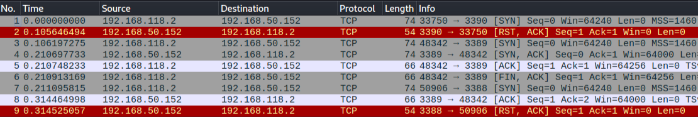
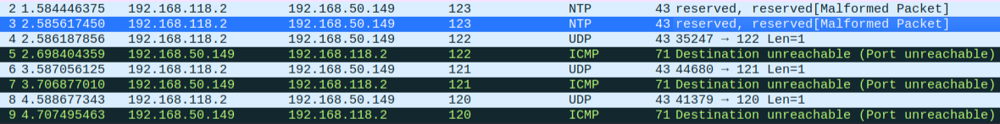

# Port Scanning Techniques
## [TCP](../../networking/protocols/TCP.md) CONNECT Scan
Uses the TCP [3 Way handshake:](../../networking/protocols/TCP.md#3%20Way%20handshake) two hosts who want to communicate negotiate parameters of the connection before establishing it.
### Steps
#### 1. SYN
Initiating server sends a TCP `SYN` packet to the destination server.
#### 2. SYN ACK
The servers responds w/ a `SYN ACK` TCP packet.
#### 3. ACK
The client responds to the server's `SYN ACK` with a `ACK` packet which *completes the handshake*. When the handshake completes, the *server's port is considered open*. 
### CONNECT Scan w/ netcat
We can use [netcat](../../cybersecurity/TTPs/exploitation/tools/netcat.md) as a basic port scanner. To demonstrate a TCP CONNECT scan, use the following command:
```bash
┌──(trshpuppy㉿kali)-[~/oscp/recon]
└─$ nc -nvv -w 1 -z 192.168.45.190 3388-3390
(UNKNOWN) [192.168.45.190] 3390 (?) : Connection refused
(UNKNOWN) [192.168.45.190] 3389 (ms-wbt-server) open
(UNKNOWN) [192.168.45.190] 3388 (?) : Connection refused
 sent 0, rcvd 0
```
This command tells netcat to:
- `-nvv`: `n` use numeric IP addresses only, `vv` output should be double verbose
- `-w`: timeout in seconds for connect read
- `-z`:  zero I/O mode (used for scanning, doesn't send data to server)
- `3388-3390`: the range of ports to scan
In this output, port `3389` is open while the other two ports refused connection. If we were to have run [wireshark](../../cybersecurity/TTPs/recon/tools/scanning/wireshark.md) or ([tcpdump](../../CLI-tools/linux/tcpdump.md)) to capture the TCP traffic, we would have seen something like this:
Packets 1, 3, and 5 are the TCP packets sent by netcat to the server. The TCP `SYN ACK` packet sent by the server in response is shown on item 4. This `SYN ACK` is enough to *determine that the port is open* (port `3389`).

The other ports did not reply with `SYN ACK` but actively *rejected* the connection by sending `RST-ACK` packets (items 2 and 9). Finally, the `FIN-ACK` packet (item 6) was sent by netcat to close the connection.
## UDP Scan
[UDP](../../networking/protocols/UDP.md) is a *stateless* protocol, meaning unlike TCP the hosts involved *do not check w/ each other and establish a connection* before sending packets. UDP is faster than TCP because TCP cares about packet sequence, whether all the packets were received,  whether they're corrupted or not, etc.. Because of this, UDP is used for things like streaming video or in video games. If TCP were used, then packets which arrive out of order would still be received and read by both hosts. For a user watching YouTube, that would mean that if they had a poor connection and a few frames of the video were late, the video would bounce back and forth out of order.

Whereas w/ UDP, neither host cares if all the packets were received or not. So if packets are dropped, thats it. For someone watching YouTube with UDP, dropped frames (caused by UDP packets failing to show up) would just be skipped and the video would continue playing in order (with some missing frames). 
### UDP scanning w/ netcat
Because UDP is stateless, it *doesn't use a 3 way handshake* which means the process for port scanning is different. To UDP scan w/ netcat, use the following command:
```bash
┌──(trshpuppy㉿kali)-[~/oscp/recon]
└─$ nc -nvv -u -z -w 1 192.168.45.190 120-123
(UNKNOWN) [192.168.45.190] 123 (ntp) : open
(UNKNOWN) [192.168.45.190] 122 (?) : Connection refused
(UNKNOWN) [192.168.45.190] 121 (?) : Connection refused
(UNKNOWN) [192.168.45.190] 120 (?) : Connection refused
 sent 0, rcvd 0
```
In this command:
- `-u` tells netcat to use UDP
The wireshark capture of this scan would look something like this:

The scan above shows that netcat used *empty UDP packets* to scan the ports (items 2, 3, 4, 6, and 8). If the destination server's port is open then the packet will be passed *through the [application layer](../../networking/OSI/7-application/application-layer.md)*. If the application is *programmed to respond to empty packets* then it will send a response, indicating that its open. 

If the port sends *no response*,  most port scanners treat that *as open* because closed ports are supposed to respond with an *[ICMP](../../networking/protocols/ICMP.md) port unreachable* packet. However, if the port is *filtered by a [firewall](../../cybersecurity/defense/firewalls.md)* then it may not respond, but that does not mean the port is open. 
## Comparing the two
TCP and UDP scans have their own pitfalls and disadvantages.
### Speed
TCP scans tend to be much faster than UDP scans. Compared to TCP scan, UDP take much longer because, since there is no packet sequence, you end up waiting longer for a response (instead of moving on when there is none like in a TCP scan).
### Traffic
Since TCP scans have to establish a connection using the three way handshake, they tend to create *much more traffic*. This is also because when packets are dropped during a connection, TCP is designed to *retransmit* those packets, whereas UDP doesn't care or track packet drops at all.
### Reliability
TCP scans are much more reliable because there is an established sequence of events/packets which have to occur to establish a connection. UDP is unreliable, especially when it comes to ports protected by a firewall. Good firewalls are configured to ignore UDP packets, which can cause false positives when scanning if the scanning tool considers a non-response as the port being open.

> [!Resources]
> - My [own notes](https://github.com/trshpuppy/obsidian-notes) linked throughout the text.
