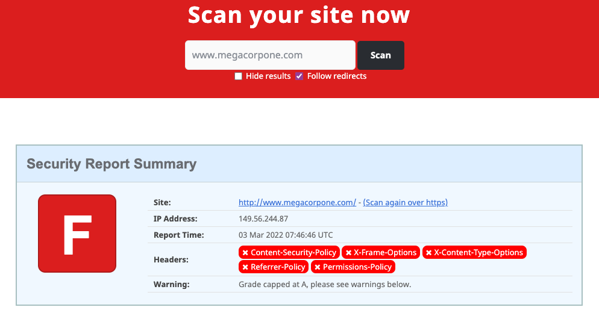
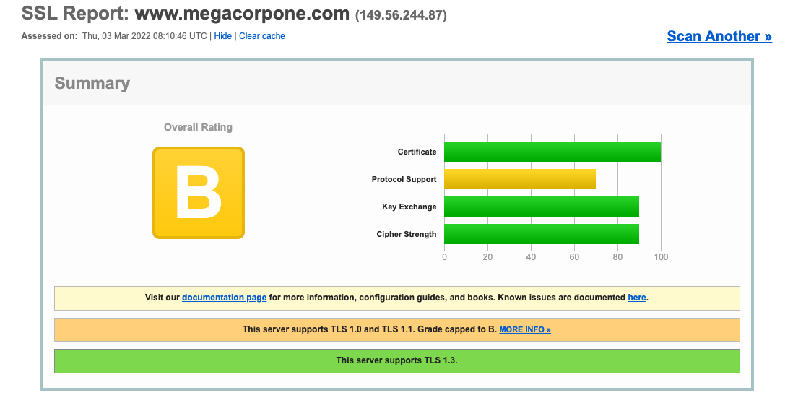

# (PASSIVE) Security Headers and SSL
## Tools
There are a few tools we can use to get an idea of a target server's security and configuration. These tools will help us determine if the developers understand and implement good server hardening practices.
### Server Hardening
Server hardening is the practice of securing a server through various configurations. You can harden a server through many ways like disabling unneeded services, removing unused content or user accounts, rotating passwords, setting correct server headers, etc.. 
### Security Headers
[Security Headers](https://securityheaders.com/) is a site which will scan a target website and analyze the [HTTP](../../www/HTTP.md) response headers.

A site like this one scoring an F may indicate that its developers *have poor server hardening practices*. This site is failing because it is missing some *defensive headers* like `Content-Security-Policy` and `X-Frame-Options`.
### Qualys SSL Labs
[Qualys SSL Labs](https://www.ssllabs.com/ssltest/) provides an SSL Server Test which is a tool that analyzes [SSL](../../networking/protocols/SSL.md)/[TLS](../../networking/protocols/TLS.md) configuration of a site and compares it to best practice guidelines. It will also point out vulnerabilities related to misconfigured SSL/TLS.

This site is getting a B because the server supports TLS 1.0 and 1.1 which are considered insecure. This indicates that the developers are not following best practices for TLS and SSL hardening.

> [!Resources]
> - [Security Headers](https://securityheaders.com/)  
> - [Qualys SSL Labs](https://www.ssllabs.com/ssltest/) 
> - My [own notes](https://github.com/trshpuppy/obsidian-notes) linked throughout the text.
