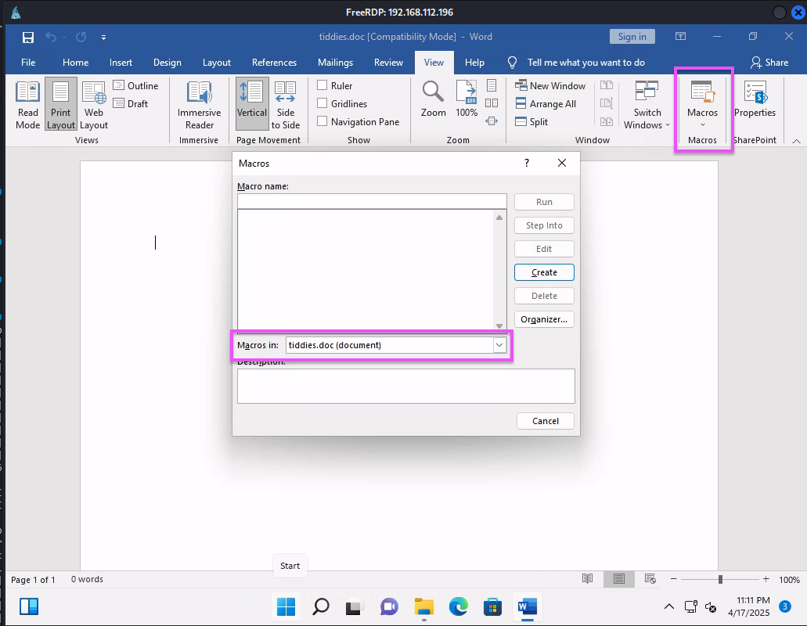
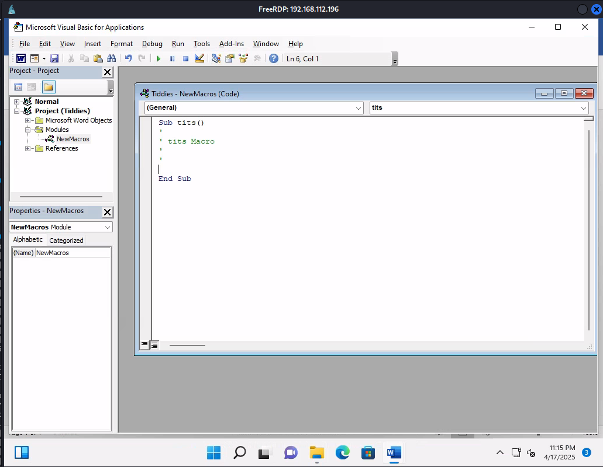
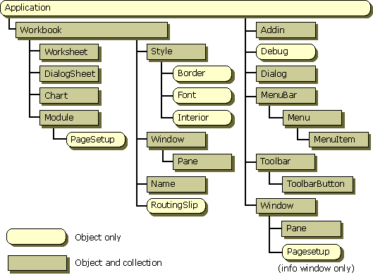

# Leveraging Macros in MS Word
Macros are commands and instructions grouped together which some Office products let usters enabled. Macros are written in [VBA](../../coding/languages/VBA.md) which provides *full access to ActiveX and Windows Scrpt Host*. 
## Creating a Macro
Create a blank Word document and give it a name. Make sure it's saved as a `.doc` (not `.docx` which won't allow you to save the macro in the document). You could also use `.docm`. In the Macros dialog window (under the `View` tab) select your document to make sure the macro gets saved to it (*rather than the global template*).
Give your macro a name and hit `Create`. Then you'll be met with the VBA window where you can write your macro:

## Macro Structure
The main "sub procedure" of our macro is the `Sub` token with the name we gave the macro (`tits` in this case).  Sub procedures are similar to functions in programming, except *they do not return anything*. 

Our `tits` sub procedure ends with the `End Sub` token. Everything in between is the body of our `tits()` macro/ sub procedure.
### ActiveX Objects
Active X Objects ("ActiveX controls") are instances of a class which exposes Microsoft Excel properties, methods, and events to an ActiveX client (similar to [Objects](../../coding/languages/javascript.md#Objects) in JavaScript). In Microsoft Excel, objects are organized *into a hierarchy* with the top-most object called the "Application."

#### Windows Script Host Shell object
The Windows Script Host Shell (WshShell) object is an ActiveX object which provides *access to the native Windows shell*. Using the properties and methods attached to the WshShell object, you can use it to run a program locally, manipulate the registry, create shortcuts, access system folders, etc.. It also allows you to handle environment variables including `WINDIR`, `PATH`, `PROMPT`, etc..
## Using our Macro to Start a PowerShell Window
In our macro, we can use the `CreateObject` function to *instantiate* a Windows Script Host Shell Object.
```vb
Sub tits()
	Dim wshShellObj As Object
	Set wshShellObj = CreateObject("Wscript.Shell")
End Sub
```
Once the object is instantiated, we can invoke its `Run` method to launch an application on the victim's machine, in this case, [powershell](../../computers/windows/powershell.md):
```vb
Sub tits()
	Dim wshShellObj As Object
	Set wshShellObj = CreateObject("Wscript.Shell")

	wshShellObj.Run "powershell"
End Sub
```
To check if this is working, press the green run button.
### Auto-Execution
Since our target is not going to manually open the VBA window, and hit the green run button, we need to add more code to make sure the macro is triggered to run *automatically*. Fortunately, Excel has a predefined `AutoOpen` macro and a `Document_Open` event which we can use. They both differ in ways that complement each other, so we'll use both to make sure our macro triggers.


> [!Resources]
> - [Microsoft: WshShell Object](https://learn.microsoft.com/en-us/previous-versions/windows/internet-explorer/ie-developer/windows-scripting/aew9yb99(v=vs.84))
> - [Microsoft Learn: ActiveX Objects](https://learn.microsoft.com/en-us/previous-versions/windows/desktop/automat/activex-objects)