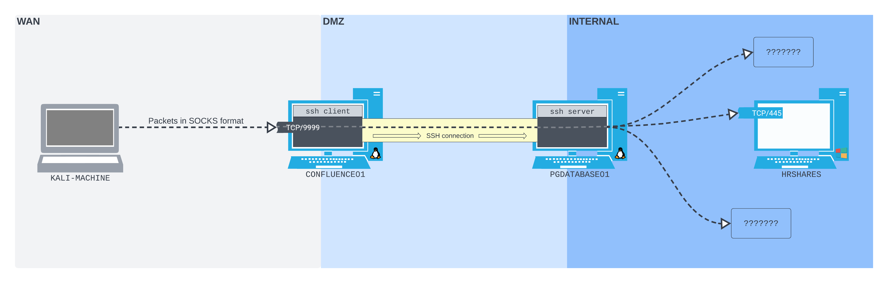

---
aliases:
  - dynamic port forwarding
  - SOCKS
---

# SSH Dynamic Port Forwarding
[Local port forwarding](local-port-forwarding.md) has an important *limitation*: you can only use *one socket per [SSH](../../../networking/protocols/SSH.md) connection*, which makes it difficult to use at scale. Fortunately, Open SSH also provides *Dynamic port forwarding* from a single listening port *on the SSH client*. 

With Dynamic forwarding, packets can be forwarded *to any address the SSH server has access to*. That's because the SSH client's listening port acts as a [_SOCKS_](https://en.wikipedia.org/wiki/SOCKS) proxy server port. SOCKS is a *[proxy](../../../networking/design-structure/proxy.md)ing* protocol. It accepts packets and (if they have a SOCKS header) forwards them to wherever they're addressed-- similar to a postal service:

The biggest limitation to dynamic port forwarding through SOCKS is that the packets *have to be properly formatted*. This means that you need access to SOCK-compatible software on the client.
## Scenario
Assume the same scenario as in the [local-port-forwarding](local-port-forwarding.md) notes, but this time, instead of just connecting to the [SMB](../../../networking/protocols/SMB.md) service on `HRSHARES`, we also want to do a full [port scan](../../enum-and-info-gathering/active/port-scanning.md). First, we can spawn a [TTY](../../../computers/linux/terminal-tty-shell.md) using python:
```bash
confluence@confluence01:/opt/atlassian/confluence/bin$ python3 -c 'import pty; pty.spawn("/bin/sh")'
</bin$ python3 -c 'import pty; pty.spawn("/bin/sh")'
```
Once we're in the new bash TTY, then we can use `ssh` with the `-D` flag to setup a *dynamic port forward*, giving it the IP address and port we want to bind to. Based on our diagram, we want to open port `9999` on `CONFLUENCE01` and configure it to listen *on all interfaces* (`0.0.0.0`). Unlike the local port forwarding command, *we don't have to give it the address to forward traffic to*. Don't forget `-N` to prevent a shell from being spawned upon connection:
```bash
$ ssh -N -D 0.0.0.0:9999 database_admin@10.4.50.215
<$ ssh -N -D 0.0.0.0:9999 database_admin@10.4.50.215   
Could not create directory '/home/confluence/.ssh'.
The authenticity of host '10.4.50.215 (10.4.50.215)' can't be established.
ECDSA key fingerprint is SHA256:K9x2nuKxQIb/YJtyN/YmDBVQ8Kyky7tEqieIyt1ytH4.
Are you sure you want to continue connecting (yes/no/[fingerprint])? yes
yes
Failed to add the host to the list of known hosts (/home/confluence/.ssh/known_hosts).
database_admin@10.4.50.215's password:
```
### Connecting Thru the SOCKS Proxy
Now that our SOCKS proxy connection is setup, we can connect to it from our Kali machine. We can start by connecting to the `HRSHARES` SMB service (port `445`) but instead of using [smbclient](../../../CLI-tools/linux/remote/smbclient.md) like we did last time, we'll have to use something else. This is because `smbclient` *doesn't support SOCKS connections*.

If we try to use smbclient, it wouldn't know *how to handle traffic encapsulated with the SOCKS protocol* format. However, we **CAN** use `smbclient` if we leverage [_Proxychains_](https://github.com/rofl0r/proxychains-ng). Proxychains is a tool which is usually used to send traffic *over a concurrent chain of [proxies](../../../networking/design-structure/proxy.md)* (and can be used to circumvent censorship in whack-ass countries like N.K.!). But it can also be used to force network traffic from tools like `smbclient` over [HTTP](../../../www/HTTP.md) or SOCKS.  


> [!Resources]
> - [_SOCKS_](https://en.wikipedia.org/wiki/SOCKS)
> - [_Proxychains_](https://github.com/rofl0r/proxychains-ng)