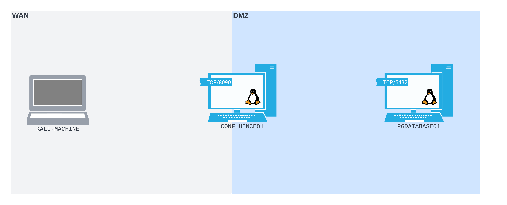

# A Port Forwarding Scenario on Linux
Assume that during a pentest assessment, we find a [Linux](../../../computers/linux/README.md) web server running [_Confluence_](https://www.atlassian.com/software/confluence) with a version that is vulnerable to [_CVE-2022-26134_](https://confluence.atlassian.com/doc/confluence-security-advisory-2022-06-02-1130377146.html). This vulnerability leads to remote code execution *without authentication* and with it, we can gain a [rev-shell](../../../cybersecurity/TTPs/exploitation/rev-shell.md) on the server. 

Once on the server, we start our enumeration and find two network interfaces. One is attached *to the same network as our attacking machine* (allowing us to remote in), and the other *is on an internal [subnet](../../../PNPT/PEH/networking/subnetting.md). 

Assume in the Confluence config file on the server, we find creds an the [IP address](../../../networking/OSI/3-network/IP-addresses.md) + port for a PostgreSQL [database](../../../coding/databases/DBMS.md) instance. The instance is hosted on a server on an internal subnet.

If we want to use the creds to access the Postgres server, then we need to find a way to *access the internal subnet*. Right now, our understanding of the network and our current situation looks something like this:

Notice that the Postgres server is within the [DMZ](../../../networking/design-structure/DMZ.md) and our attacking machine is in the [WAN](../../../networking/design-structure/WAN.md) (Wide Area Network). The Confluence server (the one we compromised) can *communicate on both networks* and has a listening [TCP](../../../networking/protocols/TCP.md) port of `8090`. In this situation, the DMZ is serving as a buffer zone between the WAN (internet in this case), and the *actual* internal network.

Since our kali attacking machine is not in the DMZ, *we don't have direct access to the Postgres server*.

This is the kind of situation where we can use [port-forwarding](../../../networking/routing/port-forwarding.md) to gain access from one compromised machine to another machine on a network we can't access directly. 
## General Steps
In general, we want to use our access to the Confluence server to gain access to the more internal Postgres server. Since we've compromised the Confluence server, there is nothing stopping us from *binding ports on its WAN* interface. 

Once we bind a port on the WAN interface, we can then use port forwarding to *forward incoming packets to the port to the Postgres server* on the internal/DMZ subnet. 

(See [port forwarding with socat](socat.md))

> [!Resources]
> - [_CVE-2022-26134_](https://confluence.atlassian.com/doc/confluence-security-advisory-2022-06-02-1130377146.html)
> - My [own notes](https://github.com/trshpuppy/obsidian-notes) linked throughout the text.