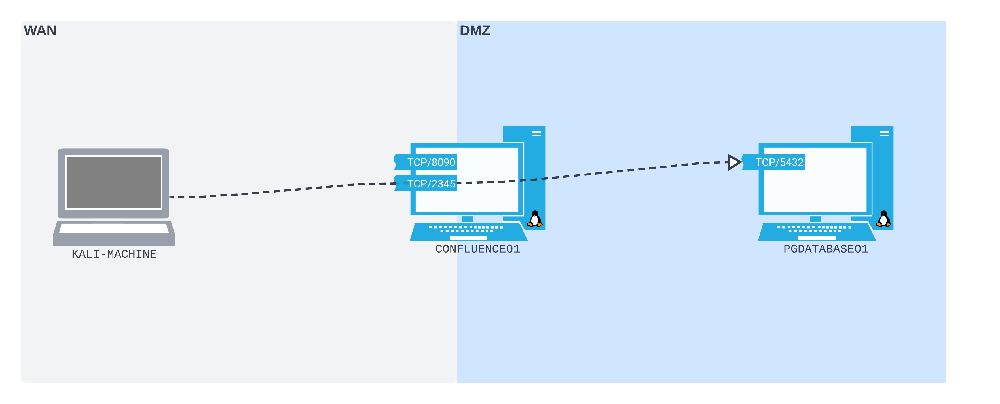

# Port Forwarding With Socat
> [!Note]
> For these notes, we're using the scenario described [here](port-forwarding-scenario.md).

Before breaking out socat, we should have a diagram of what we want to achieve. We want `CONFLUENCE01` (the Confluence server we compromised) to have a [port](../../../networking/routing/ports.md) on its [WAN](../../../networking/design-structure/WAN.md) interface which is configured to listen for any packets received on that port. 

Any packets it receives we want it to forward to `PGDATABASE01` (the Postgres database on the internal/[DMZ](../../../networking/design-structure/DMZ.md) subnet):

## Socat
[_Socat_](http://www.dest-unreach.org/socat/doc/socat.html) is a general-purpose networking tool which we can use to configure our port forwarding. Assume we've found that `socat` is installed on `CONFLUENCE01`. In a situation where `socat` is *not installed*, we can download the statically linked binary version instead.
### Socat Command
To open the listening port on `CONFLUENCE01` and configure it to forward traffic to port `5432` on `PGDATABASE01`, we can use the following `socat` command:
```bash
socat -ddd TCP-LISTEN:2345,fork TCP:10.4.50.215:5432
  
2022/08/18 10:12:01 socat[46589] I socat by Gerhard Rieger and contributors - see www.dest-unreach.org
2022/08/18 10:12:01 socat[46589] I This product includes software developed by the OpenSSL Project for use in the OpenSSL Toolkit. (http://www.openssl.org/)
2022/08/18 10:12:01 socat[46589] I This product includes software written by Tim Hudson (tjh@cryptsoft.com)
2022/08/18 10:12:01 socat[46589] I setting option "fork" to 1
2022/08/18 10:12:01 socat[46589] I socket(2, 1, 6) -> 5
2022/08/18 10:12:01 socat[46589] I starting accept loop
2022/08/18 10:12:01 socat[46589] N listening on AF=2 0.0.0.0:2345
```
- `-ddd`: verbosity
- `TCP-LISTEN:2345`: open [TCP](../../../networking/protocols/TCP.md) port `2345` on the any interface `0.0.0.0`
- `fork`: fork the traffic *into a new subprocess* (prevent connection from dying after a single connection)
- `TCP:10.4.50.215:5432`: (fork) the traffic to `PGDATABASE01` port `5432`
### Connecting from Kali
Now that `socat` has created the listening port on `CONFLUENCE01` and configured it to port forward to `PGDATABASE01`, we can use `psql` on our attacking box to establish a connection to the Postgres database (assume we have the password for the database after enumerating `CONFLUENCE01`):
```bash
psql -h 192.168.50.63 -p 2345 -U postgres

Password for user postgres: 
psql (14.2 (Debian 14.2-1+b3), server 12.11 (Ubuntu 12.11-0ubuntu0.20.04.1))
SSL connection (protocol: TLSv1.3, cipher: TLS_AES_256_GCM_SHA384, bits: 256, compression: off)
Type "help" for help.

postgres=# \l
                                  List of databases
    Name    |  Owner   | Encoding |   Collate   |    Ctype    |   Access privileges   
------------+----------+----------+-------------+-------------+-----------------------
 confluence | postgres | UTF8     | en_US.UTF-8 | en_US.UTF-8 | 
 postgres   | postgres | UTF8     | en_US.UTF-8 | en_US.UTF-8 | 
 template0  | postgres | UTF8     | en_US.UTF-8 | en_US.UTF-8 | =c/postgres          +
            |          |          |             |             | postgres=CTc/postgres
 template1  | postgres | UTF8     | en_US.UTF-8 | en_US.UTF-8 | =c/postgres          +
            |          |          |             |             | postgres=CTc/postgres
(4 rows)
```

> [!Resources]
> - [_Socat_](http://www.dest-unreach.org/socat/doc/socat.html)
> - My [own notes](https://github.com/trshpuppy/obsidian-notes) linked throughout the text.