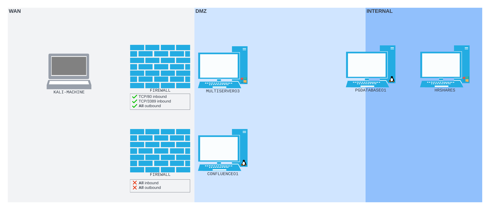
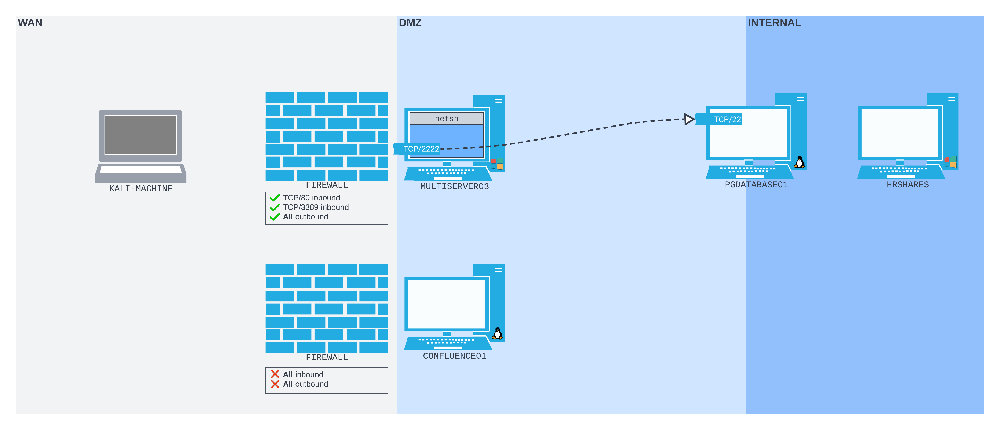

# Using `netsh` on Windows
[_Netsh_](https://docs.microsoft.com/en-us/windows-server/networking/technologies/netsh/netsh) (also known as _Network Shell_) is a native way to do [port forwarding](../../../networking/routing/port-forwarding.md) on [Windows](../../../computers/windows/README.md). It requires *Administrative privileges* but despite that, can be very useful in restrictive environments.
## Scenario
Assume we're using the same scenario as in the [plink](plink.md) notes, but this time the [firewall](../../../cybersecurity/defense/firewalls.md) allows inbound connections to port `3389` on `MULTISERVER03` as well as to port `80`. 

If we want to be able to [SSH](../../../networking/protocols/SSH.md) into `PGDATABASE01` on the internal network, then we need to create a port forward on `MULTISERVER03` which will forward packets sent to its [WAN](../../../networking/design-structure/WAN.md) interface to the SSH port on `PGDATABASE01`.

We can use the [_portproxy_](https://docs.microsoft.com/en-us/windows-server/networking/technologies/netsh/netsh-interface-portproxy) [_subcontext_](https://docs.microsoft.com/en-us/windows-server/networking/technologies/netsh/netsh-contexts#subcontexts) of netsh to do this. This command *requires admin privileges* which means we need to consider Windows' [UAC](../../windows-privesc/security-mechanisms/UAC.md) whenever we want to use netsh. Fortunately in this scenario, assume we have access to an account with admin privileges already.
### RDP into `MULTISERVER03`
First we need to [RDP](../../../networking/protocols/RDP.md) into `MULTISERVER03` from our Kali machine. Assume we already have the credentials:
```bash
kali@kali:~$ xfreerdp /u:rdp_admin /p:P@ssw0rd! /v:192.168.50.64
[07:48:02:576] [265164:265165] [WARN][com.freerdp.crypto] - Certificate verification failure 'self signed certificate (18)' at stack position 0
[07:48:02:577] [265164:265165] [WARN][com.freerdp.crypto] - CN = MULTISERVER03
[07:48:03:685] [265164:265165] [ERROR][com.winpr.timezone] - Unable to find a match for unix timezone: US/Eastern
[07:48:03:886] [265164:265165] [INFO][com.freerdp.gdi] - Local framebuffer format  PIXEL_FORMAT_BGRX32
[07:48:03:886] [265164:265165] [INFO][com.freerdp.gdi] - Remote framebuffer format PIXEL_FORMAT_BGRA32
[07:48:03:940] [265164:265165] [INFO][com.freerdp.channels.rdpsnd.client] - [static] Loaded fake backend for rdpsnd
[07:48:03:940] [265164:265165] [INFO][com.freerdp.channels.drdynvc.client] - Loading Dynamic Virtual Channel rdpgfx
``` 
### Running `netsh`
Once we have the GUI from RDP, we can open a command prompt as admin and use the `netsh` command. `netsh` offers a few contexts. The one we're going to use is the `interface` context. With this context, we're going to instruct `netsh` to add a "portproxy" rule from an [IPv4](../../../networking/OSI/3-network/IP-addresses.md#IPv4%20vs%20IPv6) listener forwarded to an IPv4 port ("v4tov4").

The listener port will be port `2222` on the WAN interface of `MULTISERVER03`. The port we forward packets to will be port `22` on `PGDATABASE01`:
```powershell
C:\Windows\system32>netsh interface portproxy add v4tov4 listenport=2222 listenaddress=192.168.50.64 connectport=22 connectaddress=10.4.50.215

C:\Windows\system32>
```
#### Verify Port Forward
Since we don't get output from the above command, we can use `netstat` to confrim that port `2222` is listening on our Windows machine:
```powershell
C:\Windows\system32>netstat -anp TCP | find "2222"
  TCP    192.168.50.64:2222     0.0.0.0:0              LISTENING

C:\Windows\system32>
```
We can also use the `show all` command in the `netsh` interface portproxy context to *confirm the port forward*:
```powershell
C:\Windows\system32>netsh interface portproxy show all

Listen on ipv4:             Connect to ipv4:

Address         Port        Address         Port
--------------- ----------  --------------- ----------
192.168.50.64   2222        10.4.50.215     22
```
Now that the listener and the port forward are set up, our situation looks something like this:

### Using the Port Forward
In order to use our new port forward, we need to be able to *connect to port `2222` from our external Kali machine*. Unfortunately, the firewall is configured to only allow connections to port `3389` and `80` on `MULTISERVER03`.

If we were to use [nmap](../../../CLI-tools/linux/remote/nmap.md) to [port scan](../../enum-and-info-gathering/active/port-scanning.md) `MULTISERVER03` we'd see that port `2222` is *filtered*:
```bash
kali@kali:~$ sudo nmap -sS 192.168.50.64 -Pn -n -p2222
Starting Nmap 7.92 ( https://nmap.org ) at 2022-07-21 06:27 EDT
Nmap scan report for 192.168.50.64
Host is up (0.00055s latency).

PORT     STATE    SERVICE
2222/tcp filtered EtherNetIP-1
MAC Address: 00:0C:29:A9:9F:3D (VMware)

Nmap done: 1 IP address (1 host up) scanned in 0.50 seconds
```
Fortunately, `netsh` is a. *firewall configuration tool* and we have admin rights!
#### `netsh advfirewall firewall` Subcontext
To create a hole through the firewall, we can use the `netsh advfirewall firewall` subcontext. With this context, we can *create a firewall rule* to allow connections to port `2222` on `MULTISERVER03`. 
> [!Note]
> You need to get rid of any rules you create after you're done, so give the rule a descriptive name!
```powershell
C:\Windows\system32> netsh advfirewall firewall add rule name="port_forward_ssh_2222" protocol=TCP dir=in localip=192.168.50.64 localport=2222 action=allow
Ok.

C:\Windows\system32>
```
The `Ok.` response verifies that our rule was added successfully.
#### Verify new rule
If we port scan `MULTISERVER03` again, we should see that port `2222` is now *open*:
```bash
kali@kali:~$ sudo nmap -sS 192.168.50.64 -Pn -n -p2222
Starting Nmap 7.92 ( https://nmap.org ) at 2022-07-21 06:28 EDT
Nmap scan report for 192.168.50.64
Host is up (0.00060s latency).

PORT     STATE SERVICE
2222/tcp open  EtherNetIP-1
MAC Address: 00:0C:29:A9:9F:3D (VMware)

Nmap done: 1 IP address (1 host up) scanned in 0.23 seconds
```
#### Connect
Now all we have to do is SSH into `PGDATABASE01` as if we have a direct connection to it from our Kali machine:
```bash
kali@kali:~$ ssh database_admin@192.168.50.64 -p2222
The authenticity of host '[192.168.50.64]:2222 ([192.168.50.64]:2222)' can't be established.
ED25519 key fingerprint is SHA256:3TRC1ZwtlQexLTS04hV3ZMbFn30lYFuQVQHjUqlYzJo.
This host key is known by the following other names/addresses:
    ~/.ssh/known_hosts:5: [hashed name]
Are you sure you want to continue connecting (yes/no/[fingerprint])? yes
Warning: Permanently added '[192.168.50.64]:2222' (ED25519) to the list of known hosts.
database_admin@192.168.50.64's password: 
Welcome to Ubuntu 20.04.4 LTS (GNU/Linux 5.4.0-122-generic x86_64)

 * Documentation:  https://help.ubuntu.com
 * Management:     https://landscape.canonical.com
 * Support:        https://ubuntu.com/advantage

  System information as of Sun 21 Aug 2022 10:40:26 PM UTC

  System load:  0.0               Processes:               231
  Usage of /:   60.9% of 7.77GB   Users logged in:         0
  Memory usage: 16%               IPv4 address for ens192: 10.4.50.215
  Swap usage:   0%                IPv4 address for ens224: 172.16.50.215


0 updates can be applied immediately.


Last login: Sat Aug 20 21:47:47 2022 from 10.4.50.63
database_admin@pgdatabase01:~$
```
### Deleting the rule
To delete the rule we made for the firewall we can use the `netsh advfirewall firewall` subcontext with the `delete` command this time. When we made the rule, we named it `port_forward_ssh_2222`. We have to give that same name for the `delete` command:
```powershell
C:\Users\Administrator>netsh advfirewall firewall delete rule name="port_forward_ssh_2222"

Deleted 1 rule(s).
Ok.
```
### Deleting the port forward
I'm so bored, here...
```powershell
C:\Windows\Administrator> netsh interface portproxy del v4tov4 listenport=2222 listenaddress=192.168.50.64

C:\Windows\Administrator>
```