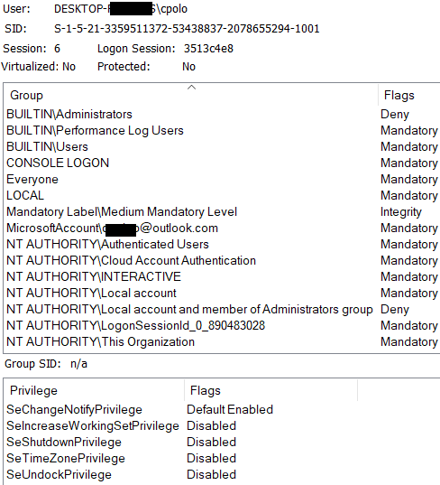

---
aliases:
  - access tokens
  - Windows Access Tokens
  - Access Tokens
---
# Access Tokens
Once a user is authenticated, Windows generates an access token and assigns it to the user and their current session. The access token *contains info* pertaining to the *security context* of the user. The security context is made up of a few rules and attributes which are in effect for the user:
- the [SID](SID.md) of the user
- the SID of *the current logon session*
- *SIDs of the groups* they belong to
- the user's privileges
- the groups' privileges
- the scope of the token

You can view information about your access token by using `whoami /all`
```cmd
whoami /all

USER INFORMATION
----------------
User Name             SID
===================== ============================================
desktop-rgfrdxl\cpolo S-1-5-21-3359511372-53430657-2078432294-1001

GROUP INFORMATION
-----------------
...
```
You can also see it in the GUI by using the Process Explorer from Sysinternals by selecting a specific process and clicking the "Security" tab:

## Local Administrator
When a local admin logs in, *two access tokens are created*. One of the tokens *has admin rights* and the other has normal rights. When the local admin user executes a process, the process adopts *the regular token* by default.

If the user executes a process with admin rights (i.e. "Run as Administrator) the [UAC](UAC.md) will *prompt the user for permission* (and ask for their pin/password)
## Types of Tokens
### Primary Tokens
Every process executed by or on behalf of the user *has a copy of their access token*. Once a user starts a process or thread, *a token will be assigned to it*. This token is called a *primary token*. This token determines the permissions the thread or process has when interacting w/ other objects. The primary token *copies the user's access token*. 

Creating and associating primary access tokens w/ processes *requires elevated privileges* and there are two services which handle each task:
- *"Authentication service"* is responsible for creating the token
- *"Logon service"* is responsible for associating the token with the user's operating system shell
### Impersonation Tokens
Threads can be assigned impersonation tokens which are used to *provide a different security context* from the process' (which owns the thread). The thread uses the impersonation token to interact with processes *on behalf of the impersonation token* instead of on behalf of the process' token. 

Server applications can use impersonation tokens to *adopt the client's identity* (temporarily). This allows them to access secure objects via *four levels of operation*:
1. **Anonymous**: grants the server access equal to that of an unidentified user
2. **Identification**: allows the server to verify the client's identity without using it for system access
3. **Impersonation**: allows the server to operate under the client's identity
4. **Delegation**: same as Impersonation but also allows the server to *extend the impersonated identity to remote systems* while ensuring credential preservation

> [!Resources]
> - [Microsoft: Impersonation Tokens](https://learn.microsoft.com/en-us/windows/win32/secauthz/impersonation-tokens)
> - [HackTricks: Access Tokens](https://book.hacktricks.wiki/en/windows-hardening/windows-local-privilege-escalation/access-tokens.html)
> - My [own notes](https://github.com/trshpuppy/obsidian-notes) linked throughout the text.