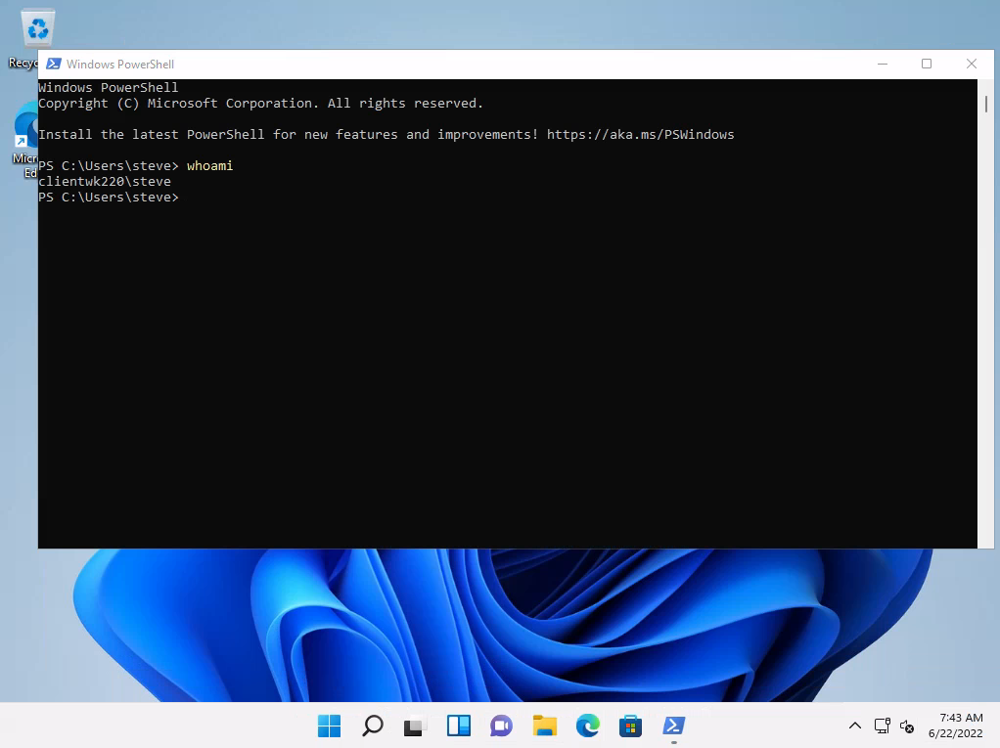

# Files Hidden in Plain View
> [!Note]
> For these notes the assumption is we've used a client-side attack to gain access via a [bind-shell](../../cybersecurity/TTPs/exploitation/bind-shell.md) running on port `44444`. The system is called `CLIENTWK220`, and the account we've compromised is `dave`. 

Even though there is a password manager app on our compromised machine (which we found via [enumeration](enumeration.md)),  most users *are lazy* and will often save sensitive information to easy to access files, such as a `note.txt` on the Desktop. So, we should do our best to look around the filesystem we have access to for tidbits like this. 
## Where to Start
From enumerating, we know that both KeePass and XAMPP are installed on the system. A good place to start is looking for password [databases](../../coding/databases/DBMS.md) and configuration files on the machine.
### KeePass Database files
To search for this kind of file, we can use `Get-ChildItem` with a `-Include` flag set to `.kdbx` (which is the filetype for KeePass password manager databases). Note that we're searching *recursively* through the `C:\` directory:
```powershell
PS C:\Users\dave> Get-ChildItem -Path C:\ -Include *.kdbx -File -Recurse -ErrorAction SilentlyContinue
...
```
Unfortunately, there's nothing.
### Searching for Config Files in XAMPP
We'll run the same cmdlet, but this time giving the `-Path` for the XAMPP directory, and setting `-Include` to `.txt` and `.ini` filetypes (based on the [documentation](https://www.apachefriends.org/docs/))
```powershell
PS C:\Users\dave> Get-ChildItem -Path C:\xampp -Include *.txt,*.ini -File -Recurse -ErrorAction SilentlyContinue
...
Directory: C:\xampp\mysql\bin
Mode                 LastWriteTime         Length Name
----                 -------------         ------ ----
-a----         6/16/2022   1:42 PM           5786 my.ini
...
Directory: C:\xampp
Mode                 LastWriteTime         Length Name 
----                 -------------         ------ ----  
-a----         3/13/2017   4:04 AM            824 passwords.txt
-a----         6/16/2022  10:22 AM            792 properties.ini     
-a----         5/16/2022  12:21 AM           7498 readme_de.txt 
-a----         5/16/2022  12:21 AM           7368 readme_en.txt     
-a----         6/16/2022   1:17 PM           1200 xampp-control.ini  
```
So far, the two interesting files we've found are `passwords.txt` and `my.ini` which is a [mysql](../../CLI-tools/linux/mysql.md) configuration file. We can use the `type` [Windows](../../computers/windows/README.md) command to print the files' contents to the command line:
```powershell
PS C:\Users\dave> type C:\xampp\passwords.txt
### XAMPP Default Passwords ###

1) MySQL (phpMyAdmin):
   User: root
   Password:
   (means no password!)
...
   Postmaster: Postmaster (postmaster@localhost)
   Administrator: Admin (admin@localhost)

   User: newuser  
   Password: wampp 
...

PS C:\Users\dave> type C:\xampp\mysql\bin\my.ini
type : Access to the path 'C:\xampp\mysql\bin\my.ini' is denied.
At line:1 char:1
+ type C:\xampp\mysql\bin\my.ini
+ ~~~~~~~~~~~~~~~~~~~~~~~~~~~~~~
    + CategoryInfo          : PermissionDenied: (C:\xampp\mysql\bin\my.ini:String) [Get-Content], UnauthorizedAccessEx 
   ception
    + FullyQualifiedErrorId : GetContentReaderUnauthorizedAccessError,Microsoft.PowerShell.Commands.GetContentCommand
```
From the output we've only found the *default passwords* for XAMPP. Plus, we've learned we *don't have permission* to view the contents in `C:\xampp\mysql\bin\my.ini` (as the user `dave`).
### User Home Directory
Next lets search for documents and text files in `dave`'s home directory:
```powershell
PS C:\Users\dave> Get-ChildItem -Path C:\Users\dave\ -Include *.txt,*.pdf,*.xls,*.xlsx,*.doc,*.docx -File -Recurse -ErrorAction SilentlyContinue

    Directory: C:\Users\dave\Desktop
Mode                 LastWriteTime         Length Name  
----                 -------------         ------ ----    
-a----         6/16/2022  11:28 AM            339 asdf.txt 
```
Let's use `cat` this time to print the `asdf.txt` file content to the command line (technically both `cat` and `type` are *aliases* for the `Get-Content` cmdlet)
```powershell
PS C:\Users\dave> cat Desktop\asdf.txt
notes from meeting:

- Contractors won't deliver the web app on time
- Login will be done via local user credentials
- I need to install XAMPP and a password manager on my machine 
- When beta app is deployed on my local pc: 
Steve (the guy with long shirt) gives us his password for testing
password is: securityIsNotAnOption++++++
```
Nice, we found a password for some guy named "Steve." From enumeration, we know that there is a user account called `steve` on the system. We can use `net user` again to find out more about `steve` the user account:
```
PS C:\Users\dave> net user steve
User name                    steve
...
Last logon                   6/16/2022 1:03:52 PM
Logon hours allowed          All
Local Group Memberships      *helpdesk             *Remote Desktop Users 
                             *Remote Management Use*Users                
...
```
From this we can see `steve` is a member of `Remote Desktop Users` which means he can *login to this system using [RDP](../../networking/protocols/RDP.md)*. 
## New User Access
Let's see if we can login to the system using his username and the password we found in `asdf.txt` via RDP:

Now that we've accessed the system as a different user, we need to *start the enumeration process over again*. This is part of the *cyclical process* that is penetration testing. Once you've gained a new level of access, or discovered a new system, etc. you need to re-evaluate the situation and include any new information so you can identify *potential new attack vectors*.

We can start by re-evaluating our permissions and privileges as this new user `steve`. For example, let's check if we can access the config file `dave` was unable to access:
```powershell
PS C:\Users\steve> type C:\xampp\mysql\bin\my.ini
# Example MySQL config file for small systems.
...

# The following options will be passed to all MySQL clients
# backupadmin Windows password for backup job
[client]
password       = admin123admin123!
port=3306
socket="C:/xampp/mysql/mysql.sock"
```
Since the `steve` account does have access to the file, we can see its contents which includes the password for the `backupadmin` user's MySQL password.
### `Runas`
Since we have GUI access via RDP, we can try to use `Runas` to try and run a program as a different user.  `Runas` can be used for any account *as long as it has the ability to log in to the system*. Without a GUI, we can't use `Runas` because `Runas` will immediately display a password prompt. This password prompt *does not accept passwords issued from a shell*.

> [!Resources]
> - [Apache XAMPP Docs](https://www.apachefriends.org/docs/)