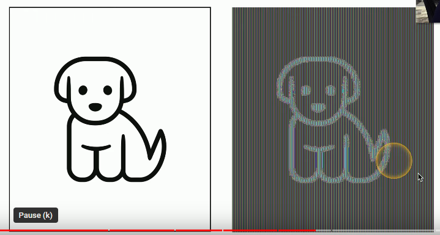
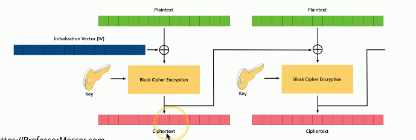
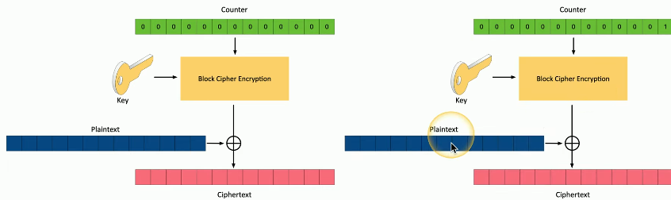

# Block Ciphers
Encrypts a *fixed length of information at a time*. Usually with lengths of *64 bit* or *128 bit*, etc.. If the input data *is less than the block amount* (for example, only 37 bits for a 64 bit block), then *padding is added* to make the input the same length.
## Modes of Operation
There are many ways to encrypt a block of data, each method is referred to as a *mode of operation*. Some methods may be able to provide *authentication* as well. Additionally, some modes will require padding while other won't to account for input data of different lengths.
### Electronic Codebook (ECB)
This is the *simplest* encryption mode. It has a single encryption key and encrypts each block of data *in the same way*. This means that identical plaintext blocks result in *identical ciphertext blocks*. This mode is too simple for most use cases. The method is SO simple, that the ciphered text *can easily be reversed*:
 

 
### Cipher Block Chaining (CBC)
With CBC, each plaintext block is *XOR'd with the previous **ciphertext** block*.  An *initialization vector* is added as the first block so that the first block of *real data* has something to be XOR'd with. This method increases randomization and is popular to use. It's also *easy to implement*.

### Counter (CTR)
Uses an incremental counter to add to the randomization to the process. First, the counter is *encrypted using block cipher encryption*. Then, the ciphered counter is *XOR'd* against the plaintext block which produces the end cipher text. 

The next block of plaintext is encrypted the same way, but first, *the counter has to be incremented again*.

### Galois/ Counter Mode (GCM)
This mode of encryption is able to *provide authentication* by combining encryption w/ "Galois Authentication". This method is very efficient at both encryption and authentication b/c it causes *minimum latency and overhead*. This is commonly used in *packetized data*, including:
- Network traffic (wireless, IPsec)
- [SSH](../../../networking/protocols/SSH.md)
- [TLS](../../../networking/protocols/TLS.md)
 

> [!Resources]
> - [Professor Messer](https://www.youtube.com/watch?v=bEOrdqLB1Io&list=PLG49S3nxzAnkL2ulFS3132mOVKuzzBxA8&index=98)

