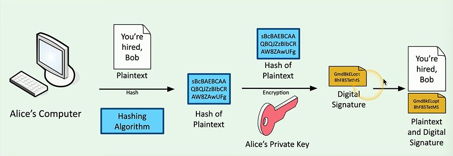
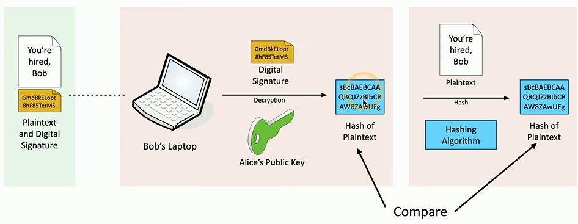

# Hashing
Hashing is the process of creating a hash-value by putting data through an algorithm. Every piece of data produces a unique hash (with some overlap), and the hash becomes a unique fingerprint for that data.

Any type of data can be hashed including passwords, photos, entire applications, etc.. The algorithm produces a *numeric* value of fixed length which uniquely identifies the data.
## Functions
Hashing functions take an input *of any size* and create a string of fixed size from it. Changing even a single part of the input will generate *a completely different hash*. However, collisions can occur, which means two different inputs *result in the same hash*. When this happens, the hashing algorithm *is not cryptographically secure.*
## Common Hashing Algorithms:
### MD5 (Message Digest)
This algorithm is defined by `RFC 1321`. It's a cryptographic hash function which produces a 128-bit hash value. **NOT CONSIDERED CRYPTOGRAPHICALLY SECURE** because collisions are common.

MD5 was updated by `RFC 6151` which describes multiple attacks against MD5 hashing including hash-collision.
### SHA-1 
Algorithm defined by RFC-3174 and developed by the NSA in 1995. SHA-1 takes input and creates a 160-bit hash value string as a 40 digit *hexadecimal* number

This algorithm was **BANNED and DEPRECATED 2011-2014** since it's susceptible to brute-force attacks.
### SHA-2 
Developed by NIST (national institute of standards and technology) and the NSA in 2001 to replace SHA-1. This algorithm has multiple variants, the most common being *SHA-256*.
#### SHA-256
Returns an output which is a 256-bit hash as a 64 digit hexadecimal number.
## Use
### As [checksums](../../../cybersecurity/opsec/checksums.md)
### Digital signatures

### Passwords
Commonly , passwords are stored *as their hash values* since the hash of the actual password can be compared to the hash of an attempted password.
#### Salting
Because users can have the same password, if an attacker is able to exfiltrate a bunch of password hashes and then brute force them using a [rainbow table](../../../cybersecurity/TTPs/exploitation/rainbow-table.md), it's common now to add a *salt* to a password before hashing it.

A salt is *random data* added to the password before its hashed so that its hash *is different* in the case that another user has the same password.

> [!Resources]
> - [Professor Messer](https://www.youtube.com/watch?v=VUI89yBDcdk&list=PLG49S3nxzAnkL2ulFS3132mOVKuzzBxA8&index=93)

> [!Tools]
> - [Cyber-Chef](cybersecurity/resources/Cyber-Chef.md)
> - [OPSWAT](cybersecurity/resources/OPSWAT.md) 
> - [Virus-Total](../../../cybersecurity/TTPs/recon/tools/reverse-engineering/Virus-Total.md)

> [!Command Line]
> - see [checksums](/cybersecurity/opsec/checksums.md)
> - [hash-id](../../../cybersecurity/TTPs/cracking/tools/hash-id.md)

