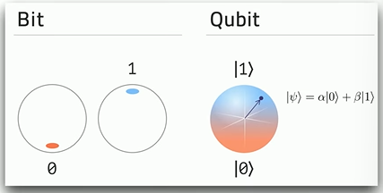
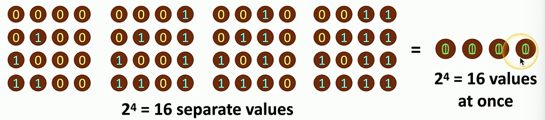

# Quantum Computing
Computing based on quantum physics. Most computers function using *'classical mechanics'* where the smallest form of information *is a single bit*. Quantum computing is based on *quantum mechanics* where the smallest form of information *is a qubit*. 
## Quantum Superposition
Qubits can have a value of `1`, `0` or *any combination in between at the same time*. This is known as *Quantum Superposition*. So, any one qubit is effectively a zero and a one *at the same time*.

### Vs. Binary Calculations
The following image shows *all the permutations* a collection of 4 bits can have. Since each can either be a one or a zero, there are `2^4` (16) possible values. Compare that to 4 qubits which can represent *all 16 permutations at the same time*:

So, compared to binary computing, quantum computing can represent *more information per qubit* than can be represented by one binary bit.
## Advantages
Because so much information can be stored/ represented by *far less units of info*, quantum computing presents a lot of advantages. For example, searching through a large database would be much faster because *you can index everything at the same time*.
### Interesting applications
Simulating the quantum world can be applied to many fields including:
- Medicine and medical advancements
- weather prediction
- astrophysics
- etc.
## Post Quantum [Cryptography](cryptography/cryptography.md)
Because quantum computing can process information much faster, quantum computing can *break all of our current encryption methods*. The implications are large. Theoretically, because of the processing power and speed, everything we've currently secured using cryptography could easily be *brute-forced*.
- No existing cryptography could be trusted
- Financial transactions would not be safe
- No data would be private
### Shor's Algorithm
In 1994, Peter Shor created a theoretical algorithm describing how quantum computing could be used to brute force a given integer (`N`) and all its prime factors. Where traditional computers would take *longer than the lifetime of the universe* to calculate (?), Shor's algorithm could theoretically get it done much faster using qubits.
### Future of Cryptography
Given the threat of quantum computing on current cryptography, researchers have begun work on finding a solution. One of these is *NTRU*.
#### NTRU
NTRU is a cryptosystem which uses *lattice theory* rather than the prime factorization of large numbers. This theory relies on the idea of the *closest vector* (which is evidently a much harder problem for quantum computers to solve).
### Quantum Communications
Because the act of *observing qubits changes them* quantum cryptography can theoretically provide *integrity* when information is transmitted across a network using it. That's because when it reaches the recipient, the qubits will be changed from how they're expected to be if someone intercepted them during transmission.
#### Quantum Key Distribution (QKD)
Because of this, it would be easy to send random streams of qubits (the key) across a network channel. Once it's received, both sides can verify it, and if there is a change, then it's obvious the key was compromised.

> [!Resources]
> - [Professor Messer](https://www.youtube.com/watch?v=UNcXp6dIUNw&list=PLG49S3nxzAnkL2ulFS3132mOVKuzzBxA8&index=96)