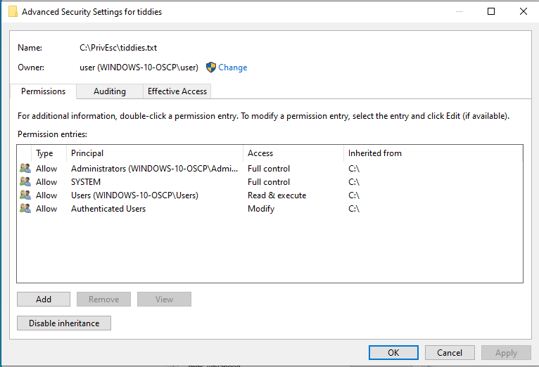

---
aliases:
  - ACE
  - ACL
  - ACEs
  - access control lists
  - access control list
---

INIT
# ACLs & ACEs
Each resource in a [Windows](../README.md) machine has an ACL (Access Control List) associated to it. Each ACL is a list of *none or more* access control entries (ACEs).
## Access Control Entry
Each ACE defines the relationship *between a principal* (user, group, etc.) and a *particular access right*.
