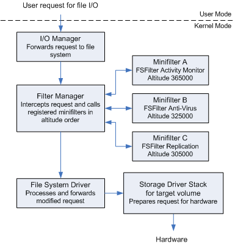

# Filter Manager
INIT.
The Filter Manager (`FltMgr.sys`) is a [kernel](../../concepts/kernel.md)-mode driver which exposes common functionality required for file system filter drivers. It provides developers with an easy way to write [minifilters](filter-drivers.md). 
## Behavior
`FltMgr` is installed on [Windows](../README.md) but only activates *when a minifilter is loaded*. It attaches to the file system stack of a target volume *on behalf* of the current minifilter so that the minifilter can indirectly carry out I/O operations on the file system stack via the `FltMgr`. 
### Attachment Order
Minifilters attach in a specific order based on their *"altitudes"*. A minifilter's attachment to a specific volume at a specific altitude is referred to as *an instance* of the minifilter driver.
### Altitude
A minifilter's altitude accomplished two things:
- it ensures the minifilter instance *is always loaded* at the right location relative to other instances
- it determines the order the instance is called *by the filter manager to handle I/O*
 

 
When the filter manager calls a specific minifilter to handle an I/O operation, it calls each minifilters' *callback routine* (for minifilters which registered to for the operation). Once one callback routine returns, the filter manager calls the callback routine *of the next minifilter*. 

> [!Resources]
> - [Microsoft: Filter Manager Concepts](https://learn.microsoft.com/en-us/windows-hardware/drivers/ifs/filter-manager-concepts)