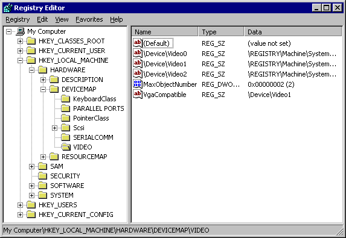

INIT
# Registry (Windows)
The registry is the *primary configuration database* for Windows machines. It is actually a *collection of databases* which store the *low-level* settings for all users, services, applications, etc.. 

The registry is organized into a hierarchical tree structure. Each node in the tree is called a "key" and each key has a "value" assigned to it. Keys can hold multiple values and values can come in any form. Sometimes just the existence of the key is enough information (for whatever application is using it).  

A registry tree can have up to `512` levels.
## Keys
Each key has a name which is *not case sensitive* and can be made up of one or more printed characters. Any printable character is valid *except for the backslash `\` character* (however values can have backslashes in their names or content).

> The Registry Editor showing the `HKLM\Hardware\DeviceMap\Video` registry key
### Subkeys
Keys can contain subkeys. A subkey's name *has to be unique to the key* (within the key's namespace). Each of the trees under "My Computer" is a key. For example, `HKEY_LOCAL_MACHINE` is a key which has the following subkeys:
- `HARDWARE`
- `SAM`
- `SECURITY`
- `SOFTWARE`
- `SYSTEM`
## Security related Registry changes
The registry has some *important security settings.* For example, the registry can be used to *configure permissions* for files and services. Additionally, *vulnerable apps and services can be enabled/ disabled* from the registry. For example, [SMBv1](../../../networking/protocols/SMB.md#SMBv1) (a vulnerable version of SMB) can be enabled in the registry, making the device vulnerable to exploits which take advantage of it.

> [!Resources]
> - [Microsoft: Registry](https://learn.microsoft.com/en-us/windows/win32/sysinfo/structure-of-the-registry)
> - [Professor Messer](https://www.youtube.com/watch?v=KxiPfczekFA&list=PLG49S3nxzAnkL2ulFS3132mOVKuzzBxA8&index=106)