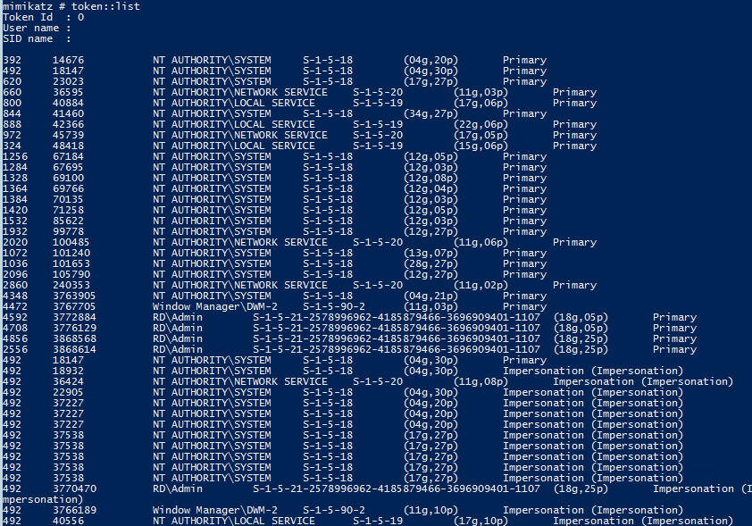
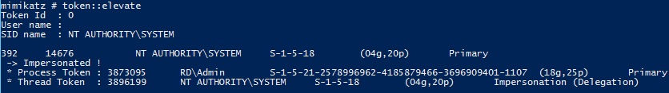
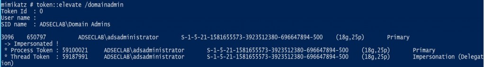
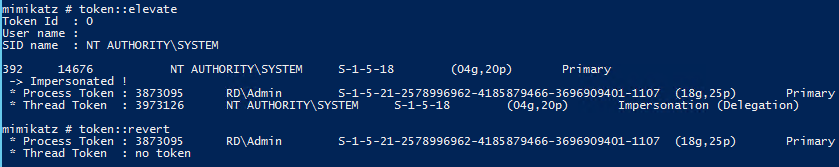

INIT
# Mimikatz
[Mimikatz](https://github.com/gentilkiwi/mimikatz) is a tool written primarily in [C](../../../../coding/languages/C.md) which can do a lot of fun things with [Windows](../../../../computers/windows/README.md). It can extract passwords, [hashes](../../../../computers/concepts/cryptography/hashing.md), [kerberos](../../../../networking/protocols/kerberos.md) tickets, PIN codes, etc. all from memory. It can also do some ticket/ hash-based attacks like [pass-the-hash](../../exploitation/pass-the-hash.md).
## Use
### `privilege::debug`
A lot of modules, like `sekurlsa::logonpasswords` and `lsadump::sam` require you to have the `SeDebugPrivilege` access right enabled. If you're running mimikatz from an Admin account, then you can enable it with `privilege::debug`:
```powershell
mimikatz # privilege::debug
Privilege '20' OK
```

### `sekurlsa` module 
#### `sekurlsa::logonpasswords`
This module will attempt to extract *plaintext passwords* from all possible sources. This generates a huge amount of output, so it might be better to run a module which returns more specific output.
### `lsadump` module
#### `lsadump::sam`
This modules extracts *[NTLM](../../../../networking/protocols/NTLM.md) hashes from the [SAM](../../../../computers/windows/SAM.md)*. To run it, you need `SYSTEM` level privileges (see `token::elevate`). 
```powershell
mimikatz # lsadump::sam
Domain : MARKETINGWK01
SysKey : 2a0e15573f9ce6cdd6a1c62d222035d5
Local SID : S-1-5-21-4264639230-2296035194-3358247000
 
RID  : 000003e9 (1001)
User : offsec
  Hash NTLM: 2892d26cdf84d7a70e2eb3b9f05c425e
 
RID  : 000003ea (1002)
User : nelly
  Hash NTLM: 3ae8e5f0ffabb3a627672e1600f1ba10
...
```
#### `lsadump::secrets`
Dumps secrets from the local SECURITY [registry](../../../../computers/windows/registry.md) hive
```bash
mimikatz # lsadump::secrets
Domain : WEB02
SysKey : 15e1050a6b4a11f2c1ebe8aaa2a80fc5

.. SNIP ..

Secret  : DefaultPassword
cur/text: Flowers1
old/text: Flowers1
...
```
#### `lsadump::cache`
Dumps cached domain credentials from the registry. These are cached in case the device *can't connect to the DC*. They can be found at registry keys: `HKEY_LOCAL_MACHINE\SECURITY\Cache\NL$1` through to `NL$10`.

The recovered hashes can be cracked with hashcat, [if the hash is transformed](https://www.ired.team/offensive-security/credential-access-and-credential-dumping/dumping-and-cracking-mscash-cached-domain-credentials) into the format “`$DCC2$10240#**USERNAME**#**HASH**`**”** and mode 2100 is used.
### Token Module
Mimikatz' *token elevation function* allows Mimikatz to interact with Windows *[access tokens](../../../../OSCP/windows-privesc/security-mechanisms/access-tokens.md)*. With this module, mimikatz can grab tokens and then impersonate them. It has a few sub-modules. **P.S.**: you need to have the [`SeImpersonatePrivilege`](../privesc/token-abuse.md#`SeImpersonatePrivilege`) access right (all local Admins have it by default).
#### `token::list`
List all of the tokens on the current system:

#### `token::whoami`
Display your current identity and token.
#### `token::elevate`
You can use this sub-module to elevate your current permissions to those of another group/ user. For example, if you want to escalate your privileges to `SYSTEM` or to `Administrator`:

You can also give `::elevate` a specific credential to elevate to:

#### `token::revert`
Revert to the process token you had before elevating:

#### `token::run`
Executes a new process with its token. It has the following command line arguments:
- [`/id`](https://tools.thehacker.recipes/mimikatz/modules/token/run#id): Token id to use for the new process
- [`/user`](https://tools.thehacker.recipes/mimikatz/modules/token/run#user): Execute the process with the tokens of this user (instead of specifying the token ID)..
- [`/process`](https://tools.thehacker.recipes/mimikatz/modules/token/run#process): The process to run. By default, the command `whoami` is executed.

> [!Resources]
> - [Mimikatz Repo](https://github.com/gentilkiwi/mimikatz)
> - [Ad Security: Unofficial Mimikatz Guide & Command Ref.](https://adsecurity.org/?page_id=1821)
> - [The Hacker Tools: Mimikatz/Modules/Token](https://tools.thehacker.recipes/mimikatz/modules/token/run)
> - [http418infosec: Mimikatz modules explained](https://http418infosec.com/digging-into-mimikatzs-lsadump-and-sekurlsa#secrets)